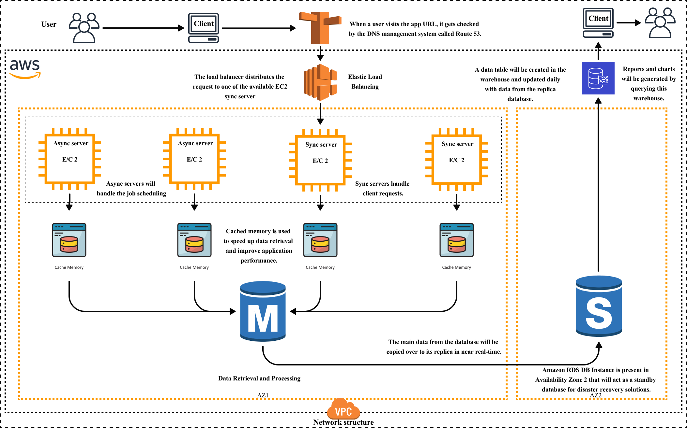

# HotWax Commerce System Architecture

## Introduction

This document provides an overview of the high-level architecture for the HotWax Commerce application deployed on Amazon Web Services (AWS), emphasizing scalability, fault tolerance, performance, and security considerations.

## System Components

The architecture comprises essential components and they are as follows:

* **Route 53**: Clients interact with the web application through their web browser's URL. AWS's DNS service then translates user-friendly URLs into the IP addresses of the web servers.
* **Elastic Load Balancer (ELB)**: Distributes incoming traffic across multiple EC2 instances to ensure scalability and reliability.
* **EC2 Instances**: Virtual servers hosting the application:
  * **Async Servers**: Manage background tasks scheduled by the application.
  * **Sync Servers**: Handle user requests forwarded by the ELB.
* **RDS DB Instance**: Managed relational database service ensuring high availability, scalability, and data security in Availability Zone (AZ) 1.
* **Replica Database**: Maintains a copy of the main database in AZ 2 for disaster recovery and reporting purposes.
* **Data Warehouse**: Stores historical data from the replica database for comprehensive analysis.
* **VPC (Virtual Private Cloud)**: Provides a secure and isolated network environment for all AWS resources.

<figure><figcaption></figcaption></figure>

## Data Flow

The flow of data within the HotWax Commerce application involves several steps and components working together to ensure efficient processing and handling of user requests. Here’s a detailed breakdown:

### Client Interaction

Users interact with the HotWax web application through their web browser by entering a URL. For example, they might type in www.hotwaxcommerce.com to access the site.

### DNS Resolution

The URL entered by the user is translated into an IP address by AWS's Route 53, a Domain Name System (DNS) service. This translation is necessary because web browsers need IP addresses to locate and communicate with web servers.

### Load Balancing

Once the IP address is determined, the user's request is directed to the Elastic Load Balancer (ELB). The ELB is responsible for distributing incoming traffic evenly across multiple EC2 instances (virtual servers). This distribution ensures that no single server is overwhelmed with too many requests, thereby enhancing reliability and scalability.

### Processing Requests

The EC2 instances are categorized into two types:

* **Sync Servers**: A synchronous server handles requests and responses sequentially. Each request is processed one at a time, and the server waits for the current request to be completed before starting the next one.
* **Async Servers**: An asynchronous server can handle multiple requests concurrently without waiting for each one to complete. It helps in managing the scheduled background tasks.

When a user request arrives, a Sync Server processes it and, if necessary, communicates with the Async Servers for background tasks.

### Data Retrieval

The Sync Servers first check the cache memory used in OFBiz to retrieve the necessary data. By storing frequently accessed data in memory, this cache mechanism significantly reduces the time needed to fetch data, enhancing the application's performance.

If the required data is not found in the cache, the servers query the primary Amazon RDS instance. This managed database service stores the main dataset and supports high availability and security.

### Data Replication

To ensure data redundancy and enable disaster recovery, the primary RDS instance continuously replicates data to a secondary replica database located in a different Availability Zone (AZ 2). This replication occurs in near real-time, ensuring that the replica database is almost always synchronized with the primary database.

### Data Warehousing

For comprehensive analysis and reporting, data from the replica database is periodically copied to a data warehouse. The data warehouse is designed to store large volumes of historical data, enabling efficient data retrieval and analysis for reporting purposes. This helps in generating detailed reports and charts based on historical trends and user behavior.

## Conclusion

This high-level architecture provides a robust foundation for deploying a scalable, fault-tolerant, performant, and secure web application on AWS. Leveraging AWS services simplifies deployment, management, and maintenance tasks, enabling efficient resource utilization and enhancing overall system reliability.
