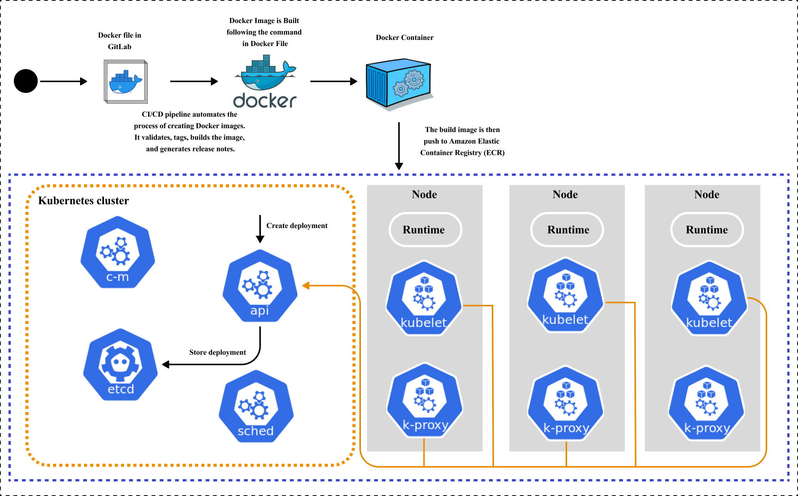
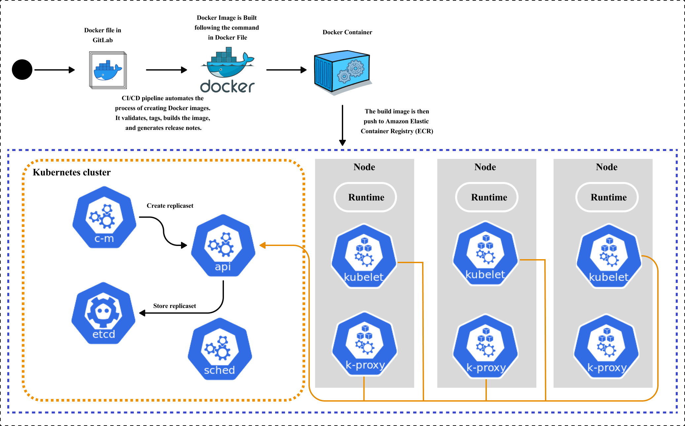
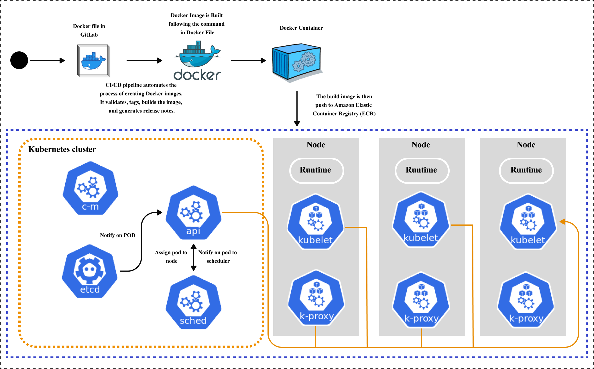

# Detailed Workflow Documentation: From Code Commit to Deployment using Jenkins and Kubernetes

This document outlines the workflow of how code changes made by developers are automatically built, tested, and deployed using Jenkins and Kubernetes. This process ensures a streamlined, efficient, and automated approach to delivering software.

### Code Commit

Developers make changes to the codebase and commit them to a GitLab repository. Each commit represents incremental updates or new features.

### Merge Code in Develop

Upon completing their work in a feature branch, developers create a Merge Request (MR) to propose merging their changes into the main development branch (often named 'develop').

### CI/CD Pipeline

A CI/CD pipeline is manually triggered to automate the build, test, and deployment processes. This pipeline ensures that all code changes undergo rigorous automated testing.

### Cut Release and Create Release Notes

As part of the CI/CD pipeline, automated scripts or tools cut a release from the main branch. This involves tagging the repository with a version number and generating release notes summarizing the changes included in the release.

### Push Docker Image to Registry

If the automated tests pass successfully, Jenkins, the automation server, pushes the built Docker image to Amazon ECR (Elastic Container Registry). ECR stores Docker images, ensuring they are ready for deployment.

### Update Kubernetes Deployment Configuration

Jenkins updates the Kubernetes deployment configuration file to specify the new version of the Docker image. This configuration file dictates how the application should run within the Kubernetes cluster.

### Deploy to Kubernetes Cluster

Using Kubernetes commands (`kubectl`), Jenkins initiates the deployment process in the Kubernetes cluster. Kubernetes ensures that new containers are created and old ones are gracefully terminated, maintaining application availability.

### Kubernetes Manages Deployment

Throughout the deployment process, Kubernetes orchestrates the management of containers, handling tasks such as scaling, load balancing, and maintaining high availability of the application.

### Monitoring and Feedback

Post-deployment, Jenkins monitors the application's performance and health using monitoring tools like Grafana. These tools provide real-time metrics, logs, and alerts to developers, enabling them to promptly address any issues and continuously improve application performance.

### Detailed Kubernetes Deployment Process

1. **Define Application in Deployment YAML File**:
    - Once we define our application in a `deployment.yaml` file, we use `kubectl apply -f deployment.yaml` to send it to the Kubernetes API, which serves as the central hub for our cluster.

<figure><figcaption></figcaption></figure>

2. **Storage in ETCD (Kubernetes Cluster API)**:
    - A new Deployment object saved in ETCD triggers an update notification within the API, which conveys this information to all subscribed components.
  
<figure><figcaption></figcaption></figure>
         
3. **Controller Manager and Replicaset Creation**:
    - The Controller Manager monitors changes in Deployments. Upon detecting a new one, it initiates the creation of a corresponding Replicaset by sending a create request to the API.
    - The API receives the Replicaset definition, stores it in ETCD, and broadcasts this update to all subscribed components, including the Controller Manager.

<figure><figcaption></figcaption></figure>

<figure><figcaption></figcaption></figure>

4. **Pod Creation**:
    - Upon receiving notification of the new Replicaset, the Controller Manager oversees the creation of Pods defined by the Replicaset. It communicates with the API to ensure these Pods are correctly stored in ETCD.

<figure><figcaption></figcaption></figure>

5. **Scheduler Assigns Pods**:
    - The Scheduler listens for events related to Pod creation. When a new Pod is created, the Scheduler determines the optimal node within the cluster for the Pod to run. It communicates this assignment back to the API, which logs this information.
     
<figure><figcaption></figcaption></figure>

6. **Kubelet Starts Pods**:
    - Every worker node in the Kubernetes cluster runs the Kubelet, which monitors Pod events. When the API informs the Kubelet that a Pod should run on its node as decided by the Scheduler, the Kubelet proceeds to start the containers specified within the Pod.
      
<figure><figcaption></figcaption></figure>

This intricate orchestration involving multiple components ensures our application configuration evolves into a fully operational application. Each component plays a vital role in managing the complexities of deployment, collectively ensuring the successful execution of our application.
