# Generate Updates Script Documentation

This document provides a detailed overview of the `scripts/generate_updates.js` script, which automates the generation of monthly release notes for HotWax Commerce by aggregating data from various GitHub repositories and processing it using Gemini AI models.

## Architectural Overview

The script follows a tiered processing pipeline consisting of a discovery stage and three AI-driven phases:

1.  **Stage 0: Discovery & Streaming Fetch**: Identifies relevant releases and PRs for the target month, fetches context, and streams raw data to disk.
2.  **Phase 1: Organizer Agent (Batched)**: Uses a high-context model to group PRs into logical clusters and filter out noise.
3.  **Phase 2: Cluster Summarizer**: Summarizes each cluster into a cohesive release note entry (Problem, Solution, Impact).
4.  **Phase 3: Conformity Agent (Synthesis)**: Finalizes the document structure, applies style guide rules, and generates the final Markdown file.

---

## Tiered Model Configuration

The script uses a specialized configuration for different tasks to balance performance and efficiency:

| Agent | Model(s) | Purpose |
| :--- | :--- | :--- |
| **ORGANIZER** | `gemini-3-flash-preview` | High context, logical grouping, and naming. |
| **SUMMARIZER** | `gemma-3-27b-it` | Efficient summarization of individual clusters. |
| **SYNTHESIZER** | `gemini-3-flash-preview` | Final document assembly and styling. |
| **PRODUCT_UPDATER** | `gemini-3-flash-preview` | Matching PR FAQs and generating product updates. |

---

## File and Folder Structure

The project enforces a strict month-based folder structure for both raw data and generated drafts.

### Data Storage (`data/raw/`)
- Production: `data/raw/YYYY-MM/`
- Dry Run: `data/raw/YYYY-MM/test/`
- Contents: `raw_context.jsonl`, `cluster_matrix.json`, and agent prompts (`*_prompt.md`).

### Drafts (`drafts/`)
- Production: `drafts/YYYY-MM/`
- Dry Run: `drafts/YYYY-MM/test/`
- Contents: `release-notes.md` and `product-updates/` folder.

---

## Function Reference

### `getTargetMonth()`
Determines the month for which release notes should be generated.

### `fetchMonthlyReleases(owner, repo, targetMonth)`
Fetches all releases from a specific repository that were published during the target month.

### `extractPRRefsWithLinks(text, owner, repo)`
Extracts Pull Request references (numbers and URLs) from a given text (e.g., release body).

### `fetchContext(owner, repo, refNumber)`
Attempt to fetch detailed information for a reference number, checking for PRs first, then Issues.

### `fetchRepoReadme(owner, repo)`
Fetches the first 500 characters of the repository's README file.

### `analyzeWithGemini(prompt, models, retries)`
Communicates with Gemini AI models with support for fallback models and retries.

### `getMonthStorageDir(targetMonth)`
Calculates the directory for raw data storage based on the target month and dry run status.

### `getDraftDir(targetMonth)`
Calculates the directory for generated drafts based on the target month and dry run status.

### `saveReleaseNotes(targetMonth, content)`
Saves the final release notes to `drafts/YYYY-MM/[test/]release-notes.md`.

### `saveProductUpdate(targetMonth, safeTitle, content)`
Saves a generated product update to `drafts/YYYY-MM/[test/]product-updates/safe_title.md`.

---

## Master Execution Flow

The following diagram illustrates the complete end-to-end execution of the script, including Product Update generation.

```mermaid
graph TD
    Start([Start]) --> Init[Initialize Env & Octokit]
    Init --> GetMonth[getTargetMonth]
    
    subgraph Stage_0 [Stage 0: Discovery & Fetching]
        GetMonth --> LoopRepos[Loop through SOURCE_REPOS]
        LoopRepos --> CacheCheck{Cache hit in repo-context.md?}
        CacheCheck -- No --> FetchReadme[fetchRepoReadme]
        FetchReadme --> SumReadme[summarizeReadme]
        SumReadme --> SaveCache[appendToRepoContextCache]
        SaveCache --> FetchRel[fetchMonthlyReleases]
        CacheCheck -- Yes --> FetchRel
        
        FetchRel --> LoopRel[Loop through Releases]
        LoopRel --> ExtPR[extractPRRefsWithLinks]
        ExtPR --> LoopPR[Loop through PR Refs]
        LoopPR --> FetchCtx[fetchContext]
        FetchCtx --> BodyCheck{Body empty?}
        BodyCheck -- Yes --> FetchBot[fetchBotSummary]
        FetchBot --> ExtIssues[extractLinkedIssueNumbers]
        BodyCheck -- No --> ExtIssues
        ExtIssues --> LoopIssues[Loop through Linked Issues]
        LoopIssues --> FetchIssueCtx[fetchContext for Issue]
        FetchIssueCtx --> StoreRaw[Stream raw metadata to .jsonl]
    end

    subgraph Phase_1 [Phase 1: Organizer Agent]
        StoreRaw --> BatchedPrompts[Batch item metadata]
        BatchedPrompts --> CallGemini1[analyzeWithGemini: Logic Grouping]
        CallGemini1 --> Clusters[Generate Clusters & Noise Filter]
    end

    subgraph Phase_2 [Phase 2: Cluster Summarizer]
        Clusters --> LoopClusters[Loop through Clusters]
        LoopClusters --> LoadRaw[Load raw PR context from disk]
        LoadRaw --> CallGemini2[analyzeWithGemini: Summarize Cluster]
        CallGemini2 --> ClusterSummaries[Cohesive Entries]
    end

    subgraph Phase_3 [Phase 3: Conformity Agent]
        ClusterSummaries --> LoadStyle[Load styleguide.md]
        LoadStyle --> CallGemini3[analyzeWithGemini: Synthesis]
        CallGemini3 --> SaveNotes[saveReleaseNotes]
    end

    subgraph Phase_4 [Phase 4: Product Update Generation]
        SaveNotes --> LoadFAQs[loadPendingPRFAQs]
        LoadFAQs --> MatchFAQs[identifyProductUpdateMatches]
        MatchFAQs --> LoopMatches[Loop Matches]
        LoopMatches --> CallGemini4[runProductUpdater]
        CallGemini4 --> SaveUpdate[saveProductUpdate]
    end
    
    SaveUpdate --> End([End])
```

