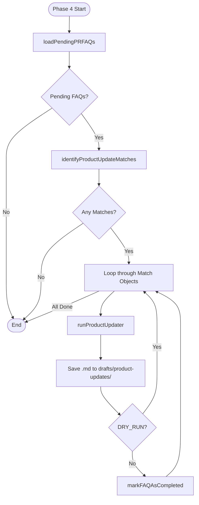
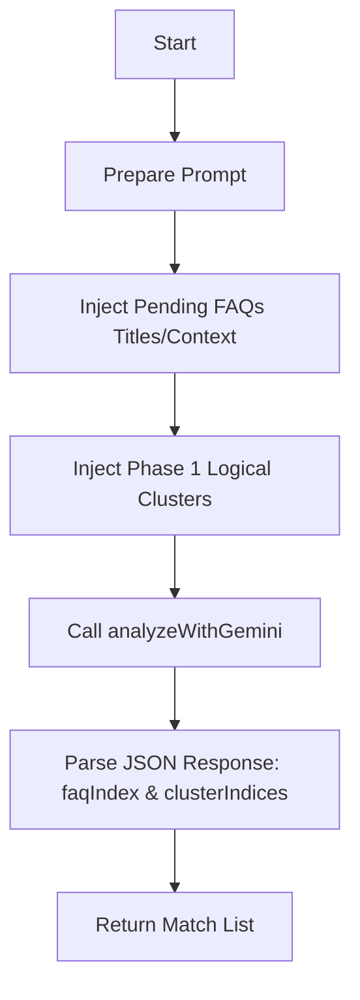
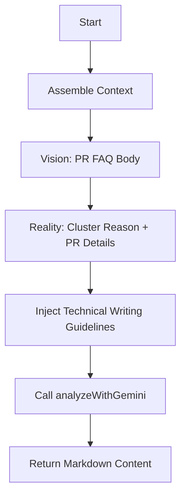

# Product Update Workflow Design

## Overview
A "Product Update" provides a detailed exploration of significant new features, going beyond standard release notes. This workflow automates the drafting of these updates by linking "Press Release FAQs" (PR FAQs) with actual implementation data from GitHub.

## Workflow Mechanics

### 1. PR FAQ Storage
- **Directory**: `data/pr-faqs/`
- **Format**: Markdown files with YAML frontmatter.
- **State Attribute**: `status: pending | completed`.

### 2. AI-Driven Matching Logic
Instead of static linking via IDs, the system uses AI for discovery:
1.  **Candidate Selection**: Filters `data/pr-faqs/` for `status: pending`.
2.  **Semantic Mapping**: The `ProductUpdateAgent` analyzes the pending PR FAQs against the logical clusters generated from GitHub data (Phase 1).
3.  **Identification**: The AI determines which PR FAQ matches which implementation cluster based on technical content and strategic alignment.

### 3. Drafting Logic
The drafting process combines:
- **Vision**: The high-level intent and FAQ data from the PR FAQ file.
- **Reality**: The technical implementation details (PR bodies, linked issues, bot summaries) from the matched GitHub cluster.
- **Synthesis**: The agent drafts a narrative that bridges the initial vision with the delivered product.

### 4. State Management (Anti-Duplication)
After a product update draft is successfully created:
1.  The script updates the PR FAQ file's frontmatter.
2.  `status` is changed to `completed`.
3.  Metadata about the release month is recorded.
4.  Future runs will skip these files.

## Integration Plan

### Component Changes
- **`data/pr-faqs/`**: New directory for input documents.
- **`src/agents/product_updater.js`**: New agent logic for deep synthesis.
- **`scripts/generate_updates.js`**: Updated to include the Product Update phase.
- **`drafts/product-updates/`**: Target directory for generated drafts.

## Technical Logic Flow

### Phase 4: Product Update Generation
The following diagram illustrates the execution flow within `scripts/generate_updates.js` (Phase 4):

### AI Matcher Logic (`identifyProductUpdateMatches`)
How the agent decides which features correlate to which technical changes:

### Agent synthesis (`runProductUpdater`)
How the "Draftsman" role merges context to create the update:

## Verification
- **Dry Run**: Validate matching logic and prompt construction without updating files.
- **End-to-End**: verify that a mock PR FAQ results in a draft and a status update.
