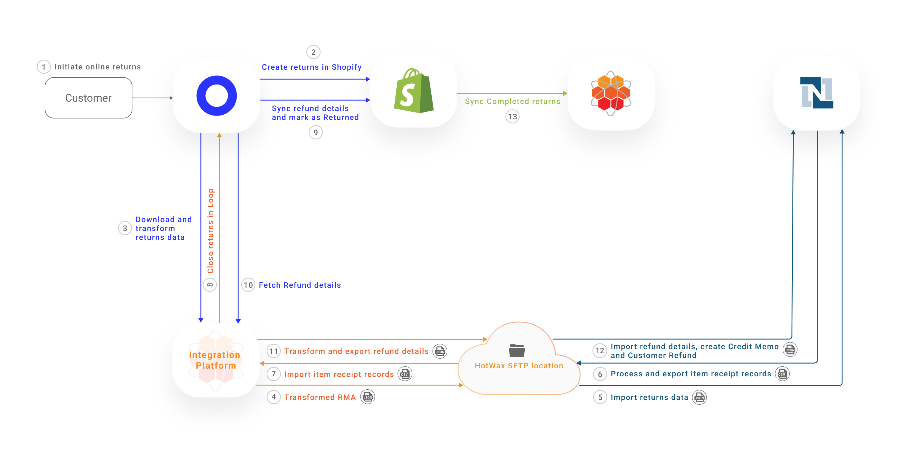
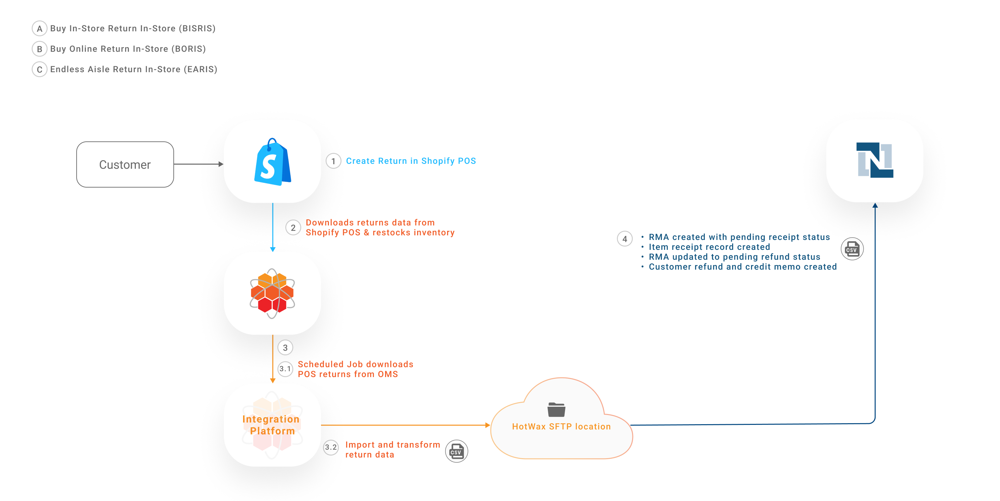
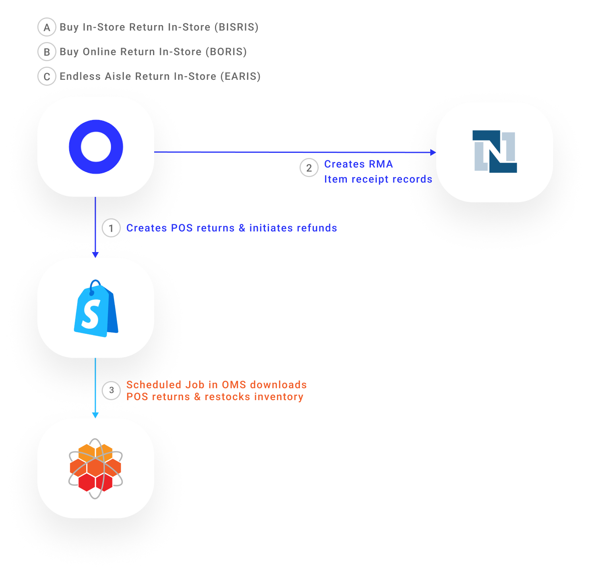

# Returns

In omnichannel retailing, retailers provide customers with the options for online returns as well as in-store returns.

## Web Returns with Loop

Customers can initiate online returns for both online and in-store purchases.

* **Buy Online Return Online (BORO)**: Customers initiate online returns for their eCommerce orders.
* **Buy In-Store Return Online (BISRO)**: Customers initiate online returns for their in-store purchases.
* **Endless Aisle Return Online (EARO)**: Customers initiate online returns for their in-store ordered items which they received home delivery for.

Retailers we work with use Shopify as their eCommerce platform, NetSuite as their ERP system, Loop as their RMS, and HotWax Commerce as their OMS. This returns management workflow involves downloading returns data, creating Return Merchandise Authorizations (RMAs), processing Item Receipt records, and creating Customer Refunds.

<figure><figcaption><p>Sync web returns to NetSuite</p></figcaption></figure>

### Data Flow

#### 1. Initiate Online Returns

Customers go to their online order in Shopify to place a return request. When selecting the return option, they are automatically redirected to Loop’s interface. Once customers submit the return request, Loop fetches the following return details:

* Order ID and items being returned (SKUs and quantities).
* Return reason provided by the customer.
* Any additional details, such as whether the return is for a refund, exchange, or store credit.

Once customers submit return requests, an RMA is created in Loop in the **Open** status.

#### 2. Create Returns in Shopify

Loop automatically syncs newly created returns to Shopify. A return record with the status **Return in Progress** is then added to the original sales order in Shopify. This enables retailers to maintain complete visibility over the entire return lifecycle in their primary sales channel, that is, Shopify.

#### 3. Download and Transform Returns from Loop

HotWax Commerce Integration Platform is subscribed to Loop's webhook to receive return data. When a return is created in Loop, Integration Platform receives an RMA JSON file from Loop.

**How HotWax Commerce Integration Platform Acts as a Bridge**

* **Return details fetched from Loop**: Loop return ID, return total, Shopify order ID, Shopify line item ID.
* **Additional details fetched from HotWax OMS**: HotWax order ID, Shopify order ID, NetSuite order ID, Shopify product SKU.

Using the above details, HotWax Commerce Integration Platform transforms the return data into a format compatible with NetSuite. This transformation is a key feature of HotWax’s integration. By consolidating the original order data with return data, HotWax ensures that RMAs in NetSuite are properly linked to their corresponding sales orders.

**Why does this matter?**

Unlike standard third-party connectors like NovaModule, which merely transfer data between systems, HotWax Commerce’s OMS integrates deeply with Shopify, Loop, and NetSuite. This integration provides the additional order and product details required to establish a direct link between the RMA and the original sales order, something other connectors cannot do effectively.

#### 4. Transform and Export Returns Data from HotWax Integration Platform

Once the RMA data is transformed, a job in HotWax Commerce Integration Platform places the file at a designated SFTP location. This enables NetSuite to access and process the data for creating RMAs for downstream processing.

**SFTP Locations**

```
/home/{sftp-username}netsuite/loop-return/create
```

#### 5. Import Returns Data in NetSuite

Every 15 minutes, a scheduled SuiteScript in NetSuite runs to check for new return files at the SFTP location.

If a new RMA JSON file is found, the NetSuite SuiteScript reads and processes the file. An RMA is then created in NetSuite and marked as **Pending Receipt.**

The newly created RMA is linked to the original sales order. This offers traceability and provides warehouse teams with advance notice that the order item will be returned.

**SuiteScript**

```
HC_SC_CreateLoopReturn.js
```

#### 6. Process and Export Item Receipts Records

After a few days, when the customer's returned item is physically received at the warehouse, the following actions take place:

* An Item Receipt record is created and linked to the RMA.
* Inventory is restocked, and the corresponding inventory count is increased in NetSuite.
* The RMA status updates from **Pending Receipt** to **Pending Refund**.

As soon as the Item Receipt record is created in NetSuite, a CSV file is generated containing Loop’s return ID for reference. This file is then placed at the designated SFTP location.

This step is important for completing the return process in Loop, let’s see how in the next steps.

**SuiteScript**

```
HC_MR_ExportLoopReturnProcess.js
```

**SFTP Locations**

```
/home/{sftp-username}netsuite/loop-return/process-return
```

#### 7. Import Item Receipt Records

A job in HotWax Commerce Integration Platform runs every 5 minutes to check for new CSV files received at the SFTP location. If any new files are identified, the job extracts the Loop return IDs from the file and subsequently triggers the [“Process Return” API](https://api.loopreturns.com/api/v1/warehouse/return/%7Breturn_id%7D/process).

**SFTP Locations**

```
/home/{sftp-username}/netsuite/loop-return/process-return
```

#### 8. Close Returns in Loop

The Process Return API triggers multiple actions in Loop based on the fetched Loop return IDs:

* The RMA status is updated from **Open** to **Closed**.
* As soon as the RMA in Loop is marked as Closed, multiple actions take place:
  * If the customer opted to receive a refund on their original payment method, Loop triggers Shopify to process the refund.
  * If the customer selected "Return for Store Credit," Loop automatically issues a gift card to the customer for the corresponding amount.
  * If the customer selected "Exchange," Loop creates a new exchange order in Shopify.

#### 9. Process Refunds to Customers

Shopify processes the customer refund using the original payment method, updating the return status from **In-Progress** to **Returned** in Shopify. At the same time, Shopify syncs the refund details back to Loop.

#### 10. Fetch and Transform Refund Details

HotWax Commerce Integration Platform subscribes to Loop’s webhook to fetch and transform refund details.

**SFTP Locations**

```
/home/{sftp-username}/netsuite/loop-return/close
```

#### 11. Transform and Export Refund Details

A flow in HotWax Commerce Integration Platform transforms refund data. The JSON file is then placed at the SFTP location.

The file contains details about Loop return ID, Shopify order ID and the refund amount initiated to the customer.

#### 12. Import Refund Details in NetSuite

A SuiteScript in NetSuite imports the file from the SFTP location, processes the data and triggers multiple actions:

* A Credit Memo is created in Open status and linked to the RMA.
* A Customer Refund record is automatically created based on the refund method and linked to the Credit Memo.
* Once the Customer Refund record is created, the Credit Memo is updated from Open to Fully Applied, and the RMA is updated from Pending Refund to Refunded.

**SuiteScript**

```
HC_SC_CreateLoopReturnRefund.js
```

#### 13. Sync Completed Returns from Shopify

A job in HotWax Commerce syncs the newly created Completed returns from Shopify and marks them as Completed in HotWax.

**How is returned inventory restocked in HotWax Commerce?**

Inventory from returns received in the warehouse is synchronized to HotWax Commerce during its periodic inventory sync with NetSuite. HotWax then also syncs the updated inventory counts of the product to Shopify.

Loop also offers the option to restock inventory. However, HotWax recommends disabling this feature in Loop. The reason is that HotWax and NetSuite handle inventory tracking across all locations, while Shopify only maintains a consolidated inventory at its default location.

With this setup, after HotWax restocks the returned inventory from NetSuite during its periodic inventory sync, a corresponding job in HotWax automatically increases the product's inventory count at the default location in Shopify.

***

### Handling of Exchanges in NetSuite

When a customer opts for an exchange through Loop, a new exchange order is automatically created in Shopify once the return is closed in Loop. HotWax Commerce downloads these exchange orders from Shopify as regular orders and syncs them to NetSuite. Here's how different exchange scenarios are handled:

#### 1. When the exchange order total is less than the original order

* Loop automatically refunds the customer for the price difference and creates a new exchange order in Shopify.
* HotWax’s Integration Platform captures this refund data and processes it as discussed earlier, transforming it for NetSuite without additional steps.

#### 2. When the exchange is for an item of equal value

* The process is straightforward, with no need for special handling.
* The return and exchange data are transformed and synced to NetSuite, as previously discussed.

#### 3. When the exchange is for an item of higher value (Upsell)

* Loop includes attribution in the Shopify order notes, indicating that the new exchange order involves an upsell.
* HotWax recognizes this attribution and processes the order accordingly.
* To handle the additional payment, HotWax creates a Customer Deposit in NetSuite.

Suppose a customer initiates a return for a $100 item and chooses to exchange it for a $150 product. Loop processes the exchange, and Shopify records the new order with an additional $50 payment. The order notes include the upsell attribution. HotWax reads these notes, identifies the upsell, and generates a Customer Deposit for $50 in NetSuite, helping maintain accurate financial records.

***

### Handling Returns for Older Orders

Retailers' return policies can vary, ranging from one to several months. To accommodate future returns, HotWax imports historical orders from Shopify. However, some retailers accept returns for orders placed over a year ago. If a retailer starts using HotWax Commerce within that year and lacks historical orders in the OMS, here’s how HotWax handles such cases:

#### 1. Matching Shopify and NetSuite order IDs

* When return data is received from Loop, HotWax’s Integration Platform first checks the Shopify order ID in the OMS.
* If a corresponding NetSuite order ID is found, the return process proceeds without interruptions.
* The RMA is created in NetSuite and linked to the original sales order, maintaining consistency in data and workflows.

#### 2. Fetching older orders from NetSuite

* In some cases, older orders may not be imported into the OMS, but the corresponding records still exist in NetSuite.
* When no matching NetSuite order ID is found in the OMS, HotWax’s Integration Platform runs a search query in NetSuite using the Shopify order ID to locate the original sales order details.\
  Once the original sales order is retrieved from NetSuite, the necessary return details are synced. This step helps ensure that even older orders, which might not have been part of the initial OMS setup, are accurately linked with the RMA and processed.

***

### Preventing Duplicate Return Syncs to NetSuite

HotWax Commerce OMS and NetSuite both need return order data but at different stages of the return lifecycle. NetSuite requires return data early in the process for return authorization and processing, so HotWax’s Integration Platform syncs return orders to NetSuite as soon as they are initiated. However, OMS only needs return data once the return is completed in Shopify, so it downloads completed returns from Shopify at a later stage.

Since NetSuite already has the return order data from the Integration Platform, syncing the same returns again from OMS would create duplicates. To prevent this, when downloading returns from Shopify, HotWax OMS reads the order notes added by Loop and tags the return order with LOOP\_RETURN\_CHANNEL. This return channel identifier allows OMS to recognize Loop-initiated returns and exclude them from syncing again, keeping NetSuite data clean.

***

## POS Returns

Customers who live near a brick-and-mortar store or those who prefer to get instant refunds opt for returning their purchases directly in-store.

#### Scenarios where POS returns are accepted

* **Buy In-Store Return In-Store (BISRIS):** Customers return their in-store purchases to a nearby store location.
* **Buy Online Return In-Store (BORIS):** Customers directly return their online purchases to a nearby store location.
* **Endless Aisle Return In-Store (EARIS):** Customers return orders made through an endless aisle feature, such as items ordered in-store for home delivery, to a nearby store location.

Retailers we work with, use Shopify POS as their POS system, NetSuite as their ERP system, Loop as their RMS, and HotWax Commerce as their OMS. Some retailers initiate in-store returns using the Loop Returns POS App, while others opt to use their Shopify POS system. Let's see how these two approaches work:

## Synchronizing POS Returns to NetSuite when returns are accepted on Shopify POS

<figure><figcaption><p>Sync POS returns to NetSuite using HotWax Commerce</p></figcaption></figure>

By leveraging Shopify POS for in-store returns, store associates are not required to navigate through a separate interface. This returns management workflow involves downloading returns data, processing Item Receipt records, and creating Customer Refunds.

#### 1. In-Store Return by Customer

Customers visit their preferred store to return a purchase, which may have been made in-store or online. Store associates search for the customer’s order ID, and once identified, they process the in-store return. Here’s how:

* Select the order item being returned.
* Specify the return reason.
* Process refunds to customers.

#### 2. Import POS Returns in HotWax Commerce

A scheduled job in HotWax Commerce downloads the return data from Shopify POS. These returns are downloaded as Completed, and the payment is marked as Refunded in HotWax Commerce.

HotWax Commerce also restocks the returned inventory based on visibility into the specific location where the inventory was received.

#### 3. Transform and Export Returns Data

A scheduled job in HotWax Commerce exports newly created POS returns and a job in HotWax’s Integration Platform imports and transforms this return data for NetSuite.

A scheduled job in the HotWax Commerce Integration Platform then generates a CSV file of the transformed POS returns data and places this file at an SFTP location.

#### 4. Import POS Returns in NetSuite

A scheduled SuiteScript in NetSuite reads this CSV file from the SFTP location, triggering multiple actions:

* An RMA is created with the Pending Receipt status and linked to the original sales order.
* An Item Receipt record is generated, linked to the RMA, and inventory is automatically restocked at the store location where the returned item was received.
* Once the Item Receipt record is created, the RMA is automatically updated to Pending Refund status.
* A Credit Memo is created in Open status and linked to the RMA.
* A Customer Refund record is automatically created based on the refund method and linked to the Credit Memo.
* Once the Customer Refund record is created, the Credit Memo is marked as Fully Applied, and the RMA is updated to Refunded.

When customers return items in-store, the return request and receipt are processed simultaneously.

HotWax syncs all return data to NetSuite, enabling all subsequent actions, from RMA generation to customer refund creation, to progress sequentially and automatically in NetSuite. This process also helps maintain accurate GL accounting and posting, simplifying financial reconciliation.


When retailers record in-store purchases as cash sales in NetSuite, POS returns do not require an RMA. Instead, a Cash Refund record is created, and the inventory is automatically restocked at the store. However, if in-store purchases are recorded as sales orders in NetSuite, the return follows the full RMA process, just like web returns.


#### Handling of Multiple Scenarios

When returning an item a customer can also opt to take the exchange item against it. The exchange item may be of higher value than the original item or may be of lesser value. Learn more about how HotWax commerce handles exchanges on an order.

***

## Synchronizing POS Returns to NetSuite when returns are accepted on Loop POS

<figure><figcaption><p>Sync POS returns to NetSuite using Loop</p></figcaption></figure>

Loop Returns POS App provides an intuitive interface to create POS returns. When it comes to in-store returns, because customers return their order items directly at the store location, the receiving of the order item and the processing of refunds happen simultaneously.

#### Create Returns in Shopify and NetSuite

Once the POS returns are completed in Loop, it syncs them with both Shopify POS and NetSuite.

Loop creates returns in Shopify POS, marks the order item as returned and payment as refunded. Subsequently, the inventory is restocked against the received order item.

Loop with Novamodule also directly creates a Cash Sale return in NetSuite, marks the order item as returned, payment as refunded and generates item receipt records. Subsequently, the inventory is restocked against the created item receipt.

#### Import POS Returns in HotWax Commerce

A scheduled job in HotWax Commerce downloads these returns from Shopify POS, including the facility ID where the returned items are received. Subsequently, HotWax Commerce marks the item as returned and payment as refunded. If the restocking flag is enabled, HotWax Commerce also restocks the inventory based on the provided facility ID.

As POS returns are already synced to NetSuite by Loop, they are not synced again by HotWax commerce.

***
