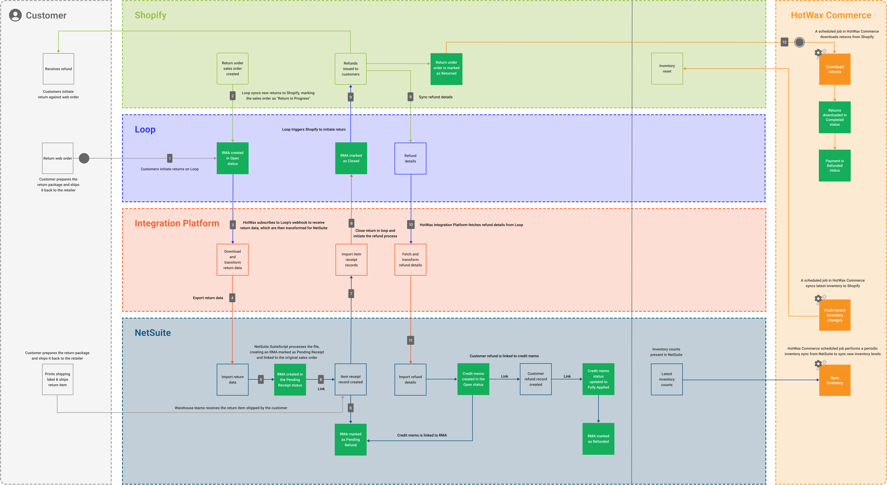

# Web Returns with Loop

<figure><figcaption>
Web returns lifecycle business process model
</figcaption></figure>

Customers start their return process in Shopify, and Loop manages the return process. From there, HotWax Commerce Integration Platform plays a key role, it connects the dots between all systems by transforming and syncing return data to NetSuite. This ensures every step, from return creation to refund and inventory updates, stays in sync.

To explain the return lifecycle, we've taken Shopify as the eCommerce platform, Loop as the Return Management System (RMS), NetSuite as the ERP, and HotWax Commerce as both the Order Management System (OMS) and the Integration Platform.

## 1. Customers Initiate Online Returns

The return process begins in Shopify, where the customer initiates a return. They are then automatically redirected to the Loop interface to complete their request, where they provide return details, including:

* Order ID and items being returned
* Return reason
* Preferred resolution (refund, exchange, or store credit).

Once a customer submits their return request, Loop creates an RMA in <mark style="color:orange;">**"Open"**</mark> status.

## 2. Create Return in Shopify

Loop automatically syncs this new return to Shopify, adding the <mark style="color:orange;">**"Return in Progress"**</mark> status to the original sales order. This helps retailers track the entire return process directly in Shopify, their primary sales platform, for better traceability and control.

## 3. Download and Transform Returns Data From Loop

To maintain accurate financial records and inventory updates, every return created in Loop must be synced to NetSuite, and that’s where HotWax Commerce Integration Platform plays a key role.
HotWax Commerce Integration Platform has subscribed to Loop’s webhook, so whenever a return is created in Loop, it automatically receives the return data file.

* Loop only sends basic return info like the Loop Return ID, Return Total, and Shopify Order ID. However, NetSuite needs more specific data to record returns and link each return (RMA) to the correct original order.

* HotWax Commerce Integration Platform adds more details to this data by fetching the HotWax Order ID, NetSuite Order ID, and Shopify Product SKU from HotWax OMS.

Once all the necessary details are fetched, HotWax Commerce Integration Platform transforms the return data into a format compatible with NetSuite.

**Why is this important?**

Most third-party tools like NovaModule only move data from one system to another. But HotWax Commerce does more than that. It brings together return, order and product details to create a clear link between the return and the original sale order.

## 4. HotWax Commerce Exports Return Data for NetSuite

Once the RMA data is transformed, HotWax Commerce Integration Platform exports this data.

## 5. NetSuite Imports and Creates RMA

A scheduled SuiteScript in NetSuite runs at regular intervals and checks for new return files.

If a new return file is found, NetSuite reads and processes it. Then, it creates an RMA and marks it as <mark style="color:orange;">**"Pending Receipt"**</mark>.

The RMA is also linked to the original sales order. This helps keep track of the return and lets the warehouse team know in advance that the item will be coming back.

## 6. Process and Export Item Receipts Records

After a few days, when the customer's returned item is physically received at the warehouse, the following actions take place:

* An Item Receipt record is created and linked to the RMA.
* The returned product is restocked, and the inventory count is updated in NetSuite.
* The RMA status updates from <mark style="color:orange;">**"Pending Receipt"**</mark> to <mark style="color:orange;">**"Pending Refund”**</mark>.

When the Item Receipt record is created in NetSuite, a CSV file is generated containing Loop’s return ID for reference. This file is then placed at the designated location.

This step is important for completing the return process in Loop; let’s see how in the next steps.

## 7. Import Item Receipt Records From NetSuite

A job in the HotWax Integration Platform regularly checks for new CSV files. When it finds one, it extracts the Loop Return IDs so that Loop can initiate the refund process for items that have been returned.

## 8. Close Returns in Loop

Based on the Loop return IDs, HotWax Commerce triggers Loop to take the next steps in the return process:

* The return status is changed from <mark style="color:orange;">**“Open”**</mark> to <mark style="color:orange;">**“Closed”**</mark>.
* Once the return is marked as Closed in Loop, different actions happen depending on what the customer chose in their return request:

  * If the customer opted to receive a refund on their original payment method, Loop triggers Shopify to process the refund
  * If the customer selects "Return for Store Credit," Loop automatically issues a gift card to the customer for the corresponding amount
  * If the customer selects "Exchange," Loop creates a new exchange order in Shopify

## 9. Refund Initiated and Return Closed in Shopify

As soon as Shopify processes the refund to the customer’s original payment method, it updates the return status from <mark style="color:orange;">**“In-Progress”**</mark> to <mark style="color:orange;">**“Returned”**</mark>, marking the return as Complete in Shopify. At the same time, Shopify syncs the refund details back to Loop.

## 10. Refund Data is Fetched and Transformed

HotWax Commerce subscribes to Loop’s webhook to receive refund details, which it then transforms and exports to NetSuite for further processing.

## 11. Import Refund Details in NetSuite

A SuiteScript in NetSuite imports and processes these data, and triggers multiple actions:

* A Credit Memo is created in the <mark style="color:orange;">**"Open"**</mark> status and linked to the RMA.
* A Customer Refund record is automatically created based on the refund method and linked to the Credit Memo.
* Once the Customer Refund record is created, the Credit Memo is updated from <mark style="color:orange;">**"Open"**</mark> to <mark style="color:orange;">**"Fully Applied"**</mark>, and the RMA status is updated from <mark style="color:orange;">**"Pending Refund"**</mark> to <mark style="color:orange;">**"Refunded"**</mark>.

## 12. Download Completed Returns From Shopify in the OMS

HotWax Commerce uses a scheduled job to sync all Completed returns from Shopify, ensuring consistency across systems.

**Inventory is Restocked in HotWax Commerce**

* A scheduled inventory sync job regularly updates stock levels from NetSuite to HotWax Commerce.
* HotWax then synchronizes the updated inventory levels to Shopify, ensuring accurate stock levels across all channels.

To prevent duplicate inventory updates, HotWax recommends disabling the inventory restock feature in Loop, as NetSuite and HotWax manage inventory adjustments.

### How HotWax Commerce OMS Helps with Return Reconciliation

To maintain data integrity, HotWax Commerce provides an auditing tool OReSA that automatically compares returns totals of the eCommerce platform with the ERP.

In case any inconsistencies are found, the returns audit dashboard provides a gap analysis report that highlights the monetary gaps in both systems.
