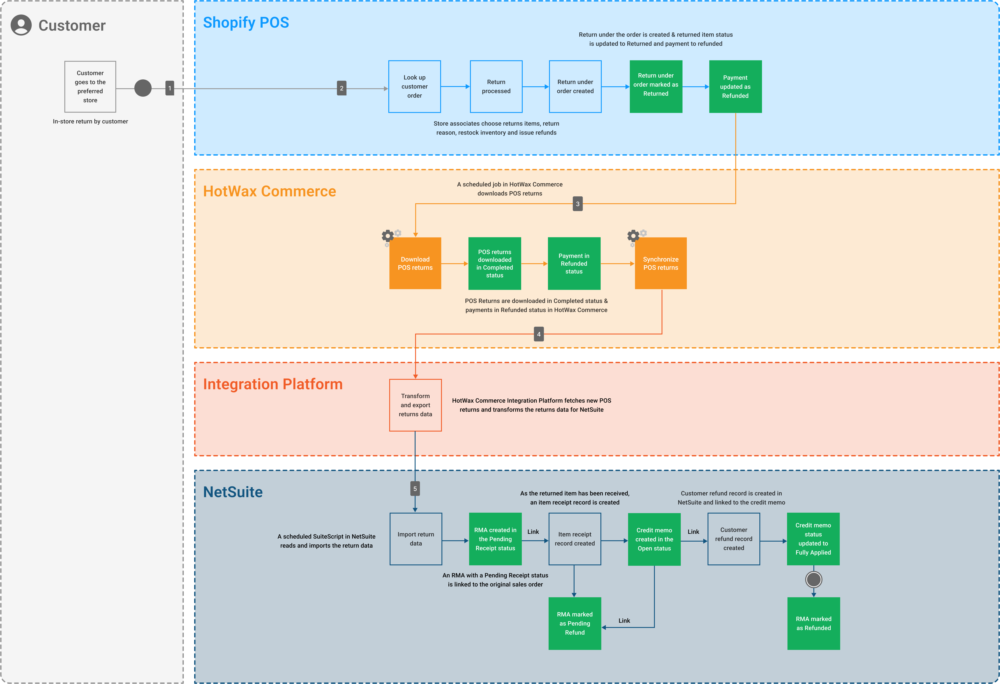

# In-Store Returns with Shopify POS

<figure><figcaption>
In-store returns lifecycle business process model
</figcaption></figure>

Many Shopify retailers allow customers to return items directly in stores using the Shopify POS App. Whether the item was purchased online or in person, store associates can easily look up the order, process the return, and issue a refund all within the app.

Once the return is completed, Shopify POS creates a return record and restocks the inventory. HotWax Order Management System syncs the return, updates inventory, then HotWax’s Integration Platform transforms the data, and syncs it to NetSuite for final processing. This ensures all systems stay in sync, and the return is reflected end-to-end, from store to backend systems.

## 1. In-Store Return by Customer

Customers visit their preferred store to return an in-store purchase or an online order.  The store associate looks up the order using the customer’s order ID. Once the order is found, the return is processed by:

* Selecting the item being returned
* Choosing the reason for return
* Issuing a refund to the customer

## 2. Returns Created in Shopify POS

Once the refund process is completed in Shopify POS, multiple actions take place:

* Returned inventory is restocked at the designated store location.
* A return under the order is created in Shopify POS with the returned item marked as <mark style="color:orange;">**“Returned”**</mark>, and the payment status is updated as <mark style="color:orange;">**“Refunded”**</mark>.

## 3. Import POS Returns in HotWax Commerce

HotWax OMS automatically downloads return data from Shopify at regular intervals. Once downloaded, the returned orders are marked as <mark style="color:orange;">**“Completed”**</mark> and with payment as <mark style="color:orange;">**“Refunded”**</mark> status.

HotWax Commerce also updates the inventory, restocking the returned item at the same store where it was received.

## 4. Transform and Export Returns Data

HotWax’s Integration Platform fetches POS returns data from HotWax Commerce OMS, transforms the data into a format compatible with NetSuite and exports it.

## 5. Import POS Returns in NetSuite

A scheduled SuiteScript in NetSuite automatically reads and downloads the returns data and takes the following steps:

* An RMA is created with <mark style="color:orange;">**"Pending Receipt"**</mark> status and linked to the original order.
* An Item Receipt record is created to confirm that the returned item has been received. This record is linked to the RMA, and the item is restocked at the same store where it was returned.
* Once the Item Receipt record is created, the RMA is automatically updated to <mark style="color:orange;">**"Pending Refund status"**</mark>.
* A Credit Memo is created in <mark style="color:orange;">**"Open"**</mark> status and linked to the RMA.
* A Customer Refund record is automatically created based on the refund method and linked to the Credit Memo.
* Once the Customer Refund record is created, the Credit Memo is updated from <mark style="color:orange;">**"Open"**</mark> to <mark style="color:orange;">**"Fully Applied"**</mark>, and the RMA status is updated from <mark style="color:orange;">**"Pending Refund"**</mark> to <mark style="color:orange;">**"Refunded"**</mark>.

This entire process, from receiving the returned item to issuing the refund, begins automatically as soon as a customer completes an in-store return.

HotWax ensures that all return data is synced to NetSuite, allowing everything from creating a return record to issuing a refund to happen smoothly and automatically. This also keeps financial records accurate and makes reconciliation easier.


When retailers record in-store purchases as cash sales in NetSuite, POS returns do not require an RMA. Instead, a Cash Refund record is created, and the inventory is automatically restocked at the store. However, if in-store purchases are recorded as sales orders in NetSuite, the return follows the full RMA process, just like web returns.

