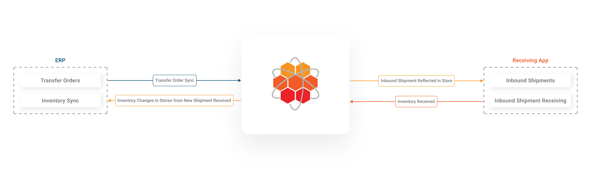
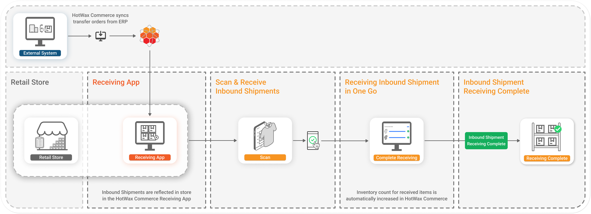
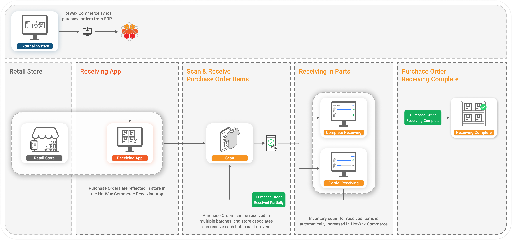
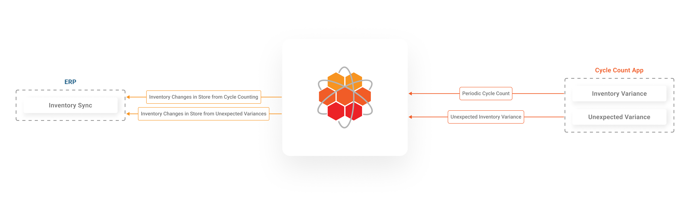
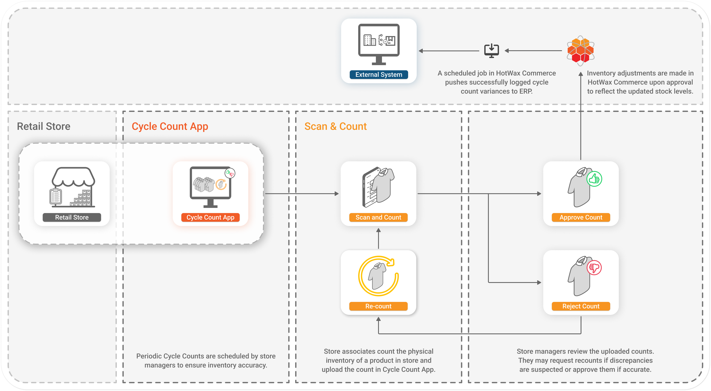

# Inventory Management

## Key Business Processes

The inventory management business process involves transferring inventory between locations, receiving new stock, performing regular cycle counts, and addressing unexpected inventory variances.

* **Inventory transfers:** Retailers move inventory between locations using transfer orders. This process helps balance stock levels across different stores and warehouses, optimizing product availability where it is needed most.
* **Receiving new inventory:** Retailers receive new inventory at their locations with respect to purchase orders and transfer orders. This step is vital for maintaining stock levels and ensuring that products are available for both in-store and online sales.
* **Cycle counting:** Periodic cycle counting at stores involves regularly performing inventory counting of products to ensure accuracy in stock records. This practice helps identify and correct discrepancies in inventory levels.
* **Handling inventory variances:** On a day-to-day basis, retailers encounter inventory variances due to factors such as theft, damage, or administrative errors. Identifying and resolving these variances is crucial for maintaining accurate inventory records.

Accurate inventory management is essential for preventing overselling and underselling on eCommerce platforms, when store inventory is also used for online orders. Keeping up-to-date record of inventory changes ensures that the inventory available for online sale matches the actual stock in stores.

## How Inventory Receiving Works

Both transfer orders and purchase orders are created in ERP systems, like NetSuite. Whenever any new transfer orders or purchase orders are created, they are imported into HotWax Commerce and automatically reflected in the Receiving App for in-store receiving.

### Receiving Transfer Orders in Stores

When there is a need to replenish inventory at retail stores, inventory planners create a warehouse-to-store transfer order in their ERP system. As items in the transfer orders are fulfilled from the warehouse, HotWax Commerce imports them and automatically creates inbound shipments for the corresponding items.

When the store associates verify the inbound shipments and receive them, inventory counts for the corresponding items are automatically increased in HotWax Commerce.

<figure><figcaption>
Transfer order sync
</figcaption></figure>

#### Creating Shipments in ERP

Many ERP systems, including NetSuite, let you create multiple outbound shipments for a transfer order, and each shipment can have multiple packages. In NetSuite, an outbound shipment is called item fulfillment.

#### Receiving Inbound Shipments in HotWax Commerce

Inbound shipments are created in HotWax Commerce with respect to each outbound shipment in the ERP or WMS. Inbound shipments in HotWax Commerce must be received in one go; partial receipt of shipments is not possible. This means that when an inbound shipment comprises multiple packages, all packages must be received together.

If a package is missing or delayed, associates cannot skip that package and receive another. The entire inbound shipment must still be received in one go.

Many retailers want to track each package and receive them independently.

One way to track this in HotWax Commerce is by creating multiple inbound shipments with respect to each package in the outbound shipment of the ERP/WMS. However, NetSuite does not track which items are in which package for each item fulfillment, meaning it is not possible to identify which package contains which items. Therefore, it is not possible to create inbound shipments with respect to packages in outbound shipments in the case of NetSuite.

If an ERP/WMS other than NetSuite tracks which items are in which package, those details can be used to create an inbound shipment for each package in HotWax Commerce. This way, each package can be tracked and received independently.

In the case of NetSuite ERP, we recommend creating one package for each shipment/item fulfillment. In the event where retailers need to ship three packages, they should create three shipments/item fulfillments, with each shipment having one package. This way, retailers can track and receive each package independently. If tracking individual packages is not a priority for retailers, multiple packages can be received as one shipment in HotWax Commerce.

Learn more about [transfer orders](/documents/store-operations/transfer-order/transfer-order-management.md)

<figure><figcaption>
Receiving inbound shipments using HotWax Receiving App
</figcaption></figure>

#### Handle Receiving of Unexpected Items in a Shipment

Often, mispicks or unexpected variations occur. When store associates identify items that were not expected to arrive, they can easily add the specific SKU to the shipment directly from the app. This ensures accurate record-keeping and helps maintain correct inventory levels. For example, if a shipment is supposed to contain 50 units of SKU101 but the shipment arrives with an additional 10 units of the SKU77, this extra SKU with items can be recorded in the app to update the inventory accurately.

#### Handle Over-Receiving and Under-Receiving

There can be scenarios where the items in a shipment are more or fewer than expected. In such cases, HotWax Commerce lets store associates adjust the quantities accordingly:

**Over-receiving:** If a shipment contains more items than ordered, store associates can receive the extra items, ensuring that inventory records reflect the actual stock on hand. For example, if a shipment was expected to contain 100 units but arrives with 110 units, the extra 10 units can be received and recorded.

**Under-receiving:** If a shipment contains fewer items than ordered, the app allows the receiving of only the items that arrived. For example, if a shipment was expected to contain 100 units but arrives with only 90 units, the app will record the received 90 units, and the missing 10 units can be addressed separately.

Learn more about additional scenarios supported in the [Receiving App](/documents/store-operations/receiving/README.md)

### Receiving Purchase Orders in Stores

In most scenarios, purchase orders are received at the warehouse location, and stock is transferred to stores using transfer orders. However, in cases where stores independently raise purchase orders without a warehouse intermediary, HotWax Commerce supports direct receiving at the store level.

<figure><figcaption>
Purchase order sync
</figcaption></figure>

**Receiving in Parts:** Purchase orders can be received in multiple parts or batches, allowing for flexibility in inventory receiving. For example, a purchase order for 200 units might arrive in two batches of 100 units each. Store associates can receive each batch as it arrives.

**Inbound Shipments:** Once a purchase order has been received, an inbound shipment is created in HotWax Commerce, and inventory counts for the received items are automatically updated.

<figure><figcaption>
Receiving purchase orders using HotWax Receiving App
</figcaption></figure>

All other features, such as receiving extra items or handling discrepancies, are also offered during the purchase order receiving process, just as they are with inbound shipments. The primary difference is that when you are receiving a purchase order instead of a shipment, you can receive it in parts, unlike shipments which must be received in one go.

### Directed Cycle Count

Retailers aiming for 98% to 99% inventory accuracy, regularly perform cycle counts at their locations to maintain up to date inventory records. Cycle counting is an important inventory management business process for these retailers and should be performed weekly or monthly, depending on the specific needs of the store.

HotWax Commerce provides a dedicated Cycle Count App for retailers that helps them create, assign, schedule and perform cycle counts. What differentiates the app is its role-based interface, operations teams use it to create, assign and review submitted counts, while store associates use it to scan and record item quantities during the count.

<figure><figcaption>
Cycle count sync
</figcaption></figure>

#### Creating & Assigning Cycle Count

Cycle counts are performed for multiple reasons. Many retailers have the SOP for scheduling cycle counts regularly every week or month. Counts are also commonly initiated after high-volume periods, such as Black Friday, to reconcile actual inventory with recorded levels. Stores reporting higher order rejections may be assigned counts to investigate potential inventory discrepancies.

Operations team leverages the Cycle Count App to create cycle counts. Once logged in, they access the admin view, where they can enter product details, add SKUs, and assign the count to a specific location.\
The app also provides a [bulk upload](/documents/retail-operations/inventory/cycle-count/bulk-upload-cycle-counts.md) feature to create and assign multiple cycle counts for different products across locations.

Once the cycle count is created and assigned, the store associates can start performing cycle count.

#### Performing Cycle Count

Store associates are responsible for carrying out the assigned cycle counts. In order to prevent inventory movement during the process, cycle counts are usually conducted either prior to the store opening or following closing hours.

To start the cycle count, associates log into the Cycle Count App. They see a different view than the admins, made specifically for them to perform the count. They scan items present in the count, and the app captures the scanned quantities.\
The app provides an optional view of the system-recorded inventory levels for reference. This view can also be disabled by admins to make sure that store associates submit counts without influence from existing data.\
Once the counting is complete, the associate submits the results for review.

<figure><figcaption>
Performing cycle count using HotWax Commerce Cycle Count App
</figcaption></figure>


Cycle counts should be performed after receiving the inventory reset from the ERP to ensure alignment with the most current inventory data.


#### Reviewing Cycle Count

The operations team reviews the submitted counts and can either approve, reject, or request a recount.\
Once approved, inventory adjustments are automatically applied in HotWax Commerce. For example:\
If a +5 variance is reported, inventory is increased by 5 units\
If a -5 variance is reported, inventory is decreased by 5 units

This automated adjustment process helps maintain accurate system inventory and reduces the need for manual reconciliation.

Learn more about [creating cycle count](/documents/retail-operations/inventory/cycle-count/draft-counts.md) and [performing cycle count](/documents/store-operations/inventory-count/directed-cycle-count.md).

By following these practices and using HotWax Commerce's intuitive apps, retailers can maintain high levels of inventory accuracy and streamline their inventory management processes.
