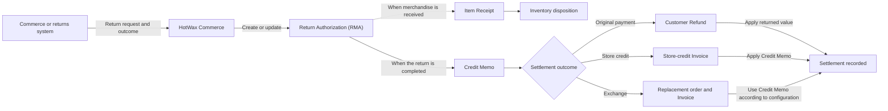
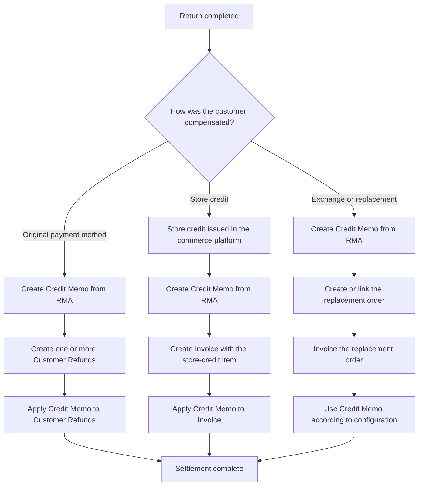
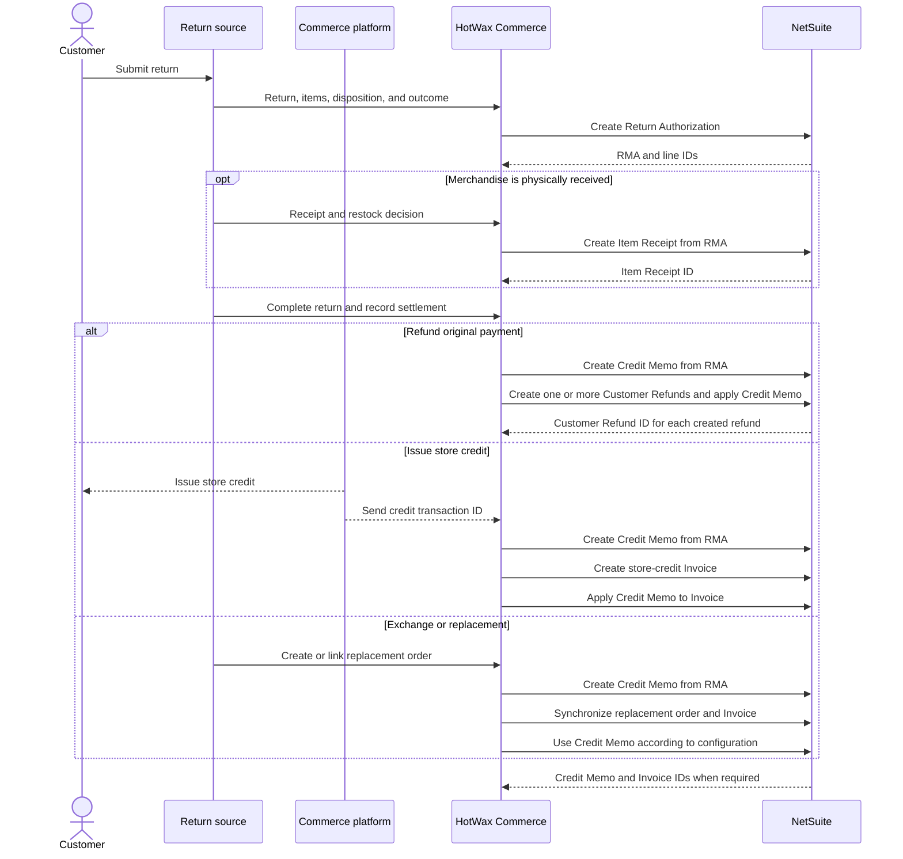

# Returns

When an implementation uses the RMA-based return cycle, HotWax Commerce converts a return into linked operational and financial records in NetSuite. The integration keeps three milestones separate:

1. Authorize the return
2. Record received inventory when merchandise comes back
3. Settle the customer value through a refund, store credit, or exchange

A return merchandise authorization (RMA) is represented by a NetSuite `Return Authorization`. Separating the RMA, inventory receipt, and financial settlement prevents inventory or accounting records from moving before the return is ready.


The exact jobs, transport, schedules, and mappings vary by implementation. This page describes the NetSuite record pattern used when a HotWax Commerce integration is configured to synchronize returns.


This page focuses on merchandise returns against NetSuite Sales Orders and Invoices that use the RMA cycle. Some implementations can post a direct `Credit Memo` and `Customer Refund` when no return authorization or physical receipt is required. Depending on the configured record flow, returns against Cash Sales can use a `Cash Refund` instead of the RMA, Credit Memo, and Customer Refund lifecycle.

## Understand the NetSuite record chain

The `Return Authorization` approves the return. The optional `Item Receipt` records the physical inventory movement. The `Credit Memo` records the returned value and is then settled according to the outcome.

## Meet the synchronization prerequisites

Before synchronizing a return, confirm that the integration can resolve:

* A stable source return ID
* The original HotWax order and return lines
* The NetSuite Sales Order and line IDs, when the original order is available
* The customer, subsidiary, location, department, item, tax, and payment mappings
* The expected inventory disposition for every return line
* The settlement method and amount
* A configured NetSuite item for store-credit posting, when store credit is supported

Returns and refunds may arrive as separate source events. The integration must use explicit return, refund, order, and line references rather than assume that every return contains a refund or that every refund contains a return.

For Shopify return intake, see [Import returns from Shopify](../../../learn-shopify/shopify-integration/order-return/import-returns-from-shopify.md).

## Synchronize the return lifecycle

### 1. Capture the return

HotWax Commerce receives the return from the commerce or returns system. The return record identifies:

* The source return and original order
* The returned items and quantities
* The customer
* The return status and completion date
* The restock or no-restock decision
* The receiving location
* The refund, store-credit, or exchange outcome

The return can remain in progress while merchandise is in transit or awaiting inspection. Financial settlement begins when the source return reaches its configured completion point and the settlement details are available.

### 2. Create the Return Authorization

When the original NetSuite Sales Order is available, the integration transforms that Sales Order into a `Return Authorization`. This preserves the relationship to the original customer, items, prices, taxes, and selling location.

For a blind return without an original order, the implementation can create a standalone `Return Authorization`. The return needs explicit customer, location, tax, and line mappings because NetSuite cannot inherit them from an original Sales Order.

HotWax Commerce saves the NetSuite RMA ID and line IDs before continuing. Retries reuse these identifiers instead of creating another RMA.

### 3. Record received merchandise

When merchandise is physically accepted, the integration transforms the RMA into an `Item Receipt` for the received quantities and destination location.

* Sellable merchandise moves into the configured sellable inventory location
* Damaged merchandise can move into a separate non-sellable location
* No-restock outcomes can skip the Item Receipt or use configured inventory adjustment logic
* Partial receipts leave the unresolved RMA quantities open

The RMA authorizes the return but does not move inventory by itself. The `Item Receipt` records the physical inventory movement.


A Credit Memo created from an RMA does not restock inventory. A standalone Credit Memo can affect inventory. Do not combine an Item Receipt with a standalone Credit Memo that restocks the same units unless that double movement is intentional.


The timing of receipt and settlement depends on the return policy. A return shipped to a warehouse may wait for receipt before completion. Merchandise already held by a store or a no-receipt outcome can become ready for settlement earlier.

### 4. Post the financial outcome

After the return is completed, the integration creates a `Credit Memo` for the returned value. The next record depends on how the customer was compensated.

The branches use the same returned value but represent different accounting events. A Customer Refund records money returned to the customer. A store-credit Invoice represents the issued credit through the configured store-credit item. An exchange Invoice records the new merchandise supplied to the customer.

## Refund the original payment method

For an original-payment refund, the integration:

1. Creates the `Credit Memo` from the RMA
2. Maps each refunded payment method to a NetSuite refund method
3. Creates one or more `Customer Refund` records for the refunded amounts
4. Applies the Credit Memo to the Customer Refund records

Saving a Customer Refund applies the Credit Memo. NetSuite returns every created Customer Refund ID, and HotWax Commerce must persist each one as a settlement checkpoint before acknowledging the settlement. Before retrying, verify those checkpoints in NetSuite instead of creating another refund blindly.

The Credit Memo moves from open to fully applied when the entire returned value has been refunded or applied elsewhere.

For split settlements, only the original-payment portion creates a Customer Refund. The remaining Credit Memo value can be applied to a store-credit or exchange Invoice.

## Post store credit

The customer-facing store credit is issued in the commerce platform. For example, a Shopify implementation issues store credit to the customer account and sends the issued amount and transaction reference to HotWax Commerce.

NetSuite mirrors the accounting impact without returning cash:

1. Create the `Credit Memo` from the RMA without a Customer Refund for the store-credit portion
2. Create a separate `Invoice` for the store-credit amount
3. Add the configured store-credit item to the Invoice
4. Apply the corresponding Credit Memo amount to the Invoice

The Invoice is the NetSuite accounting representation of the store credit issued in the commerce platform. Applying the Credit Memo balances the Invoice and fully applies that portion of the returned value.


The NetSuite Invoice does not issue customer-facing store credit. The commerce platform issues the credit once and sends its transaction reference to HotWax Commerce. NetSuite then records the financial posting. Reprocessing must reuse the recorded RMA, Credit Memo, and Invoice IDs so it does not create duplicate accounting records.


## Handle exchanges and replacements

An exchange or replacement creates a real new order. The return side still creates an RMA and Credit Memo. Depending on the implementation, the Credit Memo can be referenced by or applied to the Invoice for the new order. When the implementation applies the Credit Memo to the new Invoice:

* If the new order costs more, the customer pays the difference and the additional payment is posted separately
* If both values are equal, the Credit Memo can fully offset the new Invoice
* If the new order costs less, the remaining Credit Memo value is refunded or applied to a store-credit Invoice

See [Exchanges](../exchanges/README.md) for the full exchange lifecycle.

## Follow the end-to-end message flow

The transport can be event-driven, scheduled, file-based, or API-based. The business checkpoints remain the same even when the technical delivery method changes.

## Reconcile the lifecycle

HotWax Commerce tracks the NetSuite records required for each return:

| Checkpoint | NetSuite identifier |
| --- | --- |
| Return authorized | RMA ID |
| Merchandise received | Item Receipt ID |
| Returned value recorded | Credit Memo ID |
| Original-payment refund created | Customer Refund IDs |
| Store-credit Invoice created | Invoice ID |

A return is fully synchronized only when every record required for its outcome exists and the Credit Memo application is verified in NetSuite when required. An export attempt, queued request, or stored Invoice ID does not prove that the application succeeded.

Review these conditions during reconciliation:

* The RMA uses the correct customer and original Sales Order
* Item Receipt quantities and locations match the physical disposition
* The Credit Memo amount, tax, subsidiary, location, and department match the return
* Customer Refund records match only the amounts returned to payment methods
* The store-credit Invoice amount matches the customer-facing credit issued
* The Credit Memo and target Invoice use the same customer so NetSuite can apply them
* The Credit Memo application in NetSuite matches the required amount
* Before a retry creates another refund, verify every persisted Customer Refund ID in NetSuite

For the return feed contract, see [Returns financial feed](../../../integrate-with-hotwax/api/returns/returns-financial-feed.md).
