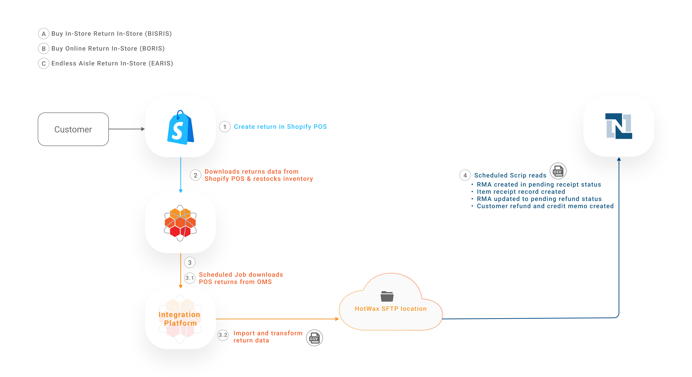

# Returns

In omnichannel retailing, retailers provide customers with the options for online returns as well as in-store returns.

## Web Returns with Loop

Customers can initiate online returns for both online and in-store purchases.

* **Buy Online Return Online (BORO)**: Customers initiate online returns for their eCommerce orders.
* **Buy In-Store Return Online (BISRO)**: Customers initiate online returns for their in-store purchases.
* **Endless Aisle Return Online (EARO)**: Customers initiate online returns for their in-store ordered items which they received home delivery for.

Retailers we work with use Shopify as their eCommerce platform, NetSuite as their ERP system, Loop as their RMS, and HotWax Commerce as their OMS. This returns management workflow involves downloading returns data, creating Return Merchandise Authorizations (RMAs), processing Item Receipt records, and creating Customer Refunds.

<figure><figcaption><p>Sync web returns to NetSuite</p></figcaption></figure>

Whenever an online return is processed in NetSuite through HotWax it follows these steps:

1. The In Progress return is posted to NetSuite as an RMA against the order the customer is returning
2. The RMA is received at the warehouse
3. The receipt confirmation is used to issue a refund to the customer

This document will break down exactly how HotWax integrates with NetSuite to help execute each of these steps.

#### 1. Export and Transform Returns Data from HotWax Integration Platform

A job in HotWax Commerce Integration Platform captures in progress returns from HotWax Commerce OMS or another online returns platform, like Loop, and places them at a designated SFTP location. This enables NetSuite to access and process the data for creating RMAs for further processing.

**SFTP Locations**

Example for Loop returns:

```
/home/{sftp-username}/netsuite/loop-return/create
```

#### 2. Import Returns Data in NetSuite

Every 15 minutes, a scheduled SuiteScript in NetSuite runs to check for new return files at the SFTP location.

If a new RMA JSON file is found, the NetSuite SuiteScript reads and processes the file. An RMA is then created in NetSuite and marked as **Pending Receipt.**

The newly created RMA is linked to the original sales order. This offers traceability and provides warehouse teams with advance notice that the order item will be returned.

**SuiteScript**

```
HC_SC_CreateLoopReturn.js
```

#### 3. Process and Export Item Receipts Records

After a few days, when the customer's returned item is physically received at the warehouse, the following actions take place:

* An Item Receipt record is created and linked to the RMA.
* Inventory is restocked, and the corresponding inventory count is increased in NetSuite.
* The RMA status updates from **Pending Receipt** to **Pending Refund**.

As soon as the Item Receipt record is created in NetSuite, a CSV file is generated containing Loop’s return ID for reference. This file is then placed at the designated SFTP location.

This step is important for completing the return process in Loop, let’s see how in the next steps.

**SuiteScript**

```
HC_MR_ExportLoopReturnProcess.js
```

**SFTP Locations**

```
/home/{sftp-username}/netsuite/loop-return/process-return
```

#### 7. Import Item Receipt Records

A job in HotWax Commerce Integration Platform runs every 5 minutes to check for new CSV files received at the SFTP location. If any new files are identified, the job extracts the Loop return IDs from the file and subsequently triggers the [“Process Return” API](https://docs.loopreturns.com/api-reference/latest/return-actions/process-return).

**SFTP Locations**

```
/home/{sftp-username}/netsuite/loop-return/process-return
```

#### 8. Close Returns in Loop

The Process Return API triggers multiple actions in Loop based on the fetched Loop return IDs:

* The RMA status is updated from **Open** to **Closed**.
* As soon as the RMA in Loop is marked as Closed, multiple actions take place:
  * If the customer opted to receive a refund on their original payment method, Loop triggers Shopify to process the refund.
  * If the customer selected "Return for Store Credit," Loop automatically issues a gift card to the customer for the corresponding amount.
  * If the customer selected "Exchange," Loop creates a new exchange order in Shopify.

#### 9. Process Refunds to Customers

Shopify processes the customer refund using the original payment method, updating the return status from **In-Progress** to **Returned** in Shopify. At the same time, Shopify syncs the refund details back to Loop.

#### 10. Fetch and Transform Refund Details

HotWax Commerce Integration Platform subscribes to Loop’s webhook to fetch and transform refund details.

**SFTP Locations**

```
/home/{sftp-username}/netsuite/loop-return/close
```

#### 11. Transform and Export Refund Details

A flow in HotWax Commerce Integration Platform transforms refund data. The JSON file is then placed at the SFTP location.

The file contains details about Loop return ID, Shopify order ID and the refund amount initiated to the customer.

#### 12. Import Refund Details in NetSuite

A SuiteScript in NetSuite imports the file from the SFTP location, processes the data and triggers multiple actions:

* A Credit Memo is created in Open status and linked to the RMA.
* A Customer Refund record is automatically created based on the refund method and linked to the Credit Memo.
* Once the Customer Refund record is created, the Credit Memo is updated from Open to Fully Applied, and the RMA is updated from Pending Refund to Refunded.

**SuiteScript**

```
HC_SC_CreateLoopReturnRefund.js
```

#### 13. Sync Completed Returns from Shopify

A job in HotWax Commerce syncs the newly created Completed returns from Shopify and marks them as Completed in HotWax.

**How is returned inventory restocked in HotWax Commerce?**

Inventory from returns received in the warehouse is synchronized to HotWax Commerce during its periodic inventory sync with NetSuite. HotWax then also syncs the updated inventory counts of the product to Shopify.

Loop also offers the option to restock inventory. However, HotWax recommends disabling this feature in Loop. The reason is that HotWax and NetSuite handle inventory tracking across all locations, while Shopify only maintains a consolidated inventory at its default location.

With this setup, after HotWax restocks the returned inventory from NetSuite during its periodic inventory sync, a corresponding job in HotWax automatically increases the product's inventory count at the default location in Shopify.

***

### Handling of Exchanges in NetSuite

When a customer opts for an exchange through Loop, a new exchange order is automatically created in Shopify once the return is closed in Loop. HotWax Commerce downloads these exchange orders from Shopify as regular orders and syncs them to NetSuite. Here's how different exchange scenarios are handled:

#### 1. When the exchange order total is less than the original order

* Loop automatically refunds the customer for the price difference and creates a new exchange order in Shopify.
* HotWax’s Integration Platform captures this refund data and processes it as discussed earlier, transforming it for NetSuite without additional steps.

#### 2. When the exchange is for an item of equal value

* The return and exchange data are transformed and synced to NetSuite, as previously discussed.
* No refund is issued to the customer because the funds from their return are applied to their exchange order.

#### 3. When the exchange is for an item of higher value (Upsell)

* Loop includes attribution in the Shopify order notes, indicating that the new exchange order involves an upsell.
* HotWax recognizes this attribution and processes the order accordingly.
* To post the additional payment, HotWax creates a Customer Deposit in NetSuite.

Suppose a customer initiates a return for a $100 item and chooses to exchange it for a $150 product. Loop processes the exchange, and Shopify records the new order with an additional $50 payment. The order notes include the upsell attribution. HotWax reads these notes, identifies the upsell, and generates a Customer Deposit for $50 in NetSuite, helping maintain accurate financial records.

***

### Handling Returns for Older Orders

Retailers' return policies can vary, ranging from one to several months. To accommodate future returns, HotWax imports historical orders from Shopify. However, some retailers accept returns for orders placed over a year ago. If a retailer starts using HotWax Commerce within that year and lacks historical orders in the OMS, here’s how HotWax handles such cases:

#### 1. Matching Shopify and NetSuite order IDs

* When return data is received from Loop, HotWax’s Integration Platform first checks the Shopify order ID in the OMS.
* If a corresponding NetSuite order ID is found, the return process proceeds without interruptions.
* The RMA is created in NetSuite and linked to the original sales order, maintaining consistency in data and workflows.

#### 2. Fetching older orders from NetSuite

* In some cases, older orders may not be imported into the OMS, but the corresponding records still exist in NetSuite.
* When no matching NetSuite order ID is found in the OMS, HotWax’s Integration Platform runs a search query in NetSuite using the Shopify order ID to locate the original sales order details.

    Once the original sales order is retrieved from NetSuite, the necessary return details are synced. This step helps ensure that even older orders, which might not have been part of the initial OMS setup, are accurately linked with the RMA and processed.

***

## POS Returns

Customers who live near a brick-and-mortar store or those who prefer to get instant refunds opt for returning their purchases directly in-store.

#### Scenarios where POS returns are accepted

* **Buy In-Store Return In-Store (BISRIS):** Customers return their in-store purchases to a nearby store location.
* **Buy Online Return In-Store (BORIS):** Customers directly return their online purchases to a nearby store location.
* **Endless Aisle Return In-Store (EARIS):** Customers return orders made through an endless aisle feature, such as items ordered in-store for home delivery, to a nearby store location.

Retailers we work with, use Shopify POS as their POS system, NetSuite as their ERP system, Loop as their RMS, and HotWax Commerce as their OMS. Some retailers initiate in-store returns using the Loop Returns POS App, while others opt to use their Shopify POS system. Let's see how these two approaches work:

## Synchronizing Shopify POS Returns to NetSuite 

<figure><figcaption><p>Sync POS returns to NetSuite using HotWax Commerce</p></figcaption></figure>

Shopify POS in-store returns sync to Credit Memo, and Customer Refunds.

#### 1. Transform and Export Returns Data

A scheduled job in the HotWax Commerce Integration Platform captures and transforms newly created POS returns. The transformed JSON file is placed at a designated SFTP location.

**SFTP Locations**

POS returns:

```
 /home/{sftp-username}/netsuite/pos-return
```

#### 2. Import POS Returns in NetSuite

A scheduled SuiteScript in NetSuite reads the JSON file from the SFTP location and triggers the following actions:

* A Credit Memo is created in Open status
* A Customer Refund record is automatically created based on the refund method and linked to the Credit Memo
* Once the Customer Refund record is created, the Credit Memo is marked as Fully Applied

Creating a Credit Memo also automatically restocks the inventory in NetSuite. This process helps in maintaining accurate GL accounting and posting, simplifying financial reconciliation.

**SuiteScript**

```
HC_SC_CreatePOSReturn.js
```

#### Handling of Multiple Scenarios

When returning an item, a customer can also opt to take the exchange item against it. The exchange item may be of higher value than the original item or may be of lesser value. Learn more about how HotWax Commerce handles exchanges on an order.

***

## Synchronizing Loop POS Returns to NetSuite 

<figure><figcaption><p>Sync POS returns to NetSuite using Loop</p></figcaption></figure>

Retailers use the Loop POS app alongside Shopify POS to handle in-store returns and exchanges. Once a return is processed in Loop POS, the data is synced to Shopify.

HotWax Commerce fetches this return data from Shopify, transforms it, and places it at a specific SFTP location. NetSuite then reads the file to create the Credit Memo and Customer Refund, while also restocking the returned inventory.

***
