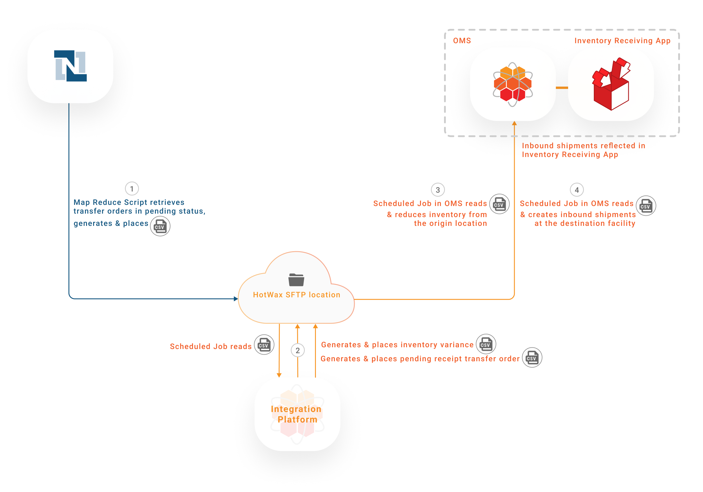
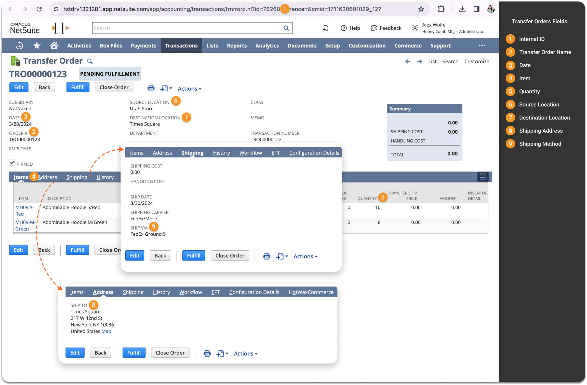
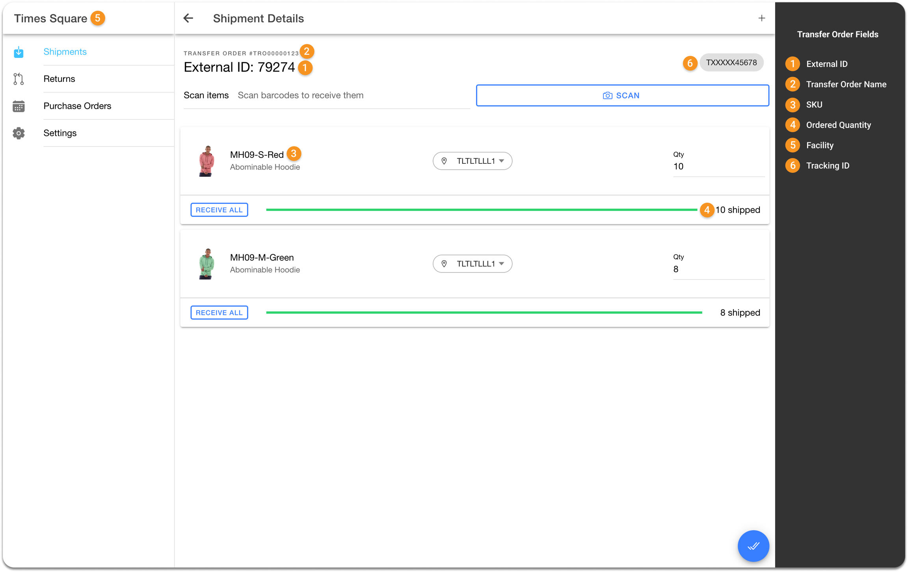
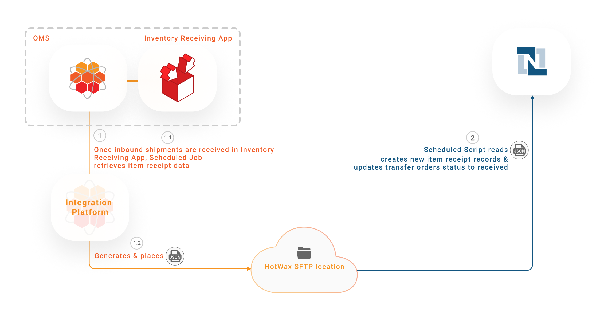

# Transfer Orders

Transfer orders are instrumental in the internal movement of inventory within an omnichannel retail environment. They are used to transfer inventory from warehouses to stores or between stores. This process is typically initiated when stores require additional inventory to meet customer demands. Retail merchandisers strategically plan inventory transfers, sourcing them either from centralized warehouses or from stores with an excess of stock that isn't selling.

Transfer Orders originate within NetSuite, but there is a distinction in how they are fulfilled. When a Transfer Order is initiated from a warehouse, NetSuite's fulfillment solution is employed to fulfill the Transfer Order, ensuring the correct allocation of inventory.

This scenario emphasizes the synchronization of transfer orders from NetSuite to HotWax Commerce for inventory receiving processes in physical stores. Once items are received, Item Receipt records are imported back into NetSuite to mark transfer orders as `Received`.

### Key Objectives

* Automate the synchronization of Transfer Orders from NetSuite to HotWax Commerce.
* Streamline the creation of Item Receipt records within HotWax Commerce when store associates receive inventory.
* Automate the update of Transfer Order statuses from "Pending Receipt" to "Received" in NetSuite after item receipt.

## Workflow

### Generate Transfer Orders in NetSuite

Transfer Orders are initiated within the NetSuite ERP system, facilitating the internal transfer of inventory from warehouses to stores or between stores.

<figure><figcaption><p>Transfer Order Sync from NetSuite to HotWax Commerce</p></figcaption></figure>

### Export Transfer Orders from NetSuite

1. A Map Reduce Script runs a specific Saved Search to identify Transfer Orders in "Pending" status within NetSuite. It compiles the relevant data into a JSON file, which is then securely placed in an SFTP location. The script runs periodically, typically every 15 minutes, so it fetches only the latest and pending Transfer Orders from NetSuite.

**SuiteScripts**

Generate Fulfilled Transfer Order file:

```
HC_MR_ExportedWHTOFulfillmentJson_v2.js
HC_MR_ExportedStoreTOFulfillmentJson_v2.js
```

### Import Transfer Orders into HotWax Commerce

2. A scheduled job within HotWax Commerce Integration Platform monitors the SFTP location, regularly checking for new Transfer Order JSON files. Upon identifying a new Transfer Order JSON file, the job processes the pending receipt transfer orders.
3. A scheduled job within HotWax Commerce OMS reads the pending receipt transfer orders JSON file and creates inbound shipments in the OMS at the destination facility.

**SFTP Locations**

NetSuite pending receipt Transfer Order files:

```
/home/{sftp-username}/netsuite/transferorderv2/import/fulfillment-wh
/home/{sftp-username}/netsuite/transferorderv2/import/fulfillment-store
```

Derived Origin Facility Inv Deduction:

```
/home/{sftp-username}/hotwax/InventoryDelta
/home/{sftp-username}/hotwax/InventoryDelta/archive
```

**Jobs in HotWax Commerce**

Import Pending Receipt Transfer Orders from SFTP:

```
Import fulfilled Transfer Orders from NetSuite
```

Import Inventory Deduction from Origin Facility from SFTP:

```
Add job name here
```

#### Here's how transfer order fields are mapped in NetSuite and HotWax Commerce

<table><thead><tr><th width="112">S.No.</th><th width="244.44856661045532">Fields in NetSuite</th><th>Fields in HotWax Commerce</th></tr></thead><tbody><tr><td>1</td><td>Order #</td><td>Shipment Attribute</td></tr><tr><td>2</td><td>Transfer Order Internal ID</td><td>External ID</td></tr><tr><td>3</td><td>Items</td><td>SKU</td></tr><tr><td>4</td><td>Quantity</td><td>Ordered Quantity</td></tr><tr><td>5</td><td>Destination Location</td><td>Facility</td></tr><tr><td>6</td><td>Tracking #</td><td>Tracking ID</td></tr></tbody></table>



<figure><figcaption><p>Transfer Order Fields Mapping in NetSuite</p></figcaption></figure>



<figure><figcaption><p>Inbound Shipment Fields Mapping in HotWax Commerce "Inventory Receiving App"</p></figcaption></figure>



#### Here's how transfer order fields are mapped in NetSuite and HotWax Commerce that remain hidden in the user interface but are included in the transfer order JSON file

<table><thead><tr><th width="112">S.No.</th><th width="217.44856661045532">Fields in NetSuite</th><th>Fields in HotWax Commerce</th></tr></thead><tbody><tr><td>1</td><td>Line ID</td><td>Shipment Item External ID</td></tr><tr><td>2</td><td>From Location</td><td>Shipment Destination Facility ID</td></tr><tr><td>3</td><td>Item Tag</td><td>Tags (hotwax-fulfilled)</td></tr></tbody></table>

### Receiving Inventory in the Store

Store associates use the HotWax Commerce Receiving App to receive transferred inventory. The user-friendly interface of this app simplifies receiving, even with minimal training.

<figure><figcaption><p>Item Receipts Sync from HotWax Commerce to NetSuite</p></figcaption></figure>

### Export Item Receipts from HotWax Commerce

1. Item Receipt records are created within HotWax Commerce when Transfer Orders are received. These records update inventory numbers and make sure that the available stock is accurately represented. To maintain a comprehensive record, a designated job within HotWax Commerce Integration Platform exports the Item Receipts created within the system. Each Item Receipt is mapped to the corresponding Transfer Order, supporting reconciliation and further processing. To facilitate the subsequent processing of this data, the JSON file is securely placed in an SFTP location, making it accessible for NetSuite.

**SFTP Locations**

Received Transfer Orders JSON

**SFTP Locations**

```
/home/{sftp-username}/hotwax/TransferOrdersReceipt
/home/{sftp-username}/hotwax/TransferOrdersReceipt/archive
```

Received Transfer Orders NetSuite JSON:

```
/home/{sftp-username}/netsuite/transferorderv2/export/receipt
```

### Import Item Receipts into NetSuite

2. In NetSuite, a scheduled SuiteScript reads this JSON file containing Item Receipt data from the SFTP location. It iterates through each record, creates new Item Receipt records, and updates inventory numbers within NetSuite. The script uses the N/Record module to update these records.

### Automated Transfer Order Status Update

The synchronization process extends to the automated status update of the associated Transfer Orders. Upon successful creation of Item Receipt records, the status of the Transfer Orders in NetSuite is automatically changed from "Pending" to "Received."

**SuiteScripts**

Import received Transfer Order file:

```
HC_SC_ImportTOFulfillmentReceipts_v2.js
```


The HC\_SC\_ImportTOFulfillmentReceipts\_v2 SuiteScript also generates a CSV file highlighting erroneous records found during processing and uploads the file to the SFTP server. Simultaneously, an email alert is automatically triggered to designated personnel, helping them quickly pinpoint the source of the issue and accelerating troubleshooting.



