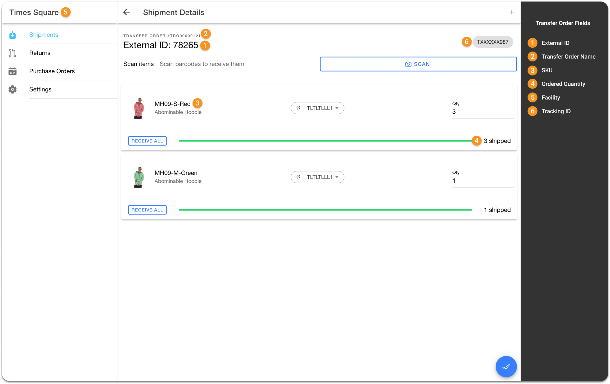

# Warehouse to Store

Transfer orders originate in NetSuite, but there is a distinction in how they are fulfilled. When a transfer order is initiated from a warehouse, NetSuite's fulfillment solution is employed to fulfill the transfer order, ensuring the correct allocation of inventory.

Now, let’s look at how warehouse to store transfer orders are processed:

Warehouse managers create transfer orders in NetSuite. On fulfilling transfer order items in NetSuite, corresponding item fulfillment records are generated and transfer orders are automatically assigned a `Pending Receipt` status in NetSuite.

Each transfer order can result in either a single item fulfillment record or multiple records, depending on the scenario:

* **Single item fulfillment record:** This happens when all products in a transfer order are fulfilled simultaneously, resulting in the creation of a single shipment and, consequently, a single item fulfillment record.
* **Multiple item fulfillment records:** This happens when products in a transfer order are fulfilled separately, leading to the creation of multiple shipments due to some products being shipped later and, consequently, multiple item fulfillment records.
* **Multiple item fulfillment records for a single product:** This happens when a transfer order is created for a single product, but its quantity is shipped in multiple shipments and, consequently, multiple item fulfillment records.

Whenever an item is fulfilled and the item fulfillment record is marked as `Shipped` in NetSuite, the inventory count for corresponding items is reduced in NetSuite. This also signifies that the items have been dispatched from the warehouse and are in transit to the store.

Inbound shipments are automatically created in HotWax Commerce so that the store can receive the transferred inventory. HotWax Commerce provides a dedicated Inventory Receiving App for store associates to receive in inventory stores. When the store associates verifies the inbound shipments and receives them, inventory counts for the corresponding items are automatically increased in HotWax Commerce.

Upon successful receipt of inventory, HotWax Commerce synchronizes item receipts with NetSuite. This ensures that the inventory count at store is accurately increased in NetSuite and the status of transfer orders status is updated from `Pending Receipt` to `Received`.

As mentioned earlier, in NetSuite, the inventory count for transfer order items shipped from the warehouse is reduced. It’s crucial to note that in HotWax Commerce, this reduction takes place during its daily inventory sync from NetSuite.

## Workflow

<figure><figcaption><p>Warehouse to store transfer order</p></figcaption></figure>

### Fulfilling Transfer Order Items

1. **Export Transfer Order Item Fulfillment Records from NetSuite:** A Map Reduce script runs a specific Saved Search to identify transfer order item fulfillment records in `Shipped` status, that have the source location as the warehouse and destination location set as the store. It compiles the relevant data into a CSV file, which is then securely placed in an SFTP location. The script runs periodically, typically every 15 minutes, to ensure it fetches only the latest shipped transfer order item fulfillment records from NetSuite, optimizing efficiency.

**SuiteScript**

Export Item Fulfillment Records to SFTP

```
HC_MR_ExportedWHTOFulfillmentCSV.js
```

**SFTP Location**

```
/home/{sftp-username}/netsuite/transferorder/fulfillment
```

2. **Import Transfer Order Item Fulfillment Records in HotWax Commerce:** A scheduled job in HotWax Commerce OMS reads the transfer order item fulfillment CSV file from the SFTP location and creates inbound shipments in the OMS at the destination facility.

**Job in HotWax Commerce**

Import Item Fulfillment Records from SFTP

```
Import Inbound Shipment
```

### Receiving Inventory in the Store

Store associates leverage HotWax Commerce Inventory Receiving App to receive transferred inventory. The user-friendly interface of this app ensures a smooth and efficient receiving process, even for users with minimal training.

Inbound shipments that have been created are automatically reflected in the Inventory Receiving App, allowing store associates to receive them in store. Upon receiving them, item receipt records are generated in HotWax Commerce. Subsequently, the inventory counts for the items received in the store are promptly increased in HotWax Commerce.

3. **Export Item Receipts from HotWax Commerce:** To maintain a comprehensive record and accurately update inventory count for items received at the store in NetSuite, a scheduled job in HotWax Commerce Integration Platform generates a JSON file with the item receipt records and securely places the file in an SFTP location, making it accessible for NetSuite.
4. **Import Item Receipts into NetSuite:** In NetSuite, a scheduled SuiteScript reads this JSON file containing item receipt records from the SFTP location. The script iterates through each record, creates new item receipt records, and updates inventory count in NetSuite. The script uses the versatile N/record module to ensure a smooth transition.

**Job in HotWax Commerce**

Export Item Receipts to SFTP

```
generate_TransferOrderShipmentsReceiptFeed
```

**SFTP Location**

```
/home/{sftp-username}/netsuite/transferorder/receipt
```

**SuiteScript**

Import Item Receipts from SFTP

```
HC_SC_ImportTOFulfillmentReceipts.js
```

### Automated Transfer Order Status Update

Once all the transfer order item fulfillment records have been successfully received in-store and their item receipt records have been synchronized with NetSuite, the transfer order status is updated from `Pending Receipt` to `Received`.

**Here's how transfer order fields are mapped in NetSuite and HotWax Commerce**

<table data-full-width="false"><thead><tr><th width="157">S.No.</th><th>Fields in NetSuite</th><th>Fields in HotWax Commerce</th></tr></thead><tbody><tr><td>1</td><td>Item Fulfillment Internal ID</td><td>External ID</td></tr><tr><td>2</td><td>Transfer Order Name</td><td>Transfer Order Name</td></tr><tr><td>3</td><td>Items</td><td>SKU</td></tr><tr><td>4</td><td>Quantity</td><td>Ordered Quantity</td></tr><tr><td>5</td><td>Destination Location</td><td>Facility</td></tr><tr><td>6</td><td>Tracking #</td><td>Tracking ID</td></tr></tbody></table>



<figure><figcaption><p>Transfer Order Fields Mapping in NetSuite</p></figcaption></figure>



<figure><figcaption><p>Inbound Shipment Fields Mapping in HotWax Commerce "Inventory Receiving App"</p></figcaption></figure>



<details>

<summary>Let's delve into the process with an example</summary>

Consider a scenario where a retailer operates a store named Brooklyn, alongside a central warehouse. The Brooklyn store is experiencing low stock levels for a particular product, so the store manager requests a transfer of 100 quantities from the central warehouse. In this event, a warehouse-to-store transfer order is created for 100 quantities in NetSuite.

It's possible that the warehouse manager ships these quantities in multiple shipments. For example, 60 quantities might be picked, packed, and shipped initially, with the remaining 40 scheduled for shipment at a later time. In this setup, a transfer order for 100 quantities will have two item fulfillment records created in NetSuite. The first record reflects the fulfillment of 60 quantities, marked with a `Shipped` status, indicating their dispatch from the warehouse. The second record represents the remaining 40 quantities.

Following this, a Map Reduce script generates a CSV file containing details of the item fulfillment record for the initial 60 quantities and places it at an SFTP location.

A scheduled job in HotWax Commerce OMS reads this CSV file and creates an inbound shipment at the Brooklyn store location. Store associates use Inventory Receiving App to initiate in-store receiving against this shipment. Upon receiving, item receipt records are generated in HotWax Commerce, increasing the product inventory by 60 quantities at the Brooklyn store location. Subsequently, HotWax Commerce then synchronizes these item receipt records to NetSuite to accurately update the inventory count in NetSuite as well.

Once the second item fulfillment record is fulfilled in NetSuite and shipped from the central warehouse, the Map Reduce script again creates a CSV file containing details of the item final fulfillment record for the remaining 40 quantities and places it at an SFTP location.

A scheduled job in HotWax Commerce OMS reads this CSV file and creates another inbound shipment at the Brooklyn store location. Upon receiving, item receipt records are generated in HotWax Commerce, increasing the product inventory by 40 quantities at the Brooklyn store location. Subsequently, these item receipt records are synchronized to NetSuite, marking the completion of the transfer order in NetSuite, updating inventory counts and updating transfer order status from `Pending Receipt` to `Received`.

</details>



