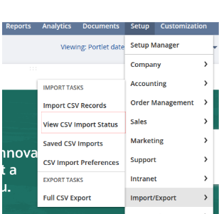
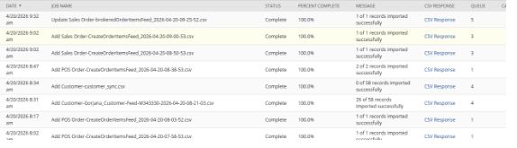
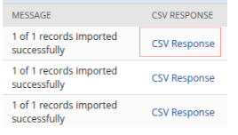
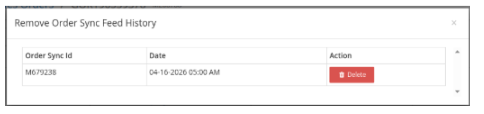

# NetSuite order import error logs

## Objective
The objective of this document is to help users identify and resolve cases where an order sent from HotWax Commerce Order Management System (OMS) does not get created in NetSuite. This guide enables users to verify the root cause by reviewing NetSuite import logs and taking appropriate actions.

## What This Document Addresses

This document addresses scenarios where:

- An order is sent from OMS but is not visible in NetSuite.
- The order sync feed history is present and the order appears successful in OMS but fails during processing in NetSuite.
- Users need to check NetSuite logs to identify the reason for failure.

## Resolution Steps

### Step 1: Navigate to CSV import status

Log in to NetSuite and navigate to:

`Setup` → `Import/Export` → `View CSV Import Status`

<figure><figcaption></figcaption></figure>

This page displays all CSV imports processed in NetSuite, including orders received from OMS.

<figure><figcaption></figcaption></figure>

### Step 2: Identify the relevant import file

Locate the file corresponding to your order by:

- Matching the file name with the one available in SFTP.
- Filtering based on the order date and time.
- Identifying files processed around the time when the order was expected to sync

### Step 3: Review import status

Each import file will display a processing status such as:

- “1 of 1 records imported successfully.”
- “26 of 58 records imported successfully.”
- “32 of 32 records imported successfully.”

Focus on files where records are either partially processed or failed, as these indicate issues during import.

### Step 4: Open CSV response

Click the `CSV Response` link corresponding to the selected file.

<figure><figcaption></figcaption></figure>

This opens a detailed response showing errors encountered during the import process.

### Step 5: Analyze the Error Message

Review the error message carefully. The response typically includes a clear description of the issue or the specific field causing the error.

#### Common types of errors include:
- Invalid customer reference.
- Invalid location reference.
- Invalid item reference.

### Step 6: Correct the issue in OMS
Based on the error identified:
- Update the required data in OMS, such as the NetSuite Internal Customer ID or product information.
- Check that all fields are correctly updated.

### Step 7: Reprocess the order
After making the necessary corrections:
- Navigate to the order details page in OMS.
- Delete the existing `Order Sync Feed History`.
  
  <figure><figcaption></figcaption></figure>

- This allows the order to be picked up again and sends the corrected data to NetSuite.

