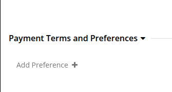

# Missing Customer Deposit in NetSuite

## Objective
The objective of this document is to help users identify and resolve cases where Customer Deposits are not created in NetSuite for orders processed through OMS. This guide outlines the end-to-end flow and provides steps to resolve issues related to this.

## Context
A Customer Deposit in NetSuite is created only when:

- A valid payment transaction exists in OMS
- That payment is successfully exported and processed in NetSuite

## Customer Deposit Creation Flow

1. An order is created.
2. A payment transaction is created for the order and recorded in OMS as an Order Payment Preference (OPP).
3. OMS syncs the payment transaction to NetSuite.
4. NetSuite processes the payment transaction and creates a **Customer Deposit** against the order.

> If the Customer Deposit is not present in NetSuite, one of the above steps may have failed. Verify each step in the flow to identify where the process was interrupted.

## Step 1: Verify Whether the Order Has Synced with NetSuite
Before investigating Customer Deposit generation, first confirm that the order has successfully synced with NetSuite. Only orders that have been synced are eligible for Customer Deposit creation.

### Steps
1. Navigate to HotWax Commerce.
2. Open the Order Details page for the order you want to verify.
3. Under the Order Identification section, check whether the NetSuite Internal ID is present.

If the NetSuite Internal ID is present, the order has successfully synced with NetSuite and is eligible for Customer Deposit generation.
If the NetSuite Internal ID is not present, the order is not eligible for Customer Deposit generation. You should now refer to the **NetSuite Troubleshooting Guide** for more information.

> **Note:** After an order has synced with NetSuite, allow up to **2 hours** for the Customer Deposit to be generated. If less than 2 hours have elapsed since the sync, wait until the 2-hour window has passed before proceeding. If the Customer Deposit is still not available after 2 hours, proceed with the verification steps below.

### Step 2: Verify Payment in OMS
- Now you must verify the payment details in both Shopify and HotWax.

_**Case 1: No Payment Transactions Present**_

This means there is no payment recorded in OMS. Since Customer Deposit creation depends on payment, NetSuite will not create any deposit.

  <figure>
    
  </figure>

This might happen if the payment is not captured from Shopify or not present on Shopify or any payment integration issue.

_**Case 2: No Payment Transactions Present in Shopify**_

Check the payment information on Shopify. If no payment transaction is present in Shopify, no payment information will be synced to HotWax. As a result, the Customer Deposit will not be created.

To view payment transaction on shopify, follow the steps below:

_**Steps:**_

1. Log in to the Shopify Admin panel.
2. Navigate to **Orders**.
3. Open the order you want to investigate.
4. Scroll to the **Timeline** section at the bottom of the order details page.
5. Review the timeline entries for payment-related events.

**If:**
The payment information is present on Shopify but it not present in OMS.

**Resolution:**

- Contact the support team and thay will re-run the payment-related service to bring the payment information from Shopify.
- After a valid transaction is present, the scheduled job will be run that will create the customer deposit.

_**Case 3: Payment Exists but Order is Partially Paid**_

For orders where a partial payment is recorded in OMS, In such a case as well, deposit may not be created.

  <figure>
    
  </figure>

  <figure>
    
  </figure>

**Resolution:**

- Compare Order Total vs Payment Total from the Order Detail Page.
- Ensure full payment is captured and reflected in OMS
- If the payment information is missing or incorrect, please contact the support team so the payment transactions can be reprocessed correctly.

### Step 3: To verify if the Customer Deposit is created or not
- Search for the order in NetSuite and open the Sales Order.
- Navigate to the Related Records tab.
- Confirm whether:
    - A Customer Deposit exists

  <figure>
    
  </figure>

