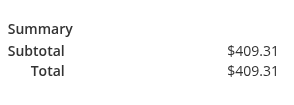
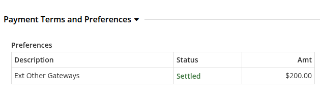
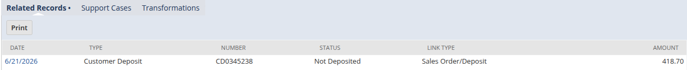

# Missing customer deposit in NetSuite

Use this guide when an order exists in NetSuite but its customer deposit is
missing. First confirm that the order was created in NetSuite, then trace the
payment and customer deposit jobs.

## How customer deposits are created

1. OMS creates the order in NetSuite and receives the NetSuite internal ID.
2. OMS records the payment as an Order Payment Preference (OPP).
3. The Moqui `generate_CustomerDepositFeed` job exports the eligible payment.
4. The configured NetSuite customer deposit job processes the feed and creates
   the customer deposit.

## 1. Confirm that the order exists in NetSuite

Open the order in Order Manager and check the **Order Identification** section
for the NetSuite internal ID.

- If the NetSuite internal ID is present, continue to the payment checks.
- If the NetSuite internal ID is missing, the whole order has not been created
  in NetSuite. Follow [Orders not syncing with NetSuite](order-do-not-sync.md)
  before troubleshooting the customer deposit.

> A partial payment blocks creation of the order in NetSuite; it is not only a
> customer deposit issue. Resolve the payment and sync the order first.

## 2. Verify the payment in OMS

On the Order Details page, compare the **Order Total** with the total in
**Payment Terms and Preferences**.

### No payment is recorded

If no Order Payment Preference is present, OMS has no payment to export.

  <figure>
    
  </figure>

Check the order timeline in Shopify for a payment event:

1. In Shopify Admin, open **Orders** and select the order.
2. Review payment events in the order timeline.
3. If Shopify contains the payment but OMS does not, run the configured order
   update import or ask the support team to reprocess the payment data.
4. Confirm that an Order Payment Preference is created in OMS.

### The order is partially paid

The payment total must equal the order total before the order can be created in
NetSuite.

  <figure>
    
  </figure>

  <figure>
    
  </figure>

Capture or correct the remaining payment and confirm that OMS reflects the full
amount. Then create the order in NetSuite before continuing with the deposit.

## 3. Run both customer deposit job layers

In the Job Manager app, open **NetSuite** and run or verify both stages:

1. Run the Moqui `generate_CustomerDepositFeed` job to generate the customer
   deposit feed.
2. Run the configured NetSuite job that consumes the feed:
   `HC_MR_CreateCustomerDeposit` or `HC_SC_CreateCustomerDepositAndRefund`.
3. Check the last run status for errors before retrying.

The Moqui feed job and the NetSuite processing job are separate. Running only
one of them does not complete the customer deposit flow.

## 4. Verify the customer deposit in NetSuite

1. Search for the order in NetSuite and open the Sales Order.
2. Open the **Related Records** tab.
3. Confirm that a Customer Deposit is listed.

  <figure>
    
  </figure>

If the deposit remains missing, check the customer deposit job error and
response files for the affected order before retrying the jobs.
