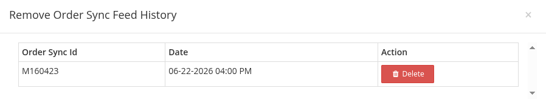
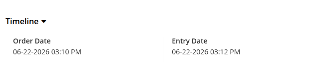
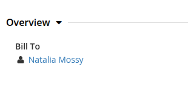
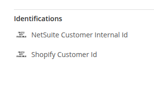
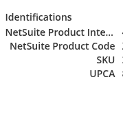
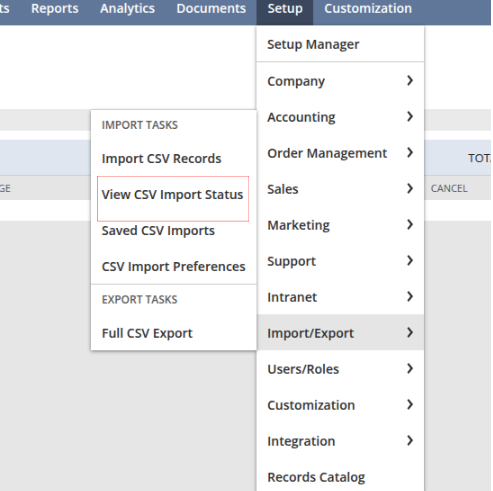
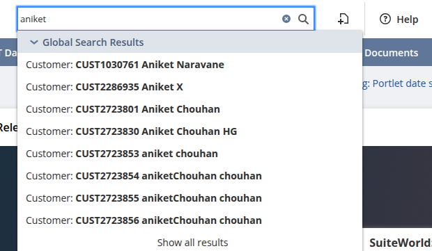

# Order Not Synced to NetSuite

## Objective
The objective of this document is to help users identify and resolve cases where an order from HotWax is not synced to NetSuite. This guide provides an approach to troubleshoot issues across HotWax, SFTP, and NetSuite.

## Troubleshooting Steps

### Step 1: Check Order Sync Feed History

- Go to the OMS and search for your order.
- Navigate to the View Order Details Page and click the icon next to the External ID to view the Order Sync Feed History.

  <figure>
    

#### Two possible scenarios:
- Order Sync Feed History NOT created
- Order Sync Feed History created (covered later)
  
### Scenario 1: Order Sync Feed History NOT Created
This means the order has not yet been picked up by the feed job yet.

### Step 2: Check Order Creation Time
- Go to View Order Details Page
- Check the Order Entry Date

  <figure>
    
  </figure>

As Orders can take up to ~2 hours to sync to NetSuite you can wait if the order is recent. i.e.
- Wait for the scheduled job to process the order.
- No manual action required.

### Step 3: If the Order is Old (Still Not Synced)
- If the order is older and still not synced, verify required data in OMS.

_**1. Validate Customer Information**_
- Open your order, in the View Order Details page, Go to Bill To Customer
  

  <figure>
    
  </figure>

- Open View Party Page.

- Check customer Identifications and verify if NetSuite Customer Internal ID is present

  <figure>
    
  </figure>

- If missing, the order will NOT sync to NetSuite.

_**Action:**_
- Go to NetSuite, search for the customer using email ID or valid phone number.
- Check the generated link and you will find the Netsuite Customer Internal Id for the customer.
- To add this in OMS, navigate back to customer Identifications click on the “pencil” icon to add the required Id.

_**2. Validate Product Information**_
- Go to Order Items
- Open each product via View Product Page and check NetSuite Product Internal ID exists in Identifications

  <figure>
    
  </figure>

- If missing, the order will NOT sync to NetSuite.

_**Action:**_
- Add the correct NetSuite Product Internal ID after verifying it on Netsuite.

_**3. Validate Payment Information**_
- Check on View Order Details Page  if Payment records are present and Payment is complete and not partial.
- Missing or incorrect payment data can prevent syncing.
- You can add the required payment from the Order Detail Page.

<figure><figcaption></figcaption></figure>

_**If:**_
- Customer ID is present
- Product ID is present
- Payment looks correct , but the order is still not synced:

**Next Step:**
Check job execution.

### Step 4: Verify Job Execution
- If the order appears eligible for syncing to NetSuite but is still not processed, the next step is to verify whether the required jobs are running correctly.

**Check the following:**

- Ensure the relevant jobs are enabled and scheduled, to verify this :
    - Navigate to the Job Manager App.
    - Under the tab Order, scroll down to "NetSuite". You will find jobs (HC_MR_ExportedSalesOrderCSV, HC_MR_ExportedCashSaleCSV) to export sales order on NetSuite.
- Verify that the jobs are executing successfully and not failing.
- If any of these conditions are not met, the job may not process the order, even if all order data is correct.

### Scenario 2: Order Sync Feed History is Present
This means OMS attempted to sync the order, but it may have failed or is still processing.

### Step 7: Check Order Import logs in NetSuite
If all data in OMS looks correct and the job is running correctly but the order is still not synced, the next step is to verify the order processing in NetSuite.

- Go to NetSuite
- Global Search your order using Shopify Order Number
- If Order is Found in NetSuite:
   - Sync is successful
   - It may take 15–20 minutes to reflect back in OMS
**Action:** Wait and refresh

If Order is NOT Found in NetSuite:
- Order was sent but failed on NetSuite side

### Step 9: Check CSV Import Status in NetSuite
Navigate in NetSuite:
`Setup → Import/Export → View CSV Import Status`

  <figure>
    
  </figure>

### Step 10: Identify Failed Records
- Under the message column, you will see statuses like:

<figure></figure>

- “5 of 5 records processed successfully”
- “4 of 5 records processed successfully”
- “0 of 1 records processed successfully”

- You need to look for files with partial or failed records or you can filter using Order Date.
- Once you find the file with your order details, click on CSV Response
- This will open a detailed response showing errors encountered during the import process.

_**Common NetSuite CSV Errors**_

**1. Invalid Entity Reference Key**

Error as seen in NetSuite:

`Invalid entity reference key 5550381`

This error indicates that NetSuite is unable to find the customer associated with the order using the provided internal ID.

**Why this happens:**
- The customer does not exist in NetSuite
- The NetSuite Customer Internal ID in OMS is incorrect
- The ID stored in OMS does not match the actual NetSuite record
- The customer might have been merged as a duplicate in NetSuite

**How to resolve:**
- Search for the customer directly in NetSuite using either the email ID or phone number

  <figure>
    
  </figure>

- Once you open the customer record in NetSuite, check the URL. At the end of the URL, you will find the internal ID of the customer
 

  <figure>
    
  </figure>

- Also, you can check NetSuite logs for entries like "merged with duplicates"
- From these logs, you can identify the correct (active) customer internal ID
- Use this updated ID in OMS to fix the reference 
- Now go back to OMS and open the order. Navigate to the Bill To Customer section and open the customer (View Party page)
- Locate the field where the NetSuite Customer Internal ID is stored and, add the Netsuite Internal Id in your OMS.

**2. Invalid Location Reference Key**

Error as seen in NetSuite:
`Invalid location reference key 443`

This means that NetSuite is unable to identify the location being sent with the order.

**Why this happens:**
- Location does not exist in NetSuite
- Location is inactive in NetSuite
- Mapping between OMS and NetSuite is incorrect

**How to resolve:**
- Check the location assigned to the order (typically at the order item level) in OMS.
- Then verify in NetSuite whether a location with that internal ID exists and is active.
- To view whether or not locations is inactive, navigate to NetSuite → Setup → Company → Locations → Search
- Click to view the desired location.
- Check whether the “Location is Inactive” checkbox is checked or not and correct it accordingly.

  <figure>
    
  </figure>

- If the location does not exist, create it in NetSuite
- If the mapping is incorrect, update the correct internal ID in OMS

**3. Invalid Location Reference Key for Subsidiary**
Error as seen in NetSuite:
`Invalid location reference key 443 for subsidiary 1`

This means that location exists in NetSuite, but it is not associated with the subsidiary used for the order.

**Why this happens:**
- The location belongs to a different subsidiary
- The order is being created under one subsidiary, while the location belongs to another
- Incorrect mapping between OMS and NetSuite

This issue is commonly seen in cases where the order creation location is different from the order fulfillment location
Since locations can be tied to different subsidiaries in NetSuite, this mismatch can lead to a cross-subsidiary issue

**How to resolve:**
Open the failed order in HotWax Commerce and identify:
- Order creation location (facility) from the Order Detail Page under Bill From section.
- Fulfillment / shipping location from the Order Detail Page under Ship From section.

**Verify Location in NetSuite**
- Search for the location in NetSuite using Global Search
- Open the location record

**Verify:**
   - Location exists
   - Location is mapped to the same subsidiary as the order
To resolve this, we need to communicate with the client and have them update the location in the appropriate place.

**Retry Sync**
- Delete the failed sync record
- Allow the order to sync again via the scheduled job

**4. Invalid Item Reference Key**
Error as seen in NetSuite:
`Invalid item reference key 12345`

This means that the product being sent from OMS does not exist in NetSuite or has an incorrect internal ID.

**How to resolve:**
Verify the NetSuite Product Internal ID in OMS and match it with the item’s Id in NetSuite. Ensure the item exists and is active.

### Step 12: Bring the Updates
Once an order is picked up by the integration job, an Order Sync Feed History record is created in OMS.

This record indicates that:

- The order has already been processed for sync
- The system will not automatically pick it up again, even if you make corrections
- Because of this, the corrected order will not be resent to NetSuite unless this history is reset.

To resolve this : 

After making all necessary corrections to the order, you must:
- Go to the Order Sync Feed History for that order from the Order Detail Page.
- Identify the existing feed history record.
- Remove or delete the existing Order Sync Feed History.

Once the feed history is removed:

- The system will treat the order as not yet processed and when the sync job runs again, the order will be picked up again, a new file will be generated and sent to NetSuite.
- The order will now sync based on the corrected data

