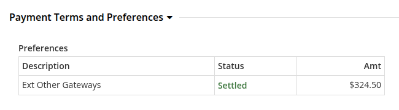
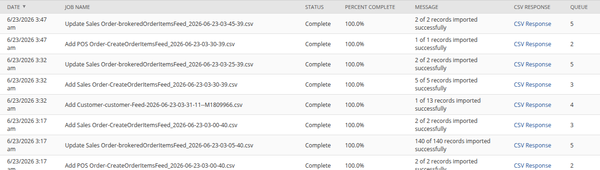
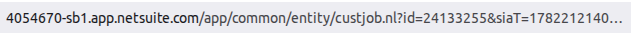
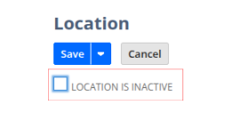

# Orders not syncing with NetSuite

Use this guide when an OMS order has not been created in NetSuite. Trace the
order through the OMS eligibility checks, the Moqui feed job, and the NetSuite
import and acknowledgement jobs to find the failed stage.

## 1. Check the order sync feed history

1. In Order Manager, search for the order and open its Order Details page.
2. Select the icon next to the External ID to open the **Order Sync Feed
   History**.

  <figure>
    
  </figure>

- If no history record exists, the Moqui order feed has not picked up the order.
  Continue with the eligibility and job checks below.
- If a history record exists, OMS generated a feed for the order. Continue with
  the NetSuite import status checks.

## 2. Check the order age

Review the Order Entry Date on the Order Details page.

  <figure>
    
  </figure>

Allow the configured Moqui and NetSuite job cycles to finish. Under the standard
schedule, the full flow can take up to two hours. Continue troubleshooting if an
older order is still missing.

## 3. Validate the order data

An ineligible order will not be included in the Moqui order feed.

### Check the NetSuite customer ID

1. On the Order Details page, select the customer in the **Bill To** section.

  <figure>
    
  </figure>

2. On the customer page, confirm that **NetSuite Customer Internal ID** is
   present in **Identifications**.

  <figure>
    
  </figure>

3. If the ID is missing, find the customer in NetSuite by email address or phone
   number. Copy the internal ID from the customer record URL and add it to the
   customer identification in OMS.
4. Remove unsupported special characters from the customer name or email address
   when the NetSuite import response identifies them as the failure.

### Check the NetSuite product IDs

Open every item from the order and confirm that **NetSuite Product Internal ID**
is present in the product **Identifications** section. Add the verified NetSuite
item ID when it is missing.

  <figure>
    
  </figure>

### Check the payment

On the Order Details page, verify that an Order Payment Preference exists and
that the payment total equals the order total.

  <figure>
    
  </figure>

A missing or partial payment prevents the whole order from being created in
NetSuite. It is not only a customer deposit issue.

- If Shopify contains the payment but OMS does not, run the
  [Import Order Updates from Shopify](https://docs.hotwax.co/documents/v/retail-operations/workflow/job-workflows/orders#import-order-updates-from-shopify)
  job or add the verified payment preference in OMS.
- If the payment is missing in Shopify, correct it in Shopify before importing
  the update into OMS.

### Check required order attributes

Confirm that all required Shopify metafields are present in the OMS order
attributes. If an attribute is missing, follow
[Order Attribute is Missing](https://docs.hotwax.co/documents/v/retail-operations/orders/order-management/troubleshooting/orderattributemissing)
and correct the attribute before retrying the order.

## 4. Run both order sync job layers

In Job Manager, open **Orders** > **NetSuite**. Verify that the Moqui feed job
and the corresponding NetSuite jobs are enabled and completing successfully.
Run both layers when manually retrying an order.

### Standard sales orders

1. Run `generate_CreateOrderFeed` in Moqui to create the outbound order feed.
2. Run `HC_importSalesOrders` to import the feed and create the Sales Order in
   NetSuite.
3. Run `HC_MR_ExportedSalesOrderCSV` to export the NetSuite result so OMS can
   record the NetSuite internal ID.

### POS cash sales

1. Run `generate_CreateOrderFeed_pos` in Moqui to create the outbound POS feed.
2. Run `HC_SC_ImportCashSale` to import the feed and create the Cash Sale in
   NetSuite.
3. Run `HC_MR_ExportedCashSaleCSV` to export the NetSuite result to OMS.

The export jobs are not the wrong jobs; they are the acknowledgement stage. The
Moqui feed job and the NetSuite import job must also run for the order to be
created.

## 5. Check the order in NetSuite

Search NetSuite using the Shopify order number.

- If the order is present, allow the acknowledgement job to add the NetSuite
  internal ID in OMS. Under the standard schedule, this can take 15 to 20
  minutes.
- If the order is not present and the OMS feed history exists, inspect the
  NetSuite CSV import response.

## 6. Check the NetSuite CSV import status

In NetSuite, go to **Setup** > **Import/Export** > **View CSV Import Status**.

  <figure>
    
  </figure>

Find the import file by order date and look for partial or failed results, such
as `4 of 5 records processed successfully` or `0 of 1 records processed
successfully`. Open **CSV Response** to see the error for the failed order.

  <figure>
    
  </figure>

## 7. Resolve common NetSuite import errors

### Invalid entity reference key

This error means NetSuite cannot find the customer using the ID sent by OMS.
The customer may be missing, inactive, merged, or mapped to an incorrect ID.

1. Search for the customer in NetSuite by email address or phone number.

  <figure>
    
  </figure>

2. Open the active customer record and copy its internal ID from the URL.

  <figure>
    
  </figure>

3. Replace the NetSuite Customer Internal ID in the OMS customer identification.

### Invalid location reference key

This error means that the location is missing, inactive, or mapped incorrectly
in NetSuite.

1. Identify the order item location in OMS.
2. In NetSuite, go to **Setup** > **Company** > **Locations**, open the location,
   and confirm that it exists and is active.

  <figure>
    
  </figure>

3. Correct the location or its mapping in OMS.

For `Invalid location reference key ... for subsidiary ...`, also confirm that
the order creation and fulfillment locations belong to the order's subsidiary.
An authorized NetSuite administrator must correct a cross-subsidiary location.

### Invalid item reference key

This error means the NetSuite item is missing, inactive, or mapped to an
incorrect product ID. Verify the item in NetSuite and update the NetSuite Product
Internal ID in OMS.

## 8. Retry the corrected order

After correcting the source data or mapping:

1. Open **Order Sync Feed History** from the Order Details page.
2. Remove only the failed history record for the affected order.
3. Run the Moqui feed job and the corresponding NetSuite import and
   acknowledgement jobs again.
4. Confirm that a new history record is created and that the NetSuite internal
   ID returns to OMS.

Removing the history record makes the order eligible for another feed. Do not
remove successful history records or records for unrelated orders.
