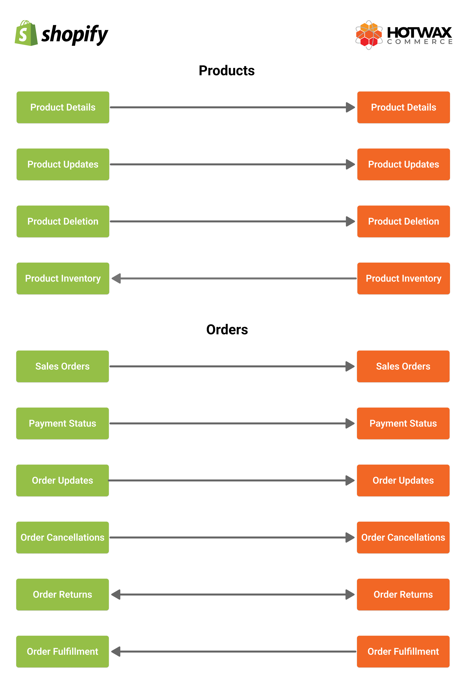

# Shopify integration reference

Use this manual after launch to understand and operate the product, inventory, order, and fulfillment flows between Shopify and HotWax Commerce.

For initial implementation, follow [Set up HotWax Commerce with Shopify](../system-admin/administration/company/product-store-onboarding.md).

The integration synchronizes available-to-promise inventory from HotWax Commerce to Shopify, routes Shopify orders to warehouses or stores for fulfillment, and returns fulfillment and tracking updates to Shopify.

## What Will Be Synced Between Shopify and HotWax Commerce

<figure><figcaption>
Flow of Data Between Shopify and HotWax Commerce
</figcaption></figure>

**Products:** HotWax Commerce synchronizes Shopify products and later product updates, including Shopify ID, SKU, UPC, images, names, and features. Read [Product Sync from Shopify](shopify-integration/products/) for the operating model.

**Inventory:** After launch, HotWax Commerce is the source for inventory availability published to Shopify. It can combine inventory inputs from the retailer's technology stack to calculate sellable inventory. Read [Inventory Synchronization](shopify-integration/inventory/) for the operating model.

**Orders:** Controlled history imports eligible open and unfulfilled orders from the agreed pre-launch window. Realtime and scheduled fallback flows then synchronize current Shopify orders and updates with HotWax Commerce.

When an order is fulfilled, HotWax Commerce updates its fulfillment and tracking information in Shopify. Read [Shopify order download flows](shopify-integration/orders/) and [Order Fulfillment](shopify-integration/order-fulfillment/) for post-launch reference.
