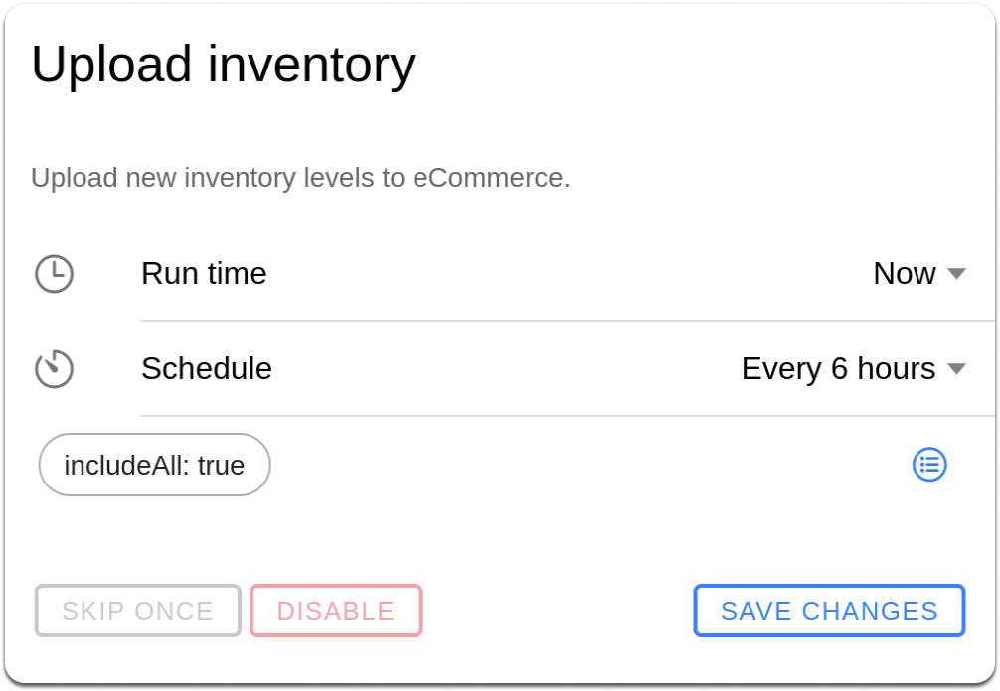
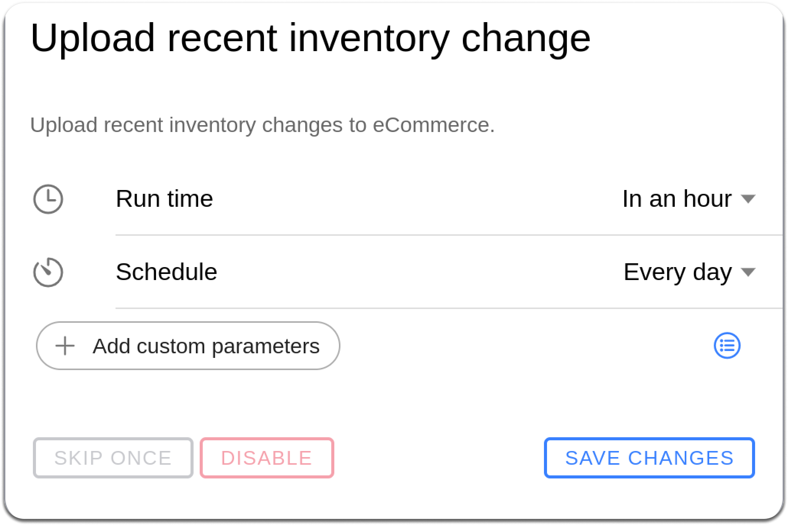

# Inventory sync

**Scenario:** Inventory Not Synced from HotWax Commerce to Shopify

Sometimes retailers may encounter inventory disparities between HotWax Commerce and Shopify Inventory. For instance, inventory may appear out of stock in Shopify despite being available in HotWax Commerce.

## Steps to Troubleshoot

### Verify in HotWax Commerce

1. **Check Job Status:**
   * Open `Catalog` in Job Manager.
   * Search for `Upload recent inventory change`. This job updates inventory changes in Shopify that occurred in HotWax Commerce after the previous run.
   * Open the job and confirm its pause state, schedule, and latest run.
   * You can also execute the `Hard Sync` job in HotWax Commerce. This job updates inventory for all the products irrespective of the inventory changes, eliminating any discrepancy between HotWax Commerce and Shopify. If inventory changes occurred before the completion of the last `Upload recent inventory change` job, execute the `Hard Sync` job.




<figure><figcaption></figcaption></figure>



<figure><figcaption></figcaption></figure>



1. **Inspect Inventory Configurations:**

Retailers can set rules such as safety stocks, thresholds, and exclude facilities to prevent overselling on Shopify. Follow these steps to verify the online ATP of the inventory that is being synchronized between HotWax Commerce and Shopify:

* In HotWax Commerce, Go to `Products` > `Find Products` > `Product Detail page` > `Product Inventory View` page.
* Check inventory configurations, including safety stocks, thresholds, reserved inventory, and excluded facilities.
* Verify the `online ATP` of products on the inventory dashboard and make sure that the `online ATP` inventory count matches with the inventory in Shopify.

### Verify in Shopify

1. **Check Online ATP in Inventory Dashboard:**
   * Navigate to Shopify Admin Panel.
   * Go to `Products` > `Product detail` page.
   * Click on the variant of the product that requires inventory verification.
2. **Verify Inventory Adjustment History:**
   * Within the variant's `inventory` section, click on the `adjustment history` button.
   * Examine historical inventory adjustments. Ensure they reflect recent changes.
   * If historical changes display outdated records or no inventory records, open `Catalog` in Job Manager. Run `Upload recent inventory change` when the changes occurred after its previous completed run. Run `Hard Sync` when the changes occurred before that completed run.
   * Wait for a few minutes and revisit the inventory history on Shopify.
3. If the inventory is still not updated, and discrepancies persist, contact the HotWax Commerce support team for assistance.

See [Troubleshoot job runs and schedules](../../../retail-operations/workflow/job-management/troubleshooting/job-runs-and-schedules.md).
