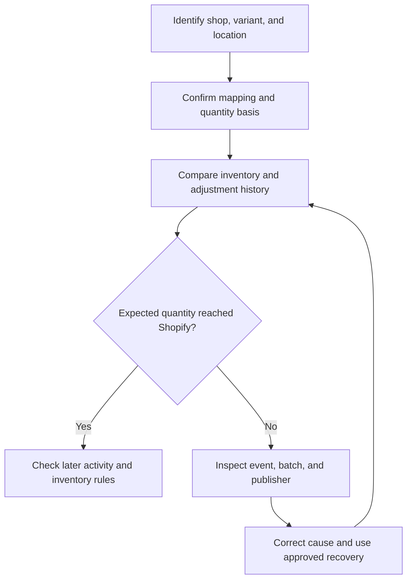
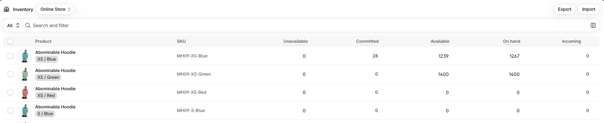
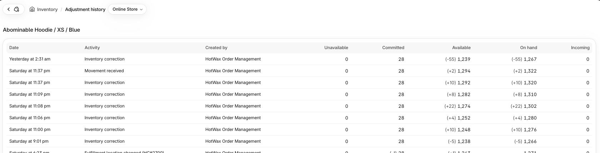

# Inventory sync

**Scenario:** A product's inventory in Shopify differs from the quantity expected from HotWax Commerce.

Start with the affected shop, variant, and Shopify location. An inventory difference can come from the selected location, the publication model, inventory rules, or a delayed or failed delivery. A successful job run alone does not prove that the expected quantity reached Shopify.

## Choose the right comparison

Confirm the location mapping and the inventory model configured for this connection before comparing quantities.

| Publication model | HotWax quantity to investigate | Shopify context |
| --- | --- | --- |
| Aggregate channel | Available-to-promise inventory calculated for the channel's facility group | The mapped aggregate location |
| Physical location | The configured physical-facility publication, such as quantity on hand or physical ATP | The Shopify location mapped to that facility |

Review [Shopify mappings in Company](../../../system-admin/administration/company/manage-shopify-mappings.md) and [the inventory publication models](../../shopify-integration/inventory/inventory-sync.md). Do not compare a single store's quantity with an aggregate channel, or assume every physical-location publisher uses the same quantity basis.

```mermaid
flowchart TD
    accTitle: Investigate a Shopify inventory difference
    accDescr: Identify the shop, variant, and location, confirm mapping and quantity basis, compare inventory and adjustment history, then investigate publication delivery before an approved recovery.
    A[Identify shop, variant, and location] --> B[Confirm mapping and quantity basis]
    B --> C[Compare inventory and adjustment history]
    C --> D{Expected quantity reached Shopify?}
    D -->|Yes| E[Check later activity and inventory rules]
    D -->|No| F[Inspect event, batch, and publisher]
    F --> G[Correct cause and use approved recovery]
    G --> C
```

## Verify in HotWax Commerce

1. Open the affected Shopify connection in the Company App and confirm its shop and Product Store.
2. Open `Inventory sync`. Use the channel or physical-location path that matches the selected Shopify location.
3. Check the expected quantity and relevant inventory rules. For an aggregate channel, review the facility group, member facilities, and ATP calculation, including reservations and exclusions.
4. Review waiting events and batches, the publisher's pause state and schedule, and its latest run. Open the affected event and batch to check delivery state and errors.
5. If the connector uses the older Job Manager workflow, inspect the applicable `Catalog` jobs, their services, parameters, and completed runs. Job names such as `Upload recent inventory change` or `Hard Sync` do not establish their scope by themselves.

See [Monitor Shopify inventory sync](../../../system-admin/administration/company/manage-shopify-inventory-sync.md) for event and batch investigation, and [Troubleshoot job runs and schedules](../../../retail-operations/workflow/job-management/troubleshooting/job-runs-and-schedules.md) for schedule and execution checks.

## Verify in Shopify

1. Open Shopify Admin and go to `Products` > `Inventory`.
2. Select the mapped location and find the affected variant by its SKU. Compare the relevant quantity column; `Available` and `On hand` can differ because Shopify also tracks committed and unavailable inventory.

<figure><figcaption>
Select the location before comparing inventory. This demo example shows separate Available and On hand values for the same variant.
</figcaption></figure>

3. Open the variant. In its `Inventory` section, select `View adjustment history`.
4. Confirm the location in the history view. Review the time, activity, creator, signed change, and resulting quantity. Check for later adjustments or fulfillment activity after the HotWax update.

<figure><figcaption>
Adjustment history shows what reached Shopify and subsequent activity. These demo records do not establish the status of another product, location, or shop.
</figcaption></figure>

## Resolve and verify

If the expected change is missing, return to the matching HotWax event, batch, or applicable job. Correct the cause before retrying. An old Shopify history entry alone does not determine whether a recent-change run or a full reset is appropriate.

For connectors with event batches, `Resend` sends the existing frozen payload; it does not recalculate current inventory. Use the appropriate reset or reconciliation only after confirming the target, quantity basis, and recovery scope with the technical team.

After recovery, refresh both sides and verify the affected variant at the mapped location. If the difference persists, share the shop, variant/SKU, location, expected and actual quantities, observation time, and relevant event, batch, or job identifiers with HotWax Commerce support.
