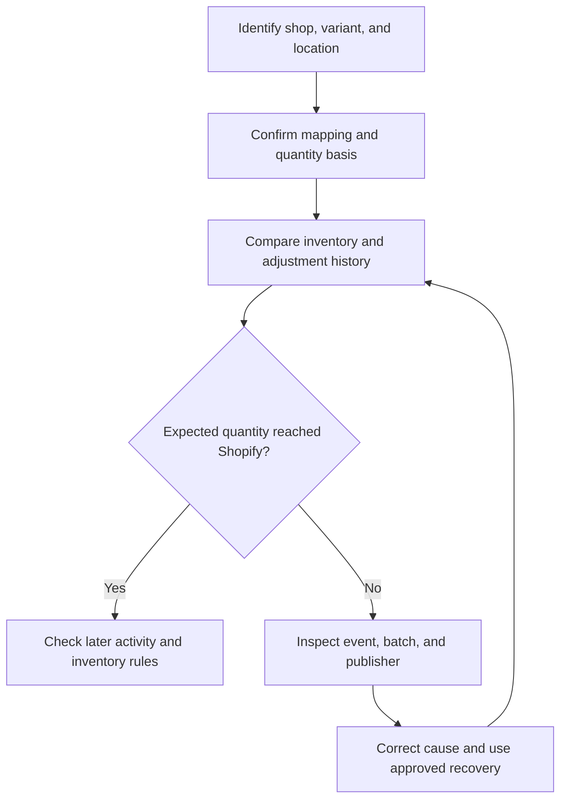
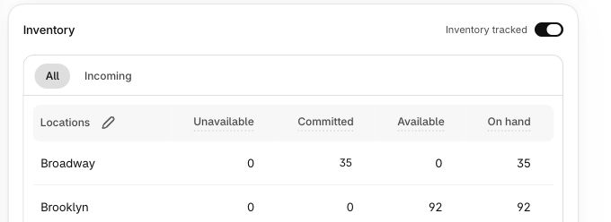

# Inventory sync

**Scenario:** A product's inventory in Shopify differs from the quantity expected from HotWax Commerce.

Start with the affected shop, variant, and Shopify location. An inventory difference can come from the selected location, the publication model, inventory rules, or a delayed or failed delivery. A successful job run alone does not prove that the expected quantity reached Shopify.

## Choose the right comparison

Confirm the location mapping and the inventory model configured for this connection before comparing quantities.

| Publication model | HotWax quantity to investigate | Shopify context |
| --- | --- | --- |
| Aggregate channel | Available-to-promise inventory calculated for the channel's facility group | The mapped aggregate location |
| Physical location | Facility ATP changes published by physical-location events to Shopify Available | The Shopify location mapped to that facility |

Review [Shopify mappings in Company](../../../system-admin/administration/company/manage-shopify-mappings.md) and [the inventory publication models](../../shopify-integration/inventory/inventory-sync.md). Do not compare a single store's quantity with an aggregate channel. Both event paths publish available inventory. Compare Shopify On hand only when investigating the separate `Reset physical on-hand` reconciliation.

```mermaid
flowchart TD
    accTitle: Investigate a Shopify inventory difference
    accDescr: Identify the shop, variant, and location, confirm mapping and quantity basis, compare inventory and adjustment history, then investigate publication delivery before an approved recovery.
    A[Identify shop, variant, and location] --> B[Confirm mapping and quantity basis]
    B --> C[Compare inventory and adjustment history]
    C --> D{Expected quantity reached Shopify?}
    D -->|Yes| E[Check later activity and inventory rules]
    D -->|No| F[Inspect event, batch, and publisher]
    F --> G[Correct cause and use approved recovery]
    G --> C
```

## Verify in HotWax Commerce

1. Open the affected Shopify connection in the Company App and confirm its shop and Product Store.
2. Open `Inventory sync`. Use the channel or physical-location path that matches the selected Shopify location.
3. Check the expected quantity and relevant inventory rules. For an aggregate channel, review the facility group, member facilities, and ATP calculation, including reservations and exclusions.
4. Review waiting events and batches, the publisher's pause state and schedule, and its latest run. Open the affected event and batch to check delivery state and errors.

See [Monitor Shopify inventory sync](../../../system-admin/administration/company/manage-shopify-inventory-sync.md) for event, batch, publisher, and reset investigation.

## Verify in Shopify

1. Open Shopify Admin and go to `Products` > `Inventory`.
2. Select the mapped location and find the affected variant by its SKU. For event sync, compare `Available`. `Available` and `On hand` can differ because Shopify also tracks committed and unavailable inventory; an on-hand reset is a separate investigation.

<figure><figcaption>
In this demo example, XS / Blue at Online Store has 1,239 Available and 1,267 On hand. For event sync, compare Available; On hand is a separate quantity.
</figcaption></figure>

3. Open the variant and check `Inventory tracked`. If the variant should track stock but this setting is off, confirm the approved setup with your implementation team. Follow [Shopify's inventory tracking setup](https://help.shopify.com/en/manual/products/inventory/setup/set-up-inventory-tracking).

<figure><figcaption>
Abominable Hoodie XS / Blue in hotwax-demo: inventory tracking is enabled. Broadway's 35 On hand are all Committed, leaving 0 Available.
</figcaption></figure>

4. In the variant's `Inventory` section, select `View adjustment history`.
5. Confirm the location in the history view. Review the time, activity, creator, signed change, and resulting quantity. Check for later adjustments or fulfillment activity after the HotWax update.

<figure><figcaption>
This demo history shows HotWax Order Management corrections and movement receipts at Online Store. Check the location, creator, and later activity before comparing totals.
</figcaption></figure>

## Resolve and verify

If the expected change is missing, return to the matching OMS event, batch, and publisher. Correct the cause before retrying. An old Shopify history entry alone does not establish which recovery is appropriate.

`Resend` sends the existing frozen payload; it does not recalculate current inventory. Use the appropriate reset or reconciliation only after confirming the target, quantity basis, and recovery scope with the technical team.

After recovery, refresh both sides and verify the affected variant at the mapped location. If the difference persists, share the shop, variant/SKU, location, expected and actual quantities, observation time, and relevant event, batch, or job identifiers with HotWax Commerce support.
