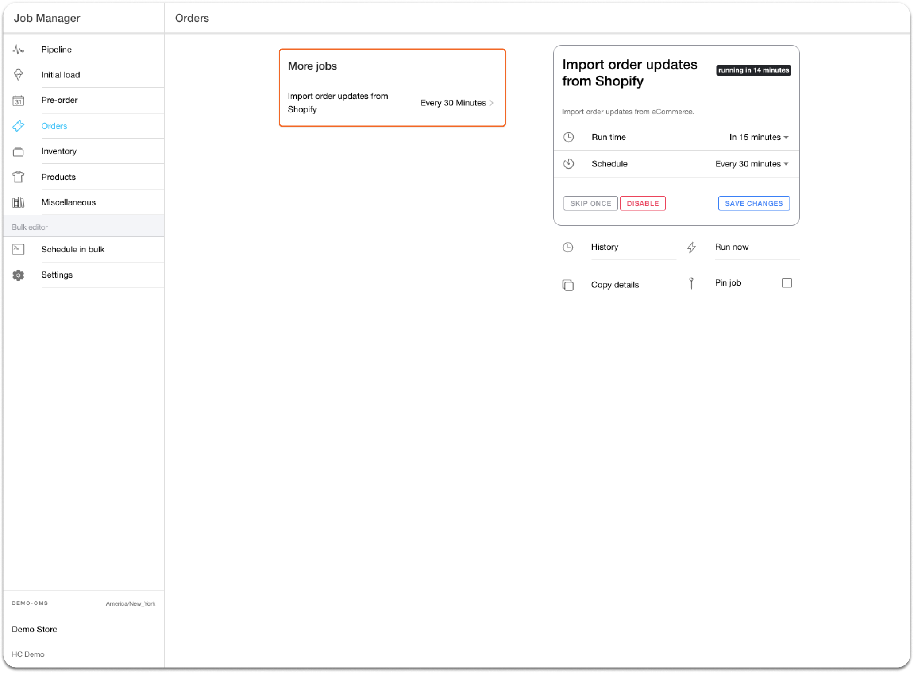

# Order Updates

### Synchronizing Order Updates

Sometimes customers or customer service representatives make changes to Shopify orders that need to be accurately reflected in Hotwax Commerce to ensure the fulfillment process meets the customer's requirements. HotWax Commerce can update the following details from Shopify:

* Adding items to an order
* Removing items from an order
* Changing item quantities

To ensure all order modifications are synced accurately, HotWax Commerce has an 'Import order updates from Shopify' job. This job checks the 'updated\_at' field of orders in Shopify and compares it to the last run time of the job. If the 'updated\_at' time is after the last run time, the job downloads all order details from Shopify, compares it to HotWax Commerce data, and updates any changed fields. The default frequency for the job is every hour, but merchants can change it through the Job Manager App to meet their requirements.

<figure><figcaption>
<em>Fig.6 : Configuration of the “Import order updates from Shopify” job in the Job Manager App</em>
</figcaption></figure>

To know more about how HotWax Commerce synchronizes Order fulfillment updates with Shopify, [click here](../../README.md). Read further to know how HotWax Commerce Manages [Presell orders ](../how-are-pre-orderable-and-backorderable-products-listed-or-delisted-on-shopify/how-are-pre-orderable-and-backorderable-products-listed-or-delisted-on-shopify.md)and [BOPIS Orders](../how-does-hotwax-commerce-manage-bopis-orders-on-shopify/how-does-hotwax-commerce-manage-bopis-orders-on-shopify.md).
