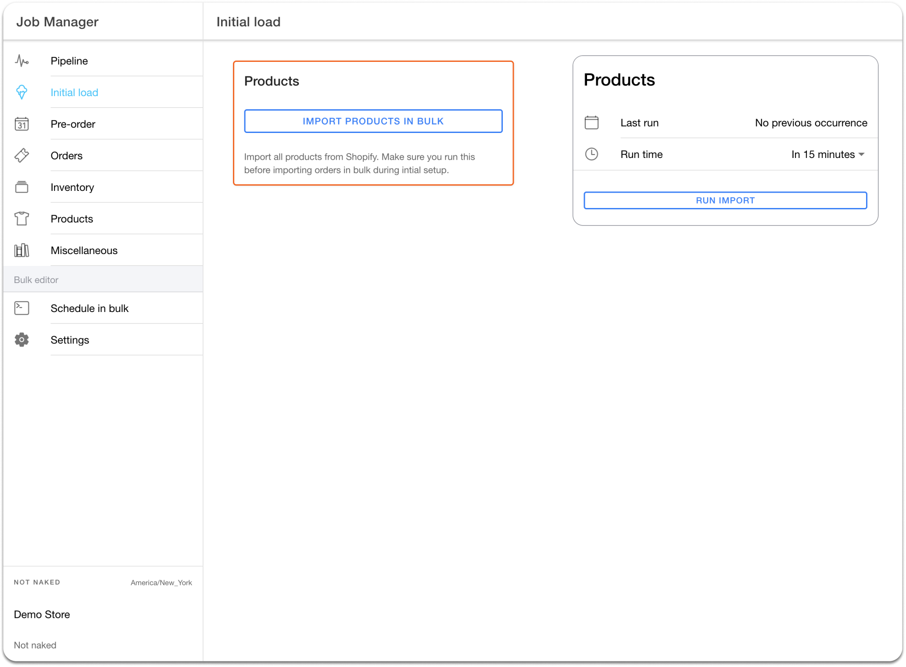

# Product Download

### Initial Product Download from Shopify to HotWax Commerce

Merchants can schedule an `Import Products in Bulk` job in HotWax Commerce to download existing product details from Shopify, including Stock Keeping Unit (SKU) code, Universal Product Code (UPC), Shopify ID, Price, Tags, and Weight. This should be done before [importing orders](../../shopify-integration/how-are-orders-downloaded-from-shopify-to-hotwax-commerce/order-download/) to ensure that products are available for incoming sales orders. The import process consists of two steps:

1. **Downloading from Shopify**- HotWax Commerce sends an [API request](https://shopify.dev/docs/api/admin-rest/2022-10/resources/product#get-products?ids=632910392,921728736) to Shopify to download products. In response, Shopify returns product data in JSON format. Shopify permits downloading 250 products per API call. To prevent large data file errors, HotWax Commerce downloads only 100 products per call.

<figure><figcaption>
<em>Fig.1: Configuration to run `Import Products in Bulk` in the `Job Manager` App</em>
</figcaption></figure>

2. **Product Creation in HotWax Commerce**- After downloading, the JSON files are read from the file system, and product records are created in HotWax Commerce's database through the `Process bulk imported files` job. If any data issues arise, error logs are recorded for later correction.

### Product data from Shopify is mapped in HotWax Commerce fields as outlined in the following table:

1. **Parent Product**

A virtual product, also known as a parent product, does not have a set size or color. When using HotWax Commerce, all fields in the product JSON are imported, but only relevant fields are processed to improve system efficiency. Here's how parent product fields are mapped in Shopify and HotWax Commerce:

<table><thead><tr><th width="103.33333333333331">S.No.</th><th width="251">Fields in Shopify</th><th>Fields in HotWax Commerce</th></tr></thead><tbody><tr><td>1</td><td>ID</td><td>Shopify Product ID</td></tr><tr><td>2</td><td>Title</td><td>Product Name</td></tr><tr><td>3</td><td>Body HTML</td><td>Product Content</td></tr><tr><td>4</td><td>Vendor</td><td>Brand</td></tr><tr><td>5</td><td>Product_type</td><td>Categories</td></tr><tr><td>6</td><td>Tags</td><td>Tags</td></tr><tr><td>7</td><td>Variant</td><td>Variant</td></tr><tr><td>8</td><td>Media</td><td>Overview</td></tr></tbody></table>




<figure><figcaption>
<em>Fig.2(i): Products in Shopify</em>
</figcaption></figure>





<figure><figcaption>
Products downloaded in HotWax Commerce
</figcaption></figure>




2. **Variant Product**

The parent product comes in various sizes and colors, resulting in multiple variants. With HotWax Commerce, all of these variants can be downloaded. Here's how product variant fields are mapped in Shopify and HotWax Commerce:

<table><thead><tr><th width="136.33333333333331">S.No.</th><th>Fields in Shopify</th><th>Fields in HotWax Commerce</th></tr></thead><tbody><tr><td>1</td><td>Product Variant ID</td><td>Shopify Product ID</td></tr><tr><td>2</td><td>Title</td><td>Product Name</td></tr><tr><td>3</td><td>Options</td><td>Feature</td></tr><tr><td>4</td><td>Image</td><td>Image</td></tr><tr><td>5</td><td>Parent Product</td><td>Parent Product</td></tr><tr><td>6</td><td>Price</td><td>Price</td></tr><tr><td>7</td><td>SKU</td><td>SKU</td></tr><tr><td>8</td><td>Quantity</td><td>View inventory</td></tr><tr><td>9</td><td>Shipping</td><td>Shippable</td></tr><tr><td>10</td><td>Product Type</td><td>Product Type</td></tr><tr><td>11</td><td>Weight</td><td>Weight</td></tr><tr><td>12</td><td>Metafields</td><td>Product Tag</td></tr></tbody></table>



<figure><figcaption>
<em>Fig.3(i): Variant product in Shopify with details</em>
</figcaption></figure>



<figure><figcaption>
Fig.3(ii) : Variant product in HotWax Commerce with details
</figcaption></figure>



Shopify has multiple product identifiers, such as Shopify Product ID, Product SKU, Product Name, and UPCA. Therefore before importing products, it is important to set up the primary product identifier that will be mapped with the product ID in HotWax Commerce. The primary product identifier can be set up in HotWax Commerce when [setting up a new product store](https://docs.hotwax.co/documents/v/system-admins/product-store/product-store) as per retailers' requirements.

#### Importing Newly Added Products Regularly

Shopify merchants create new products for two reasons::

1. When a new product is added to the catalog.
2. When users prefer to delete the existing product and create a new one with updated fields

To make it easier to keep both Shopify and HotWax Commerce's product catalogs up to date, Shopify merchants can schedule an `Import Products` job that runs every 15 minutes. This job checks the `created_at` field of products in Shopify and identifies any products that were created after the last run of the job. Any newly created products are then imported into HotWax Commerce's product catalog through the `Process bulk imported files` job. By doing this, HotWax Commerce's catalog stays synchronized with Shopify's catalog, ensuring that merchants have access to the most up-to-date product information.

<figure><figcaption>
<em>Fig.4: Configuration to run `Import Products` in the Job Manager App</em>
</figcaption></figure>


It is recommended to run this job every 15 minutes. However, the frequency of the job can be set as per a merchant’s business needs.


**Managing Sales Orders For Products That Are Not In HotWax Commerce**

When orders are placed on Shopify, they are also transferred to HotWax Commerce. However, sometimes an order might include a newly launched product in Shopify that has not yet been synced with HotWax Commerce. This can cause the order download to fail if the product import job has not yet run. To prevent this, HotWax Commerce creates a temporary placeholder product for the new item. Once the product import job is run, all the necessary information such as the product name, brand, price, weight, and so on are added to the placeholder product. This ensures that the order download is successful and the customer receives their product.
