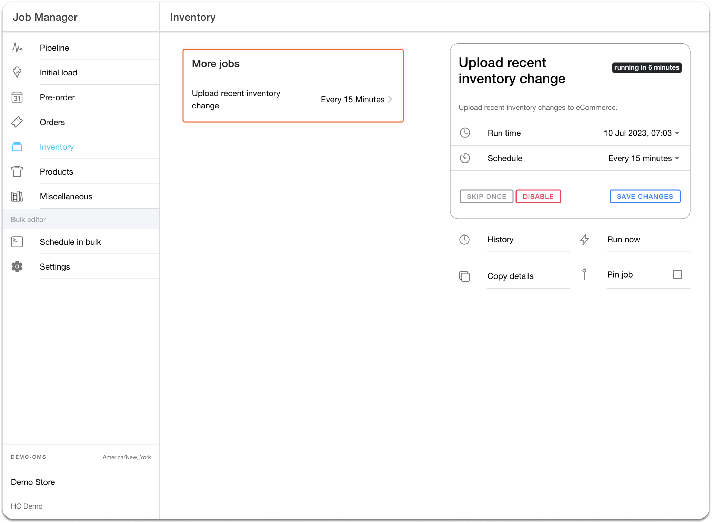
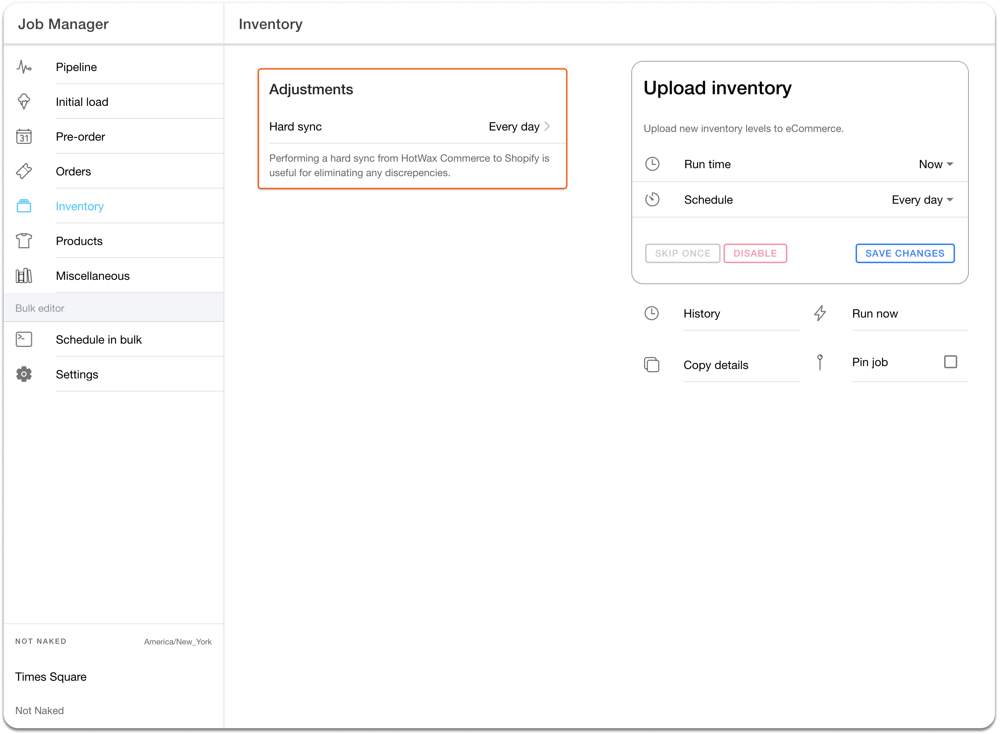
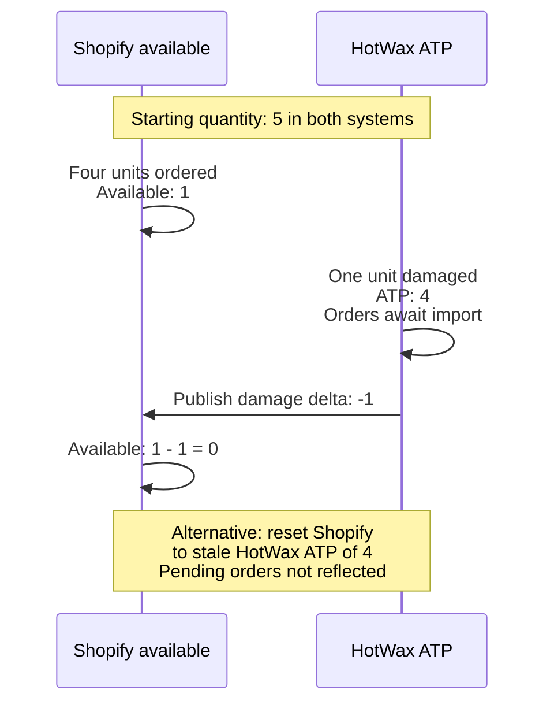
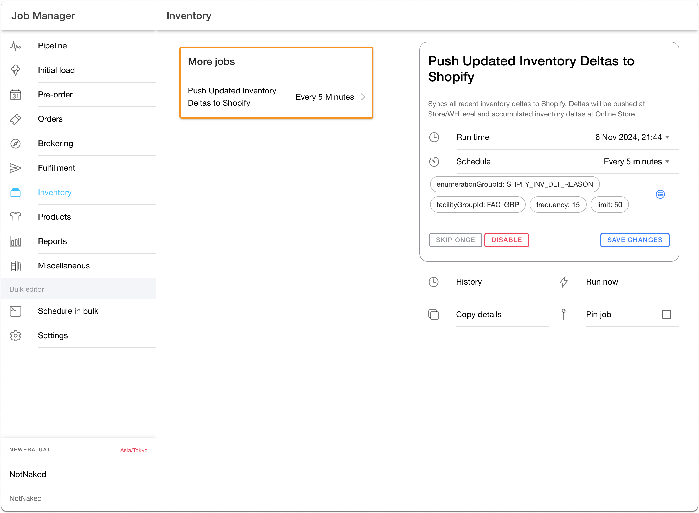
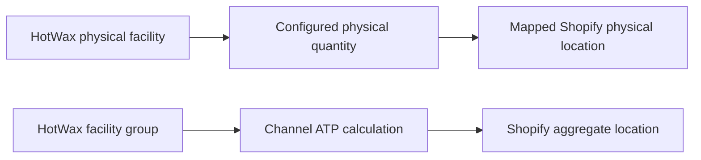

# Inventory Synchronization

**Syncing Inventory From HotWax Commerce To Shopify**

This page covers outbound HotWax-to-Shopify publication after cutover. For the one-time inbound Shopify-to-HotWax starting inventory seed, follow [Chapter 8 of Set up HotWax Commerce with Shopify](../../../system-admin/administration/company/product-store-onboarding.md#8-seed-starting-inventory-from-shopify).

HotWax Commerce supports full resets, recent-change uploads, and event-driven inventory adjustments. The jobs available on an instance depend on its installed Shopify connector and inventory-publishing model.


Use [Monitor Shopify inventory sync](../../../system-admin/administration/company/manage-shopify-inventory-sync.md) in the Company App to identify the active publication path, monitor its jobs and events, and run the correct reconciliation. Do not create or run a job from its name on this concepts page alone.


## Upload Recent Inventory Change

The `Upload Recent Inventory Changes` job updates the inventory on Shopify through the following steps:

* **Identifying Products with Inventory Changes:** The 'Upload recent inventory change' job examines the inventory records of HotWax Commerce's products. It identifies products that have undergone inventory changes since the last synchronization.\
  \
  In the following example, there are five products with inventory records in HotWax Commerce:

<table><thead><tr><th width="163.33333333333331">Product List</th><th>Inventory Count at 1:00 PM</th><th>Inventory Count at 1:15 PM</th></tr></thead><tbody><tr><td>Product A</td><td>100</td><td>95</td></tr><tr><td>Product B</td><td>50</td><td>50</td></tr><tr><td>Product C</td><td>25</td><td>30</td></tr><tr><td>Product D</td><td>100</td><td>100</td></tr><tr><td>Product E</td><td>80</td><td>80</td></tr></tbody></table>

At 1:15 PM, the job that runs every 15 minutes detects that there are inventory changes for Product A and Product C that require syncing with Shopify after the 'Upload recent inventory change' task is executed.

* **Comparing Inventory counts between HotWax Commerce and Shopify:** To update its inventory records, HotWax Commerce initiates an [API call](https://shopify.dev/docs/api/admin-rest/2023-04/resources/inventorylevel#get-inventory-levels?location-ids=655441491) to retrieve information from Shopify about products that have undergone changes in HotWax Commerce. The inventory counts for these products in Shopify are then compared with the inventory counts that HotWax Commerce has on file.

<table><thead><tr><th width="147">Product List</th><th width="238">Inventory Count in Shopify</th><th width="331">Inventory Count in HotWax Commerce</th><th width="198">Inventory Difference</th></tr></thead><tbody><tr><td>Product A</td><td>100</td><td>95</td><td>-5</td></tr><tr><td>Product C</td><td>25</td><td>30</td><td>5</td></tr></tbody></table>

* **Uploading accurate inventory on Shopify:** After comparing inventory changes, the 'Upload recent inventory change' job records the difference and generates a GraphQL file for the affected products. This file is then uploaded to Shopify, which reads it and updates the '[available adjustments](https://shopify.dev/docs/api/admin-rest/2022-10/resources/inventorylevel#post-inventory-levels-adjust)' field to either add or deduct inventory based on the changes.

<table><thead><tr><th width="152">Product List</th><th width="236">Inventory Count in Shopify</th><th width="219">Available Adjustments</th><th width="309">Updated Inventory Count in Shopify</th></tr></thead><tbody><tr><td>Product A</td><td>100</td><td>-5</td><td>95</td></tr><tr><td>Product C</td><td>25</td><td>5</td><td>30</td></tr></tbody></table>

<figure><figcaption>
Example recent-change schedule in a Job Manager-based publishing model.
</figcaption></figure>

Location mappings follow the implementation's approved inventory and fulfillment design. A physical Shopify location can map to its corresponding HotWax facility, while an aggregate location can receive inventory from a facility group. Do not infer the mapping model solely from the POS platform. Review [Shopify mappings in Company](../../../system-admin/administration/company/manage-shopify-mappings.md).

## Hard Sync

A full reconciliation compares the configured HotWax inventory quantity with Shopify across the selected products and locations. It can restore alignment after skipped updates or a changed publication target, once the underlying mapping, capture, or delivery issue is resolved. The approved schedule depends on the implementation; a daily reset is not a substitute for monitoring delivery or importing outstanding orders.

In the Job Manager-based reset model shown below, the two facility-group parameters have different roles:

* `facilityGroupId` selects the inventory group used to calculate ATP for the aggregate location.
* `shopifyFacilityGroupId` limits publication to Shopify locations mapped to facilities in that group. If omitted, the job considers all locations mapped for the shop.

For example, a retailer can calculate aggregate ATP from a group containing all 50 stores, while limiting the physical-location updates to a publication group containing its 25 Zone 2 stores. Each selected physical location receives its own mapped facility's configured quantity. The combined stock of all 50 stores belongs at the aggregate target, rather than being copied to each Zone 2 location.

Confirm that the intended aggregate target is included in the publication scope. Use [Monitor Shopify inventory sync](../../../system-admin/administration/company/manage-shopify-inventory-sync.md) for the jobs available on your instance, the required reconciliation, and verification in Shopify. A completed reset run alone does not prove the target quantity was delivered.

<figure><figcaption>
Example full-inventory schedule in a Job Manager-based publishing model.
</figcaption></figure>

## Push Updated Inventory Deltas to Shopify

The `Push Updated Inventory Deltas to Shopify` job syncs only recent inventory deltas to Shopify. If a product is sold too fast on Shopify and orders are not yet downloaded in HotWax Commerce, then inventory of this product gets out of stock on Shopify, however, inventory in HotWax Commerce is still available. In such cases, the inventory of these products also gets reset with the current ATP in HotWax Commerce with the previous jobs. And due to this Shopify was overselling the inventory.

To improve inventory accuracy, this job only syncs the inventory variances recorded in HotWax commerce rather than resetting the inventory. This means any variance—whether negative (Such as damaged, lost, POS Sales) or positive (TO receiving, Returns restock) are updated to the respective Shopify locations.

In an available-quantity example, Product A starts with 5 units in both systems. Shopify orders consume 4 units before those orders reach HotWax. A damaged unit then reduces HotWax ATP to 4. Publishing only the damage adjustment preserves the stock already consumed by Shopify orders:

Shopify distinguishes [incremental inventory adjustments](https://shopify.dev/docs/api/admin-graphql/latest/mutations/inventoryAdjustQuantities) from [absolute quantity sets](https://shopify.dev/docs/api/admin-graphql/latest/mutations/inventorySetQuantities). Before a full reset, confirm inventory ownership, the publication target and quantity basis, and whether relevant orders have finished importing. Use the Company App's inventory-sync workflow for the configured reconciliation.

In another example, if a store receives a transfer order for Product B with 2 units, which originally had 10 units, then a variance of 2 will be pushed on Shopify to update the Shopify ATP to 12.

<figure><figcaption>
Example delta-publication schedule in a Job Manager-based publishing model.
</figcaption></figure>

## Monitor outbound inventory

Open the Company App, select `Shopify`, open the connection, then select `Inventory sync`.

The dashboard separates two outbound paths:

* Physical-location inventory published from mapped HotWax facilities to their Shopify locations, using the configured quantity basis
* Aggregate-channel ATP published from a group of facilities to one Shopify aggregate location

The arrows represent inventory publication, not a physical stock transfer. Confirm the selected target and quantity basis before comparing inventory or running a reset.

Use the dashboard to review pending events, batches, job health, event sources, reset runs, and delivery errors. Follow [Monitor Shopify inventory sync](../../../system-admin/administration/company/manage-shopify-inventory-sync.md) for the complete operational and reconciliation workflow.
