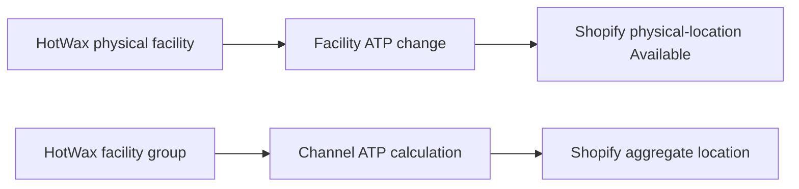
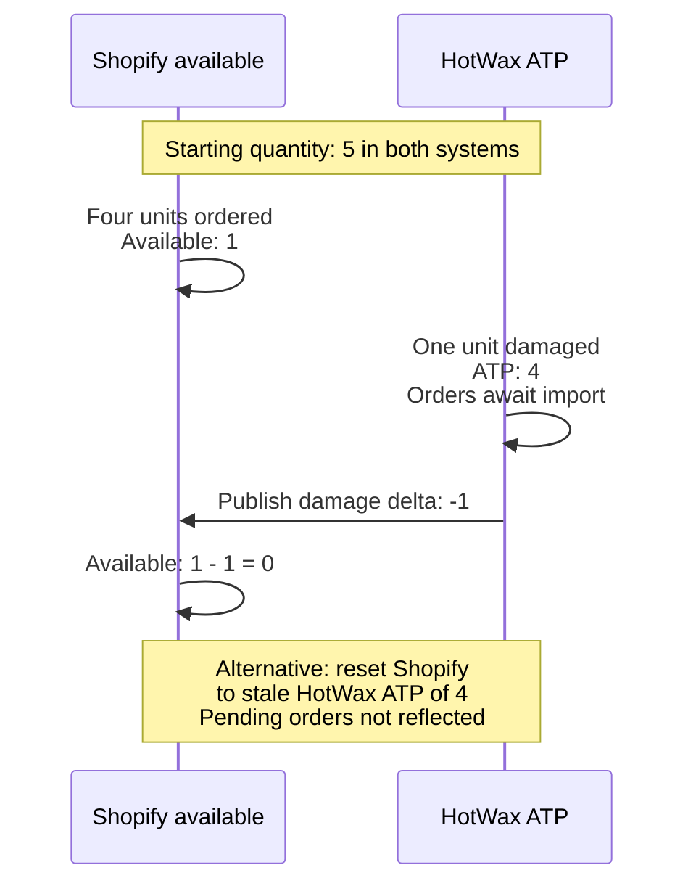

# Shopify inventory event sync

This page covers outbound OMS-to-Shopify inventory publication after cutover. For the one-time inbound Shopify-to-OMS starting inventory seed, follow [Chapter 8 of Set up HotWax Commerce with Shopify](../../../system-admin/administration/company/product-store-onboarding.md#8-seed-starting-inventory-from-shopify).

Use `Inventory sync` in the Company App to monitor inventory events, batches, publishers, and resets. Confirm the affected connection, target location, and quantity basis before choosing an action. A successful job run alone does not prove that Shopify received the expected inventory.

## Monitor outbound inventory

1. Open the Company App and select `Shopify`.
2. Open the connection and confirm its shop and Product Store.
3. Select `Inventory sync`.
4. Review the channel or physical-location queue that matches the affected Shopify location.
5. Open the waiting event or batch, and review the related publisher's schedule, pause state, and latest run before deciding on recovery.

<figure><figcaption>
HotWax sandbox inventory monitor. This example shows 14 channel events waiting to batch and paused publication jobs. Check your connection's current state rather than copying the example schedules.
</figcaption></figure>

The dashboard separates two outbound paths:

| Path | Quantity and target |
| --- | --- |
| Physical-location inventory | Facility ATP changes are published as available-quantity adjustments to the mapped Shopify physical location |
| Channel inventory | Available-to-promise inventory is calculated for a facility group and published to its Shopify aggregate location |

The arrows represent inventory publication, not a physical stock transfer. A physical location's quantity is not the aggregate inventory of every facility in its channel. Review [Shopify mappings in Company](../../../system-admin/administration/company/manage-shopify-mappings.md) before changing a target.

## Publish inventory changes

Both channel and physical-location inventory events record signed changes for their applicable targets. The publisher groups waiting events into batches for delivery. A positive change adds inventory and a negative change removes it. Open the event and its linked batch to distinguish waiting work, delivery errors, and successful delivery.

Event counts are not counts of products or units. A publisher schedule does not establish when every change reaches Shopify; inspect the actual batch delivery and the quantity at the mapped Shopify location.

### Why deltas and resets differ

An adjustment changes the quantity already held by Shopify. A reset reconciles it with the configured OMS quantity. Outstanding Shopify orders can make those two operations produce different results.

In an available-quantity example, Product A starts with 5 units in both systems. Shopify orders consume 4 units before those orders reach OMS. A damaged unit then reduces OMS ATP to 4. Publishing only the damage adjustment preserves the stock already consumed by Shopify orders:

Shopify distinguishes [incremental inventory adjustments](https://shopify.dev/docs/api/admin-graphql/latest/mutations/inventoryAdjustQuantities) from [absolute quantity sets](https://shopify.dev/docs/api/admin-graphql/latest/mutations/inventorySetQuantities). Before a reset, confirm inventory ownership, the publication target and quantity basis, and whether relevant orders have finished importing.

## Reconcile inventory with a reset

A reset is useful after resolving missed capture, a changed publication target, or another confirmed discrepancy. Choose the reset that matches the required quantity and scope:

| Company App job | Reconciliation scope |
| --- | --- |
| `Reset channel ATP` | Aggregate ATP for the channel shown on its card |
| `Reset physical ATP (this shop)` | ATP for the connection's mapped physical locations |
| `Reset physical on-hand` | Physical-location quantity on hand for the configured shop |

1. Confirm whether the affected target is a physical location or an aggregate channel.
2. Verify the mapping, quantity basis, relevant inventory rules, and outstanding order imports.
3. Inspect the event history, waiting batches, publisher state, and latest runs. Correct the cause of the discrepancy before recovery.
4. Open the applicable reset job and review its service, parameters, and scope. Use the approved recovery process for that target.
5. Review the resulting run and delivery records, then verify the actual inventory in Shopify at the mapped location.

Available jobs depend on the installed connector and configuration. Do not copy job definitions or schedules from another instance. A completed reset is an execution result; the Shopify quantity still needs verification.

## Investigate failed delivery

Filter history by the affected Shopify location and `Delivery error`, open an event and its batch, then review delivery errors and the summed change entries. Correct the cause before an approved retry.

`Resend` sends the existing frozen batch payload and its idempotency key. It does not recalculate inventory from current records. If the payload no longer represents the intended adjustment, use the appropriate approved reconciliation instead of repeatedly resending it.

Follow [Monitor Shopify inventory sync](../../../system-admin/administration/company/manage-shopify-inventory-sync.md) for history filters, event and batch inspection, job controls, and reconciliation. After any recovery, refresh both systems and verify the affected variant at its mapped Shopify location.
