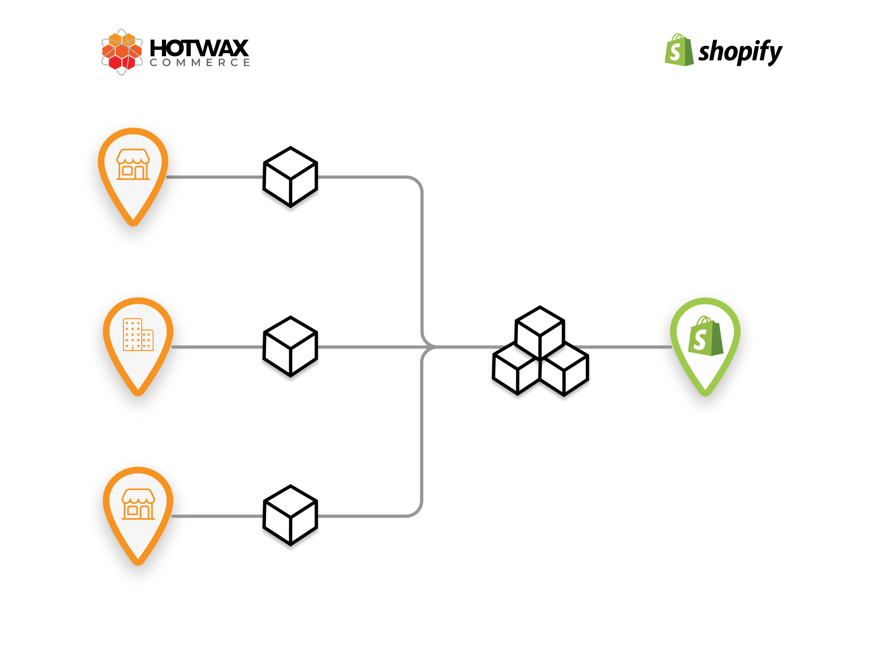
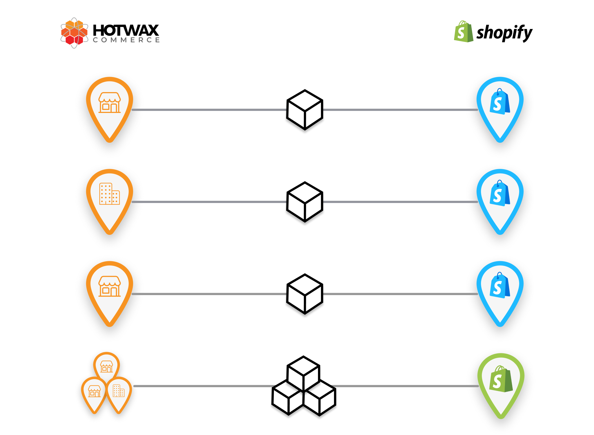

# Location mapping models

Use this page to understand terminology and compare advanced mapping models. It is not a setup procedure. For the required facility creation, Product Store association, Shopify-location import, mapping, and audit steps in a new standard launch, follow [Chapter 7 of Set up HotWax Commerce with Shopify](../../../system-admin/administration/company/product-store-onboarding.md#7-create-facilities-and-map-shopify-locations).

A HotWax Commerce **facility** represents a store, warehouse, or other fulfillment node. A Shopify **location** is Shopify's inventory and fulfillment node. They are different records and require an intentional mapping.

## Aggregated Shopify location model

Some advanced implementations publish inventory aggregated from several HotWax facilities to one approved Shopify location. This model requires an explicit aggregation, fulfillment, and routing design; do not infer it from the point-of-sale platform.

<figure><figcaption>
Example aggregated Shopify location model
</figcaption></figure>

## One-to-one physical location model

Some implementations map each approved physical Shopify location to its corresponding HotWax facility. The implementation plan must still define which facilities publish inventory, accept routing, and fulfill orders, and whether a separate aggregate eCommerce location exists.

<figure><figcaption>
Example one-to-one physical location model
</figcaption></figure>
