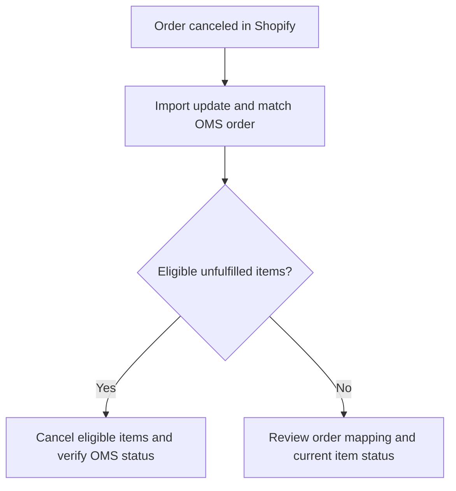
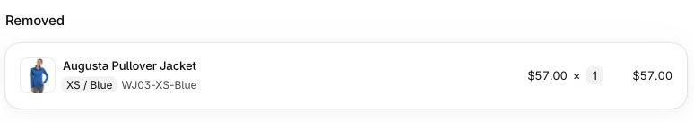
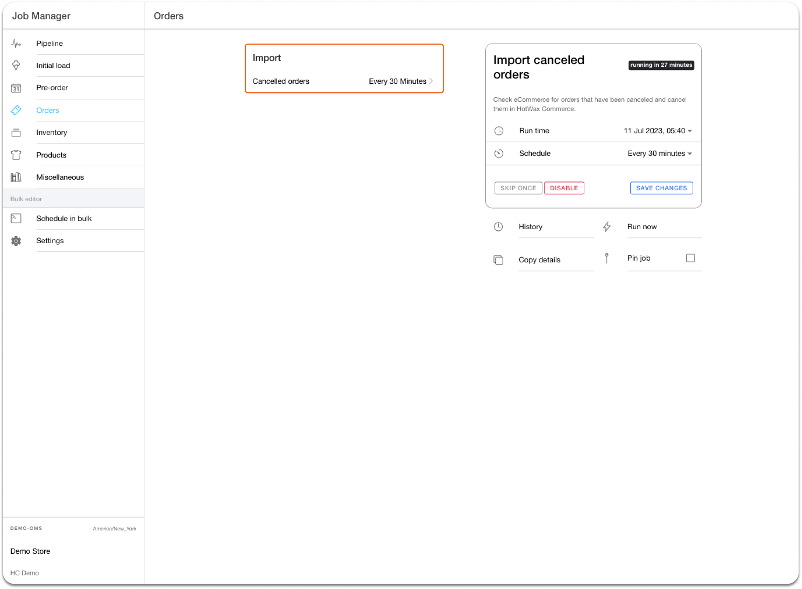

# Complete Order Cancellation

## From Shopify cancellation to OMS item status

Canceling an order in Shopify and applying that cancellation in HotWax Commerce are separate steps. The configured integration must import the update, match the OMS order, and process its eligible unfulfilled items. An imported update or successful job run alone does not establish that every OMS item was canceled.

### Check the configured import path

| Integration | Cancellation handoff |
| --- | --- |
| Current Moqui Shopify connector | The order-update sync reads Shopify's `cancelledAt` value. Its configured webhook and fallback order-sync paths are described in [Order download](../orders/order-download.md). The fallback job's normal subsequent runs inspect the updated-time window; its first run selects open, unfulfilled or partially fulfilled orders. Do not treat that first run as a historical cancellation backfill. |
| Older dedicated cancellation job | The `cancelShopifyOrders` service fetches Shopify orders with canceled status, using the configured updated-time window or a specific Shopify order ID. It matches the existing OMS order and processes eligible items. |

Use the jobs, subscriptions, date window, and shop configuration that belong to your instance. The schedule in the older illustration below is an example, not a required interval for every integration.

### Verify the cancellation scope

The current Moqui order-update path selects items in `ITEM_CREATED` or `ITEM_APPROVED` status and skips orders already marked completed or canceled. Its item cancellation service skips items already canceled or completed. Completed fulfillment remains distinct from cancellation of the remaining unfulfilled items.

After sync, compare the affected OMS item's status and cancellation history with the Shopify order. Check the order summary separately, especially when other items have already been fulfilled. For a missing update, inspect the configured import path, order mapping, item eligibility, and processing outcome before recovery; do not assume another cancellation request is needed.

<figure><figcaption>
The removed item in an existing canceled Shopify demo order. Verify the matching OMS item and cancellation history separately.
</figcaption></figure>

<figure><figcaption>
An earlier Job Manager cancellation-job configuration. Confirm the integration path and schedule used by your instance.
</figcaption></figure>
