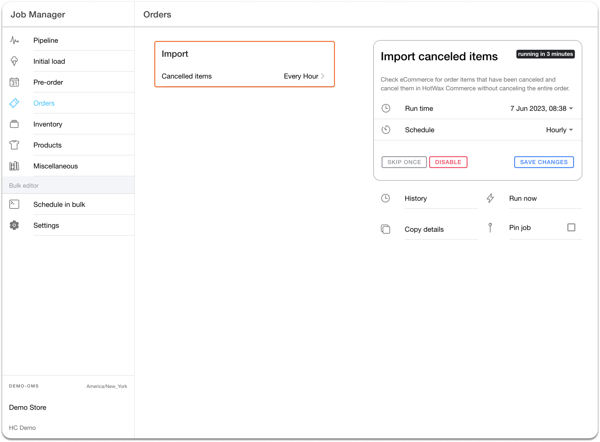

# Partial Order Cancellation

Partial cancellation removes a subset of an order's unfulfilled items or quantities. Other items can remain open or may already be fulfilled. Check the affected lines and quantities rather than using the order's overall status as proof of cancellation.

## Importing the update

The import path depends on the instance's integration:

| Integration | Item-cancellation handoff |
| --- | --- |
| Current Moqui Shopify connector | Order sync processes the order's refund details and distinguishes cancellation from returns and refunds without line items. When the outcome is cancellation, it matches the refund line IDs and quantities to eligible unfulfilled OMS items. |
| Older dedicated Canceled items job | The `cancelShopifyOrderItems` service retrieves updated orders using the configured time window and pagination, then imports them for item-cancellation processing. Its page limit and schedule belong to the instance's job configuration. |

For current order-import entry paths, see [Order download](../orders/order-download.md). The retained Job Manager illustration below shows an earlier dedicated job; its hourly schedule is an example rather than a required setting for every integration.

## Verifying the affected items

In the current Moqui connector, cancellation processing selects matching items in `ITEM_CREATED` or `ITEM_APPROVED` status. Completed items are excluded from that cancellation pool. A refund amount by itself does not establish that an item was canceled; refund line details, return context, and fulfillment state determine the processing path.

Compare the Shopify line quantities with the affected OMS item statuses and cancellation history. Check the other lines and the overall order separately: canceling one item does not establish that the whole order was canceled. See the [cancellation eligibility diagram](complete-order-cancellation.md#from-shopify-cancellation-to-oms-item-status) for the import, matching, and verification steps.

If the affected items remain open, check the import window, order and line mapping, eligibility, and processing outcome before recovery. Keep cancellation of unfulfilled quantities separate from the return of completed quantities.

<figure><figcaption>
An earlier dedicated item-cancellation job. Confirm the import path and schedule used by your instance.
</figcaption></figure>
