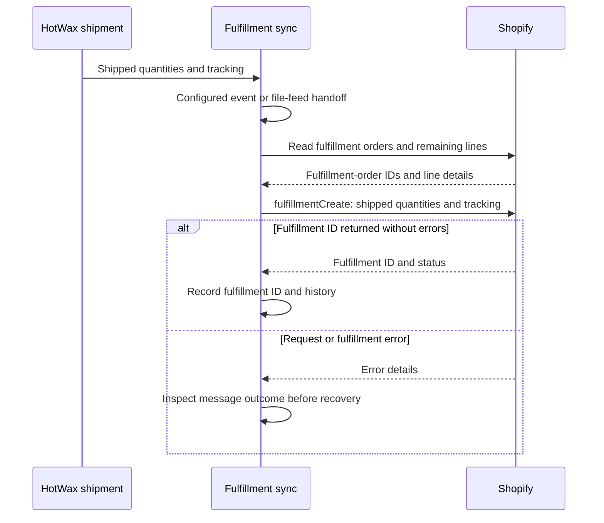

# Order fulfillment

Once an order is routed to a fulfillment center in HotWax Commerce, it can be fulfilled using either the HotWax Commerce Fulfillment App or an external system such as a warehouse management system (WMS).

## Fulfillment by HotWax Commerce Fulfillment App

HotWax Commerce provides **[Fulfillment App](../../../store-operations/fulfillment/README.md)** that enables picking, packing, and shipping of orders from stores. Shipping completes the store shipment’s fulfillment work. Other shipments on the same order can still be open.

## Fulfillment by an external system

For shipments fulfilled by an external system, HotWax Commerce receives the fulfillment quantities and status from that system. The configured fulfillment sync then sends the shipped quantities and available tracking details to Shopify.

## Updating fulfillment status to Shopify

Sync follows the eligible shipped quantities. A shipment can sync while other items on the order remain unfulfilled; creating one fulfillment does not establish that the entire order is fulfilled.

### 1. Collecting shipped quantities

The entry path depends on the instance's fulfillment configuration:

| Path | Handoff to Shopify sync |
| --- | --- |
| Shipment event | The shipped-status event queues a `CreateShopifyFulfillment` message. The dedicated `send_CreateShopifyFulfillmentProducedSystemMessages` job sends queued messages. |
| Fulfillment file feed | The configured feed supplies eligible shipment records. In the current connector, `poll_SystemMessageFileSftp_OMSFulfillmentFeed` polls the fulfillment feed; its consumer creates the per-shipment messages. |

Check which path your instance uses and whether its required jobs are running. The polling interval belongs to the file-feed path; it does not describe every fulfillment integration. A queued message is a handoff, not proof that Shopify accepted the fulfillment.

### 2. Retrieving fulfillment orders from Shopify

The connector reads Shopify fulfillment-order IDs, line-item IDs, and remaining quantities for the order. It matches the shipped line quantities to fulfillment orders that can still be fulfilled.

### 3. Creating fulfillment on Shopify

HotWax Commerce sends the GraphQL [`fulfillmentCreate` mutation](https://shopify.dev/docs/api/admin-graphql/latest/mutations/fulfillmentCreate) with the matched line quantities and any available tracking information. Shopify creates a fulfillment for those items. The order can remain `Partially Fulfilled` when other items still need fulfillment.

### 4. Checking the result

The connector checks for errors and requires a returned fulfillment ID before recording success. Verify the fulfillment record and quantities in Shopify, rather than relying only on the local shipment status or a completed job run.

If the update is missing, check the shipment's eligibility, the configured feed or sender job, and the `CreateShopifyFulfillment` message outcome. If Shopify may already have accepted the request, verify its fulfillment ID and line quantities before retrying. Keep the affected shipment distinct from other shipments on the same order.
