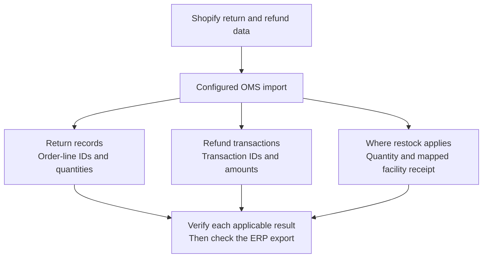

# Order Returns

Omnichannel Shopify retailers offer their customers two different options for returning online products: Mail Returns and In-Store Returns. Let's see how HotWax Commerce helps in handling these two types of returns:

**Mail Returns:** Mail returns could be initiated by customers, or by the Customer Service Representative (CSR) team in response to customer requests, which can be received through email or phone calls. Returns are created in Shopify and retailers often use third-party return management apps like Happy Returns, Loop Returns, or Returnly to facilitate the management of returns.

HotWax Commerce imports return and refund data through the configured Shopify integration. Where return lifecycle integration is configured, the current connector can import an open Shopify return as a requested OMS return before completion. A requested return does not receive inventory. Other integrations can import the return through refund processing.

The configured ERP integration can then export return and financial records for accounting. Verify the import and downstream export separately; an OMS return record alone does not establish that the ERP received it.

**In-store returns**: For in-store returns of online orders, retailers using Shopify POS can create and manage returns directly through the POS system. Shopify POS is well-equipped to handle in-store return requests for online orders, simplifying the process. For retailers using non-Shopify POS systems, HotWax Commerce provides the required functionality to create and manage returns effectively.

## Separate goods, money, and inventory

A return, a refund, and a restock describe different results. Use the identifiers and quantities for each result when investigating the import.

Restocking depends on the imported return or refund data and facility mapping. A refund without restock does not add stock merely because money was returned. For a restocked item, check the received quantity and facility inventory receipt instead of relying only on the refund amount or return status.

See [Import Returns from Shopify](import-returns-from-shopify.md) for import investigation and [Shopify POS Exchanges](shopify-pos-exchanges.md) for the separate sales orders and payment records used for exchanges.

## Appeasements

Retailers often provide appeasements in various scenarios, such as:

* Orders lost in shipment.
* Poor fulfillment experience.
* Customer dissatisfaction with the product

An appeasement compensates the customer without receiving returned goods. The current connector records the refund and can create a non-product appeasement line for financial reporting; that line does not represent an inventory receipt.

Retailers can offer appeasement through two methods:

**A. Offering Refunds Without Creating a Return:** Some retailers opt to provide a full or partial refund as compensation for post-sale satisfaction. In this case, the customer retains the product, and the order remains `Fulfilled` in Shopify and `Completed` in HotWax Commerce. When HotWax Commerce imports refunds, it imports the refunded amount to the customer and includes it in the order details for reporting to ERP systems.

**B. Offering Another Product:** In this scenario, the original product is not returned by the customer. However, a new replacement order is generated with a 0 value order total in Shopify, which is downloaded in HotWax Commerce for fulfillment.
