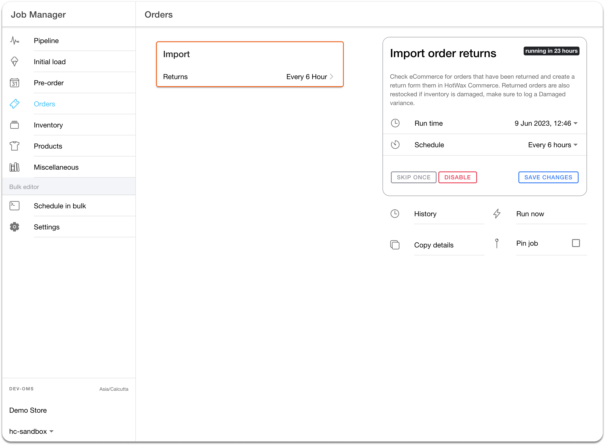

# Import Returns from Shopify

The "Import Order Returns" job in the Job Manager app initiates the return sync by sending an API request to Shopify for orders with returns created after the last sync. The frequency at which the "Import Order Returns" job is executed can be configured, but a recommended time interval for this job is every 15 minutes.

<figure><figcaption>
Fig.1(i): Import Order Returns in HotWax Commerce
</figcaption></figure>

Once the return information is downloaded, HotWax Commerce processes the JSON through the 'Process Bulk Imported Files' job. In cases where data discrepancies or issues may arise, error logs are generated, allowing for subsequent analysis and corrections to be made.

While processing returns from Shopify, if HotWax Commerce doesn't have the order being returned, it will automatically import the order from Shopify, guaranteeing that returns are always linked to a sales order for full traceability.


The refund total may differ from the actual sales total of the order. This variance can be attributed to scenarios where customers have paid shipping and handling charges on the order, which are sometimes excluded from the refund amount.


## In-Store Returns

**Shopify POS:** Shopify POS is already linked with Shopify ecommerce, providing access to online orders within the POS system. When in-store returns are created in Shopify POS for online orders, these return details are stored in Shopify. HotWax Commerce's 'Import Order Return' job works with both Shopify ecommerce and Shopify POS to download refund information and transfer transaction details to the ERP.

When in-store returns occur in Shopify POS, HotWax Commerce captures the facility ID where the returned inventory is received to ensure inventory is correctly incremented in the OMS.

**Non-Shopify POS:** For retailers using a POS system other than Shopify POS, there is no inherent information about online orders, including online order IDs in the POS system. Consequently, creating returns against these online orders becomes a challenge. HotWax Commerce, as an omnichannel Order Management System, retains records of online orders from Shopify. Retailers can use HotWax Commerce to create returns in store for online order, or use HotWax's order and return APIs to allow their POS system to accept online returns in store without having to switch systems.

To learn more about how to use HotWax Commerce for in store returns with POS systems other than Shopify POS, [read this document here](/documents/retail-operations/orders/returns/in-store-returns.md).
