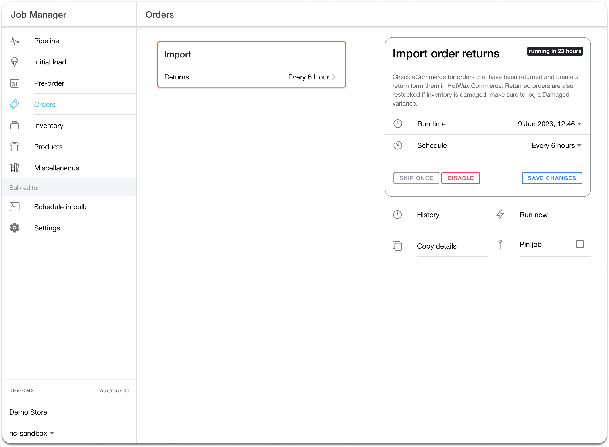

# Import Returns from Shopify

## Identify the configured import path

The current connector processes return and refund data from the Shopify order payload. When return lifecycle integration is configured for the return app, it can create a requested OMS return while the Shopify return is open and complete it when the required completion data arrives.

Older instances can use the dedicated `Import Order Returns` job. This path reads orders in the configured update-date window and stages eligible refund data for file processing. Automated runs also apply a refund-age filter, which defaults to the last 24 hours. An older refund can therefore be absent even when its order was updated recently.

Confirm the instance's job, import configuration, date window, and schedule before investigating missing records. Use the configured cadence rather than assuming every instance runs at a fixed interval.

<figure><figcaption>
Earlier Job Manager layout for the dedicated return-import job. The illustrated schedule is an example.
</figcaption></figure>

## Verify the processing result

1. Find the exact Shopify order, return, and refund identifiers that apply to the case.
2. Inspect the configured import job or order-sync message and its processing result.
3. If the path stages a file, inspect its file log and failed records; a successful download alone does not establish successful processing.
4. Confirm the resulting OMS return lines and refund transactions.
5. For restocked items, confirm the received quantity and mapped facility receipt.
6. Check the configured ERP export separately.

Use the [return, refund, and inventory diagram](README.md#separate-goods-money-and-inventory) to distinguish these results.

If the original order is missing, investigate its import and identifiers first. The older dedicated path can fetch a missing Shopify order when its Shopify configuration is available, then retry the return after creating the order. Do not assume this recovery applies to every integration or historical order.


The refund total may differ from the actual sales total of the order. This variance can be attributed to scenarios where customers have paid shipping and handling charges on the order, which are sometimes excluded from the refund amount.


## In-Store Returns

**Shopify POS:** Returns and refunds created in Shopify POS are stored in Shopify. The configured HotWax import path processes that data; verify the OMS result and ERP export independently.

Inventory receipt depends on the return or refund's restock data, the Shopify location-to-facility mapping, and the instance's inventory ownership. The older dedicated path receives stock only when HotWax manages inventory; otherwise it relies on Shopify inventory updates. A no-restock refund does not by itself increase stock.

**Non-Shopify POS:** For retailers using a POS system other than Shopify POS, there is no inherent information about online orders, including online order IDs in the POS system. Consequently, creating returns against these online orders becomes a challenge. HotWax Commerce, as an omnichannel Order Management System, retains records of online orders from Shopify. Retailers can use HotWax Commerce to create returns in store for online order, or use HotWax's order and return APIs to allow their POS system to accept online returns in store without having to switch systems.

For POS systems other than Shopify POS, see [In-store returns](../../../retail-operations/orders/returns/in-store-returns.md).
