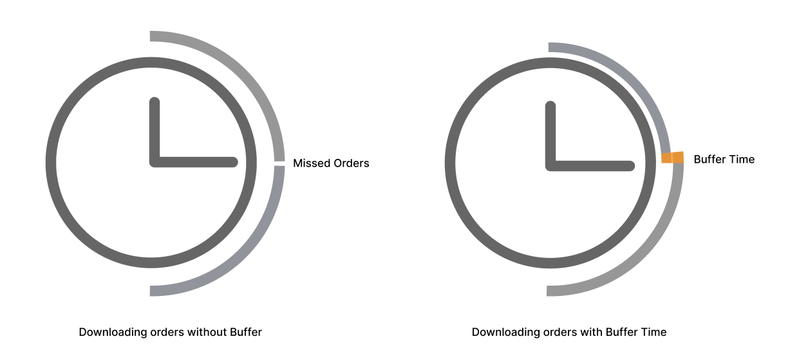

# thruDateBuffer and bufferTime

## thruDateBuffer

The `thruDateBuffer` setting delays order sync before importing orders from Shopify into HotWax Commerce. This gives Shopify enough time to process newly placed orders and update tags related to invalid or fraudulent activity, reducing the need to fetch orders again after sync.

Shopify typically takes around five minutes to process a new order. If HotWax Commerce syncs the order before this processing is complete, the order may need to be fetched again later to retrieve updated tags.

## bufferTime

It is possible for orders to be missed if they are placed during the microsecond gap between two consecutive jobs.

To prevent this, HotWax Commerce adds a time padding to the start time of each job. This creates overlap between consecutive jobs, helping capture orders that might otherwise be skipped during these brief timing gaps.

The `BufferTime` value is calculated using the previous job’s `runTime` and includes both the `thruDateBuffer` and the overlap duration. By default, BufferTime is set to 6 minutes:

- 5 minutes for `thruDateBuffer`  
- 1 minute overlap time

## Example Scenario

* Sync job interval: Every 15 minutes
* Default values: thruDateBuffer = 5 minutes, BufferTime = 6 minutes

1. The job running at 1:15 will sync orders from 12:54 - 1:10.
2. The job running at 1:30 will sync orders from 1:09 - 1:25.

This ensures that orders are accurately processed and reduces the risk of discrepancies.

<figure><figcaption>
<em>Fig.5 : Order downloading without buffer time</em>
</figcaption></figure>

