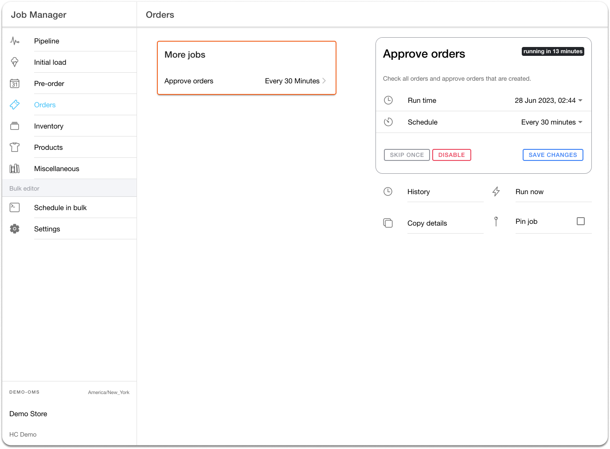

# Order Approval for Fulfillment

## Order Approval for Fulfillment in HotWax Commerce

### Overview

In HotWax Commerce, all orders are initially marked as ‘Created’ after being downloaded. Orders can be auto-approved with a scheduled job called 'Approve Orders.' This job checks the approval status of Shopify orders based on parameters set by Shopify merchants.

### Approve Orders Job

Orders need to be verified and approved before they can be fulfilled. Without a systematic approval process, invalid or fraudulent orders could proceed to fulfillment, leading to potential issues. The 'Approved Orders' job runs at a default frequency of 30 minutes and checks the ‘approved’ tag of the orders.

#### Example Scenario: Fraud Detection with Third-party Apps

For example, a third-party fraud detection app adds an ‘approved’ tag once all security checks are completed. After this processing is over, HotWax Commerce syncs these orders, initially labeling them as 'Created'. The 'Approved Orders' job then checks for the ‘approved’ tag and changes the status of these orders to 'Approved'. Only these orders are eligible for fulfillment.

<figure><figcaption>
<em>Fig.6 : Configuration of the “Approved Orders” job in the Job Manager App</em>
</figcaption></figure>


Any digital items are marked as 'Fulfilled' in Shopify. On import into HotWax Commerce, these items are automatically marked as completed.

