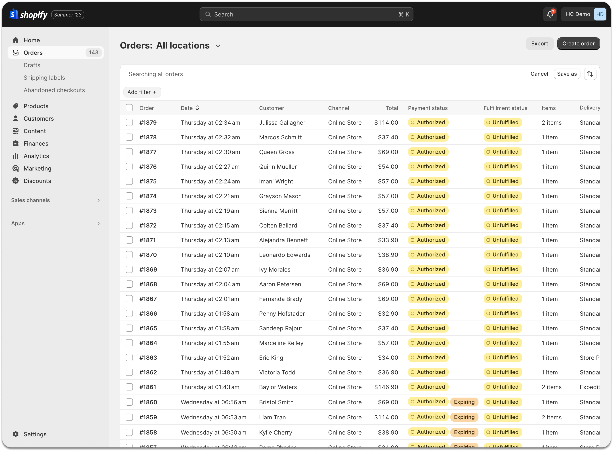
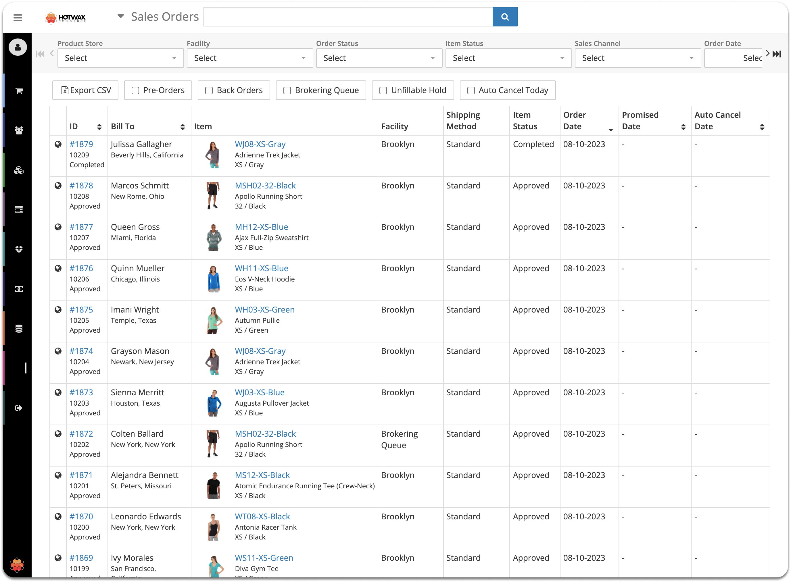
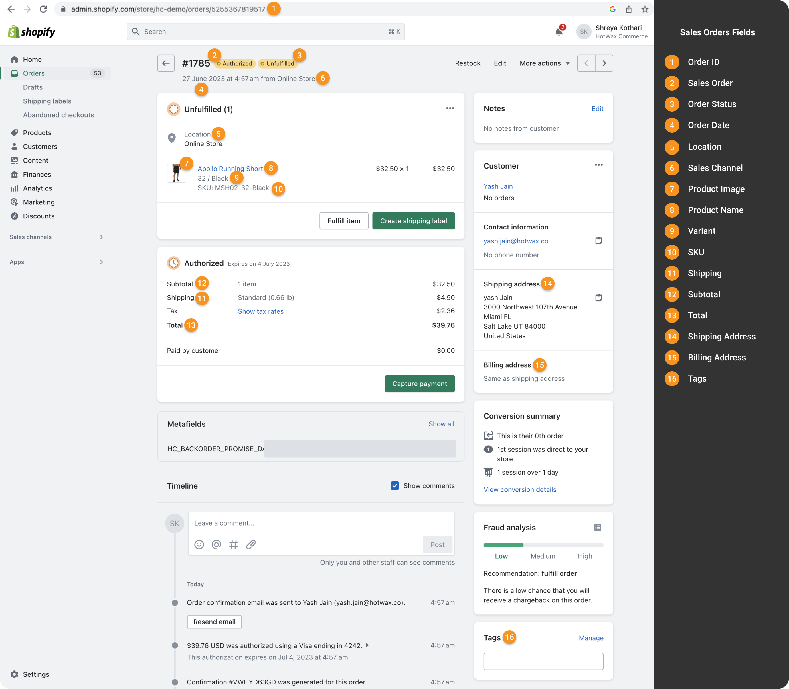
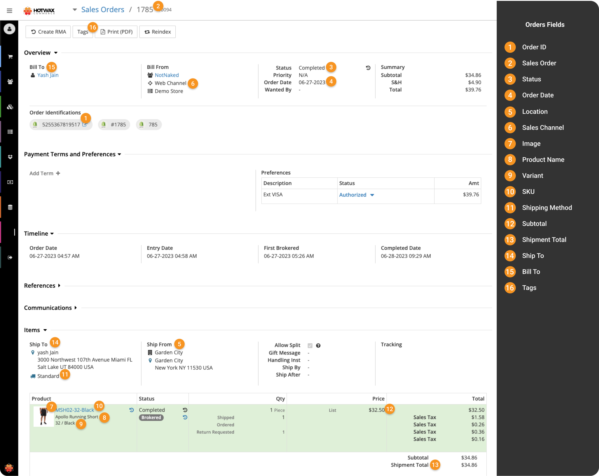
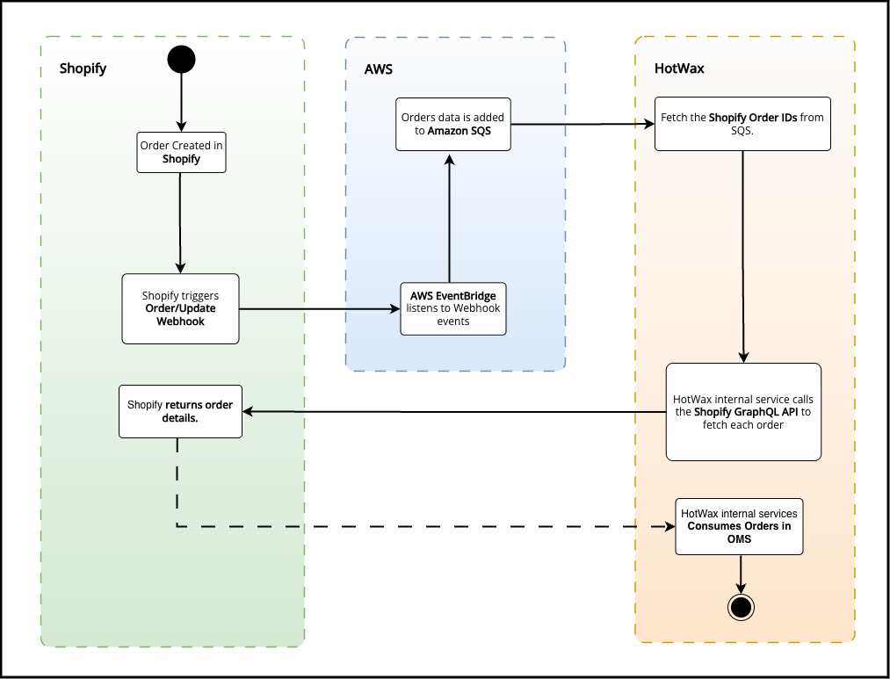

# Order download

## Initial order download

To start managing fulfillment, merchants need to import their existing open sales orders from Shopify into HotWax Commerce. This initial import brings in all pending orders so they can be processed and fulfilled without interruption.

HotWax Commerce handles this using the `Sync Shopify Order History` job. This job downloads open sales orders from a specific time period, including details like the order number, customer information, shipping address, billing details, and payment information.

### Order history

When HotWax Commerce performs the initial order download, it also creates an order history. This history is created to maintain a complete record of past orders. A complete order history allows merchants to manage customer service inquiries, process returns for past orders, and analyze historical sales data. HotWax Commerce creates this order history automatically as soon as past orders are successfully imported.

Order fields from Shopify map to HotWax Commerce as follows:

| Order in Shopify | Order in HotWax Commerce |
| ---------------- | ------------------------ |
| Order ID         | Order ID                 |
| Shopify Shop     | Product store            |
| Sales order      | Sales order              |
| Order Status     | Status                   |
| Order date       | Order date               |
| Location         | Sales Channel            |
| Image            | Image                    |
| Product name     | Product Name             |
| Variant          | Variant                  |
| SKU              | SKU                      |
| Subtotal         | Subtotal                 |
| Shipping         | Shipping Method          |
| Total            | Shipment Total           |
| Shipping Address | Ship To                  |
| Billing Address  | Bill To                  |
| Tags             | Tags                     |



<figure><figcaption>
<em>Fig.2(i): Orders in Shopify</em>
</figcaption></figure>



<figure><figcaption>
Fig.2(ii): Orders downloaded in HotWax Commerce
</figcaption></figure>





<figure><figcaption>
<em>Fig.3(i): Order Details in Shopify</em>
</figcaption></figure>



<figure><figcaption>
Fig.3(ii): Order Details in HotWax Commerce
</figcaption></figure>



## New order creation

<figure><figcaption>
<em>Fig.4: New Order Creation Flow</em>
</figcaption></figure>

When new orders are placed in Shopify, HotWax Commerce imports them using an event-driven flow. 
Here is how the new order import flow works:

### 1. Order creation in Shopify
When a customer completes a purchase, Shopify registers the new order.

### 2. Webhook triggers
Shopify immediately triggers the [`orders/updated` webhook](https://shopify.dev/docs/api/webhooks/2026-01?accordionItem=webhooks-orders-updated&reference=toml). This webhook acts as a real-time notification, instantly broadcasting that a new order exists instead of waiting for a scheduled sync.

### 3. Event routing through AWS EventBridge
HotWax Commerce has configured AWS EventBridge to catch the webhook event and securely routes the message to an Amazon Simple Queue Service (SQS) queue. This step prevents data loss during high traffic periods and keeps the system stable even if thousands of orders are placed at once.

### 4. Message polling from Amazon SQS
HotWax Commerce continuously polls the Amazon SQS queue for unread messages. SQS holds these messages safely until HotWax Commerce is ready to read them, so no order events are dropped.

### 5. Data enrichment via GraphQL API
While the webhook payload contains order details, HotWax Commerce only extracts the order ID from the message. It then uses this ID to call the [Shopify GraphQL API](https://shopify.dev/docs/api/admin-graphql/latest/queries/order). Fetching data directly from the API guarantees that HotWax Commerce processes the most reliable and up-to-date order information.

### 6. Receiving detailed order data
Shopify responds to the API request with the complete details of the order. This response includes everything needed for fulfillment, such as shipping addresses, item quantities, and payment statuses.

### 7. Order creation in HotWax Commerce
Finally, HotWax Commerce processes the detailed API response and creates the order in the order management system. The order is now fully integrated and ready to be routed to the best location for fulfillment.
