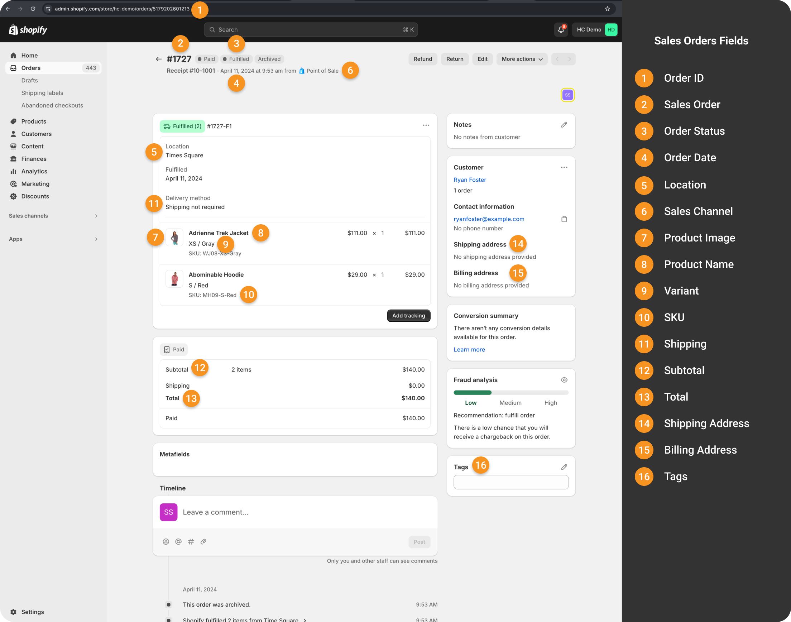
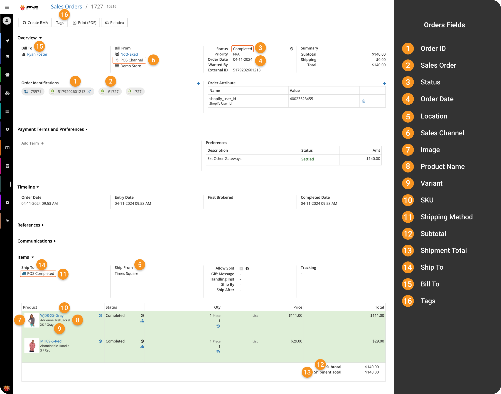

# POS sales download

Point of Sale (POS) sales are purchases made by customers directly at physical retail locations. These involve immediate payment and fulfillment, occurring in real-time.

HotWax Commerce imports POS sales from Shopify through the standard [order download process](order-download.md). Because POS sales in Shopify have already been fulfilled to customers in-store, they are automatically marked as `Completed` in HotWax Commerce upon import.

## Differentiating POS sales from regular orders

During import, HotWax Commerce differentiates between POS sales and regular orders by checking if the following conditions are met:

1. They are already fulfilled in Shopify.
2. They originated from the POS channel.
3. They have their shipping method set to `POS_Completed`.

If these conditions are satisfied, HotWax Commerce automatically marks the POS sales as `Completed`.


HotWax Commerce automatically deducts inventory against the POS sale upon import. This keeps the physical inventory available at the retail store accurate in HotWax Commerce.


POS sale fields in Shopify map to HotWax Commerce just like any regular order. Certain fields such as sales channel, status, and shipping method have different values for POS sales, reflecting how POS sales differ from regular orders.



<figure><figcaption>
POS sale field mapping
</figcaption></figure>



<figure><figcaption>
POS sale field mapping
</figcaption></figure>


