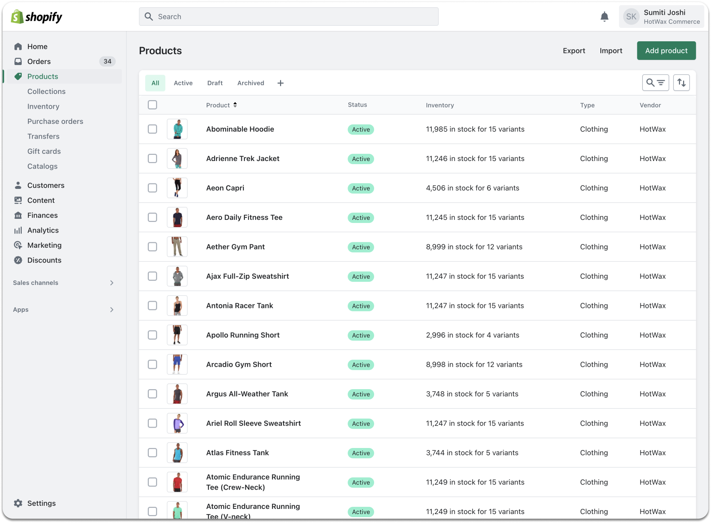
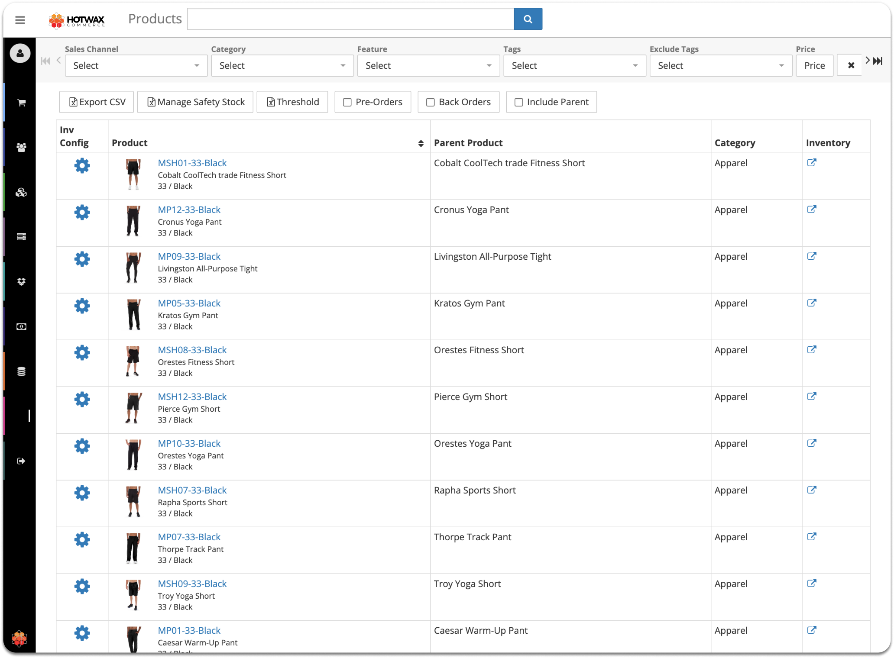
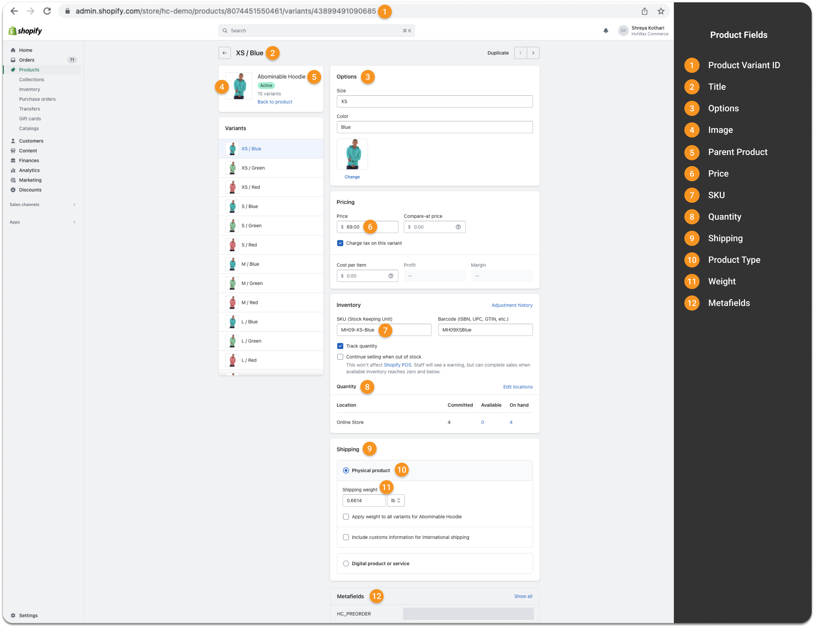
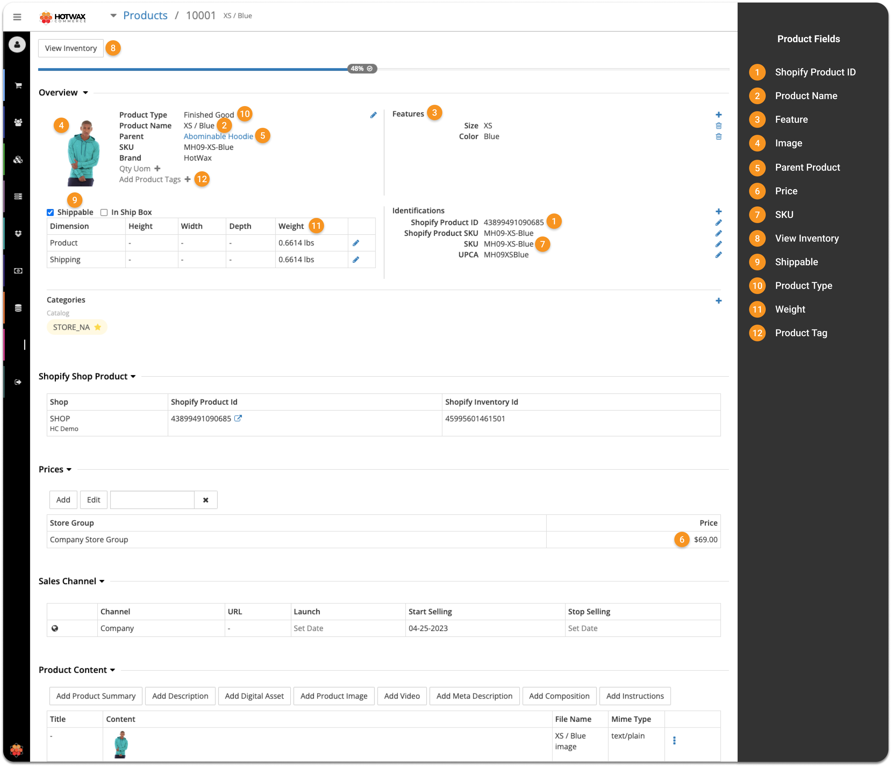

# Product download
HotWax Commerce treats Shopify as the primary source of truth for all product information. To keep large product catalogs synchronized without hitting API limits, HotWax Commerce uses the **Shopify GraphQL Admin API** and **Bulk Operations**. The synchronization process happens in seven stages:

1. **Queue the request**
HotWax Commerce first plans the sync by creating a record of type `BulkProductAndVariantsByIdQuery`. This is triggered by the scheduled job `queue_BulkQuerySystemMessage_BulkProductAndVariantsByIdQuery`. The system identifies exactly what data is needed from Shopify based on the last successful sync time and adds a small "time buffer" to ensure no updates are missed.
*   **Initial Status**: `SmsgProduced` (Message is ready to be sent).

2. **Send to Shopify**
The scheduled job `send_ProducedBulkOperationSystemMessage_ShopifyBulkQuery` picks up the queued request. Because Shopify only allows one bulk operation to run at a time per shop, the system checks for a "busy lock" (any message in `SmsgSent` status for the `ShopifyBulkQuery` group). If clear, it sends the GraphQL mutation to Shopify and updates the record.
*   **Updated Status**: `SmsgSent` (Shopify has accepted the request).

3. **Confirm completion**
HotWax Commerce monitors the status of the bulk operation using two methods:
*   **Polling**: The scheduled job `poll_BulkOperationResult_ShopifyBulkQuery` periodically checks Shopify.
*   **Webhooks**: Shopify sends a real-time `Bulk Operations Finish` notification.
Once Shopify confirms completion, the system updates the outgoing message status and creates a new **Incoming System Message** containing the result file link.
*   **Final Outgoing Status**: `SmsgConfirmed` (The operation is successfully finished).

4. **Prepare data**
The raw results are downloaded as a JSONL (JSON Lines) file. The system message framework triggers the `consume#ProductVariantUpdates` service, which transforms the "flat" file into a nested JSON format. This stage re-establishes the relationships between parent products and their specific variants, features, and metadata.

5. **Identify changes**
The data is passed to the core synchronization service, `sync#ShopifyProduct`. Instead of blindly overwriting the database, HotWax Commerce identifies exactly what has changed using a **Baseline Comparison** strategy. The system groups product data into "buckets" such as core details, tags, features, and pricing and computes a unique **SHA-256 Hash** for each.
If the new hash matches the one stored in the `ProductUpdateHistory` table, the system knows that specific group of data hasn't changed and skips it.

6. **Update the database**
Only the identified changes (deltas) are applied to the database. This selective update approach handles core product details, features, tags, pricing, and identifiers like SKU and UPC. It also automatically detects the correct product type (e.g., `FINISHED_GOOD` vs. `DIGITAL_GOOD`) based on Shopify flags.

7. **Save history**
Finally, the system updates the `ProductUpdateHistory` record with the new hashes and a snapshot of the current data. This "closes the loop" and makes the system **idempotent**, meaning that running the sync again with the same data will result in zero database changes. This stage also links the update back to the original `systemMessageId` for a complete record.

### Product data from Shopify is mapped in HotWax Commerce fields as outlined in the following table

1. **Parent Product**

A virtual product, also known as a parent product, does not have a set size or color. When using HotWax Commerce, all fields in the product JSON are imported, but only relevant fields are processed to improve system efficiency. Here's how parent product fields are mapped in Shopify and HotWax Commerce:

<table><thead><tr><th width="103.33333333333331">S.No.</th><th width="251">Fields in Shopify</th><th>Fields in HotWax Commerce</th></tr></thead><tbody><tr><td>1</td><td>ID</td><td>Shopify Product ID</td></tr><tr><td>2</td><td>Title</td><td>Product Name</td></tr><tr><td>3</td><td>Body HTML</td><td>Product Content</td></tr><tr><td>4</td><td>Vendor</td><td>Brand</td></tr><tr><td>5</td><td>Product_type</td><td>Categories</td></tr><tr><td>6</td><td>Tags</td><td>Tags</td></tr><tr><td>7</td><td>Variant</td><td>Variant</td></tr><tr><td>8</td><td>Media</td><td>Overview</td></tr></tbody></table>




<figure><figcaption>
<em>Fig.2(i): Products in Shopify</em>
</figcaption></figure>





<figure><figcaption>
Products downloaded in HotWax Commerce
</figcaption></figure>




2. **Variant Product**

The parent product comes in various sizes and colors, resulting in multiple variants. With HotWax Commerce, all of these variants can be downloaded. Here's how product variant fields are mapped in Shopify and HotWax Commerce:

<table><thead><tr><th width="136.33333333333331">S.No.</th><th>Fields in Shopify</th><th>Fields in HotWax Commerce</th></tr></thead><tbody><tr><td>1</td><td>Product Variant ID</td><td>Shopify Product ID</td></tr><tr><td>2</td><td>Title</td><td>Product Name</td></tr><tr><td>3</td><td>Options</td><td>Feature</td></tr><tr><td>4</td><td>Image</td><td>Image</td></tr><tr><td>5</td><td>Parent Product</td><td>Parent Product</td></tr><tr><td>6</td><td>Price</td><td>Price</td></tr><tr><td>7</td><td>SKU</td><td>SKU</td></tr><tr><td>8</td><td>Quantity</td><td>View inventory</td></tr><tr><td>9</td><td>Shipping</td><td>Shippable</td></tr><tr><td>10</td><td>Product Type</td><td>Product Type</td></tr><tr><td>11</td><td>Weight</td><td>Weight</td></tr><tr><td>12</td><td>Metafields</td><td>Product Tag</td></tr></tbody></table>



<figure><figcaption>
<em>Fig.3(i): Variant product in Shopify with details</em>
</figcaption></figure>



<figure><figcaption>
Fig.3(ii) : Variant product in HotWax Commerce with details
</figcaption></figure>



Shopify has multiple product identifiers, such as Shopify Product ID, Product SKU, Product Name, and UPCA. Therefore before importing products, it is important to set up the primary product identifier that will be mapped with the product ID in HotWax Commerce. The primary product identifier can be set up in HotWax Commerce when [setting up a new product store](/documents/system-admin/product-store/add-more-product-stores.md) as per retailers' requirements.

**Managing Sales Orders For Products That Are Not In HotWax Commerce**

When orders are placed on Shopify, they are also transferred to HotWax Commerce. However, sometimes an order might include a newly launched product in Shopify that has not yet been synced with HotWax Commerce. This can cause the order download to fail if the product import job has not yet run. To prevent this, HotWax Commerce creates a temporary placeholder product for the new item. Once the product import job is run, all the necessary information such as the product name, brand, price, weight, and so on are added to the placeholder product. This ensures that the order download is successful and the customer receives their product.
