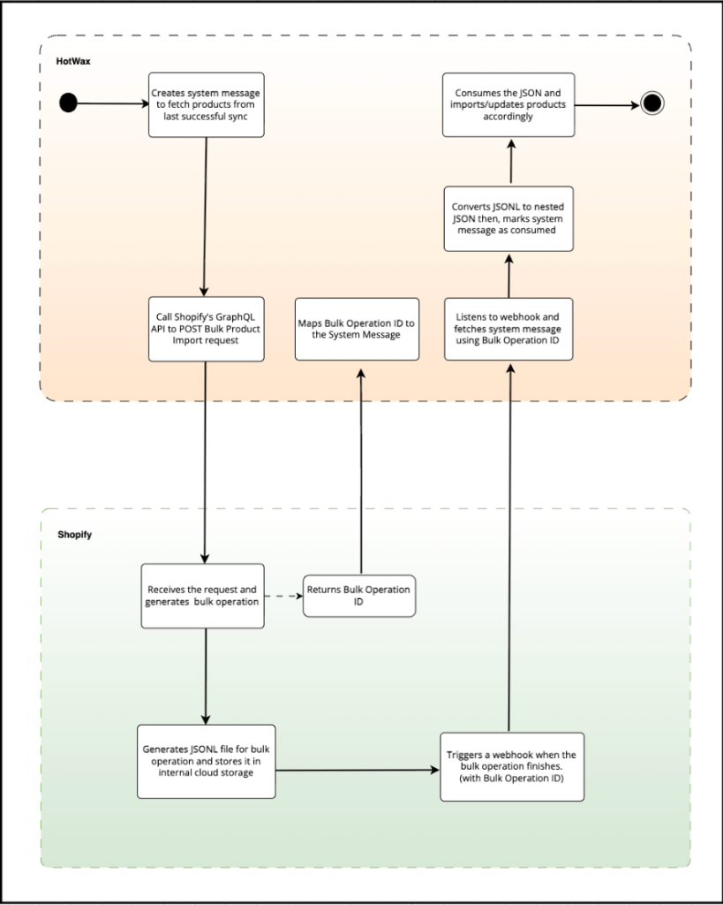

# Product download

HotWax Commerce treats Shopify as the primary source of truth for all product information. To keep large product catalogs synchronized without hitting API limits, HotWax Commerce uses the Shopify GraphQL Admin API and bulk operations. 

The synchronization process runs in seven stages:

1. **Queue the request:** HotWax Commerce plans the sync by creating a system message of type `BulkQueryShopifyProductUpdates`. This is triggered by the scheduled job `sync_ShopifyProductUpdates` (service `sync#ShopifyProductUpdates`). The system identifies exactly what data is needed from Shopify based on the last successful sync time and adds a small time buffer to make sure no updates are missed.
   * **Initial status:** `SmsgProduced` (Message is ready to be sent)

2. **Send to Shopify:** The service `send#ShopifyBulkQueryMessage` picks up the queued request, sends the GraphQL mutation to Shopify, and saves Shopify's bulk operation ID to the `remoteMessageId` field.
   * **Updated status:** Transitions to `SmsgSent` (Shopify has accepted the request)

3. **Confirm completion:** Shopify processes the bulk query. HotWax Commerce monitors the status of the bulk operation using two methods:
   * **Polling:** The scheduled job `poll_ShopifyBulkOperationResult` periodically checks Shopify.
   * **Webhooks:** Shopify sends a real-time `Bulk Operations Finish` notification.
   Once completion is confirmed, the system updates the message status and downloads the raw JSONL result file directly to `${receiveMovePath}/${systemMessageId}.jsonl`.
   * **Updated status:** Transitions to `SmsgReceived` (The result file is downloaded)

4. **Prepare data:** The system message framework triggers the `consume#ShopifyProductDataFile` service, which reads the downloaded JSONL file, transforms it into a nested JSON format, and uploads it to the MDM queue (`SYNC_SHOPIFY_PRODUCT`).
   * **Final status:** Transitions to `SmsgConsumed` (The file has been processed and queued for database sync)

5. **Identify changes:** The MDM queue processes the data using the `sync#ShopifyProduct` service. Instead of overwriting the database, HotWax Commerce identifies exactly what has changed using a baseline comparison strategy. The system groups product data (core details, tags, features, and pricing) and computes a unique SHA-256 hash for each group. If the new hash matches the one stored in the `ProductUpdateHistory` table, the system knows that specific group of data has not changed and skips it.

6. **Update the database:** Only the identified changes (deltas) are applied to the database. This selective update handles core product details, features, tags, pricing, and identifiers like SKU and UPC. It also detects the correct product type (such as `FINISHED_GOOD` vs. `DIGITAL_GOOD`) based on Shopify flags.

7. **Save history:** Finally, the system updates the `ProductUpdateHistory` record with the new hashes and a snapshot of the current data. This makes the sync process idempotent, meaning that running the sync again with the same data will result in zero database changes. This stage also links the update back to the original `systemMessageId` for a complete record.

<figure><figcaption>
Shopify product synchronization flow using bulk operations
</figcaption></figure>

---

### Product data mapping

#### Parent product

A virtual product, also known as a parent product, does not have a set size or color. All fields in the product JSON are imported, but only relevant fields are processed to improve system performance. Here is how parent product fields are mapped between Shopify and HotWax Commerce:

| No. | Shopify fields | HotWax Commerce fields |
| :--- | :--- | :--- |
| 1 | ID | Shopify Product ID |
| 2 | Title | Product Name |
| 3 | Body HTML | Product Content |
| 4 | Vendor | Brand |
| 5 | Product_type | Categories |
| 6 | Tags | Tags |
| 7 | Variant | Variant |
| 8 | Media | Overview |

<figure><figcaption>
Products in Shopify
</figcaption></figure>

<figure><figcaption>
Products downloaded in HotWax Commerce
</figcaption></figure>

#### Variant product

The parent product comes in various sizes and colors, resulting in multiple variants. Here is how product variant fields are mapped:

| No. | Shopify fields | HotWax Commerce fields |
| :--- | :--- | :--- |
| 1 | Product Variant ID | Shopify Product ID |
| 2 | Title | Product Name |
| 3 | Options | Feature |
| 4 | Image | Image |
| 5 | Parent Product | Parent Product |
| 6 | Price | Price |
| 7 | SKU | SKU |
| 8 | Quantity | View inventory |
| 9 | Shipping | Shippable |
| 10 | Product Type | Product Type |
| 11 | Weight | Weight |
| 12 | Metafields | Product Tag |

<figure><figcaption>
Variant product in Shopify with details
</figcaption></figure>

<figure><figcaption>
Variant product in HotWax Commerce with details
</figcaption></figure>

Shopify has multiple product identifiers, such as Shopify Product ID, Product SKU, Product Name, and UPC. Before importing products, set up the primary product identifier that will map to the product ID in HotWax Commerce. The primary product identifier can be configured in HotWax Commerce when setting up a new product store.

#### Manage sales orders for products not in HotWax Commerce

When orders are placed on Shopify, they transfer to HotWax Commerce. However, sometimes an order might include a newly launched product in Shopify that has not yet synced with HotWax Commerce. This can cause the order download to fail if the product import job has not yet run. To prevent this, HotWax Commerce creates a temporary placeholder product for the new item. Once the product import job runs, the system adds the necessary information, such as the product name, brand, price, and weight, to the placeholder product. This makes sure that the order download succeeds.

