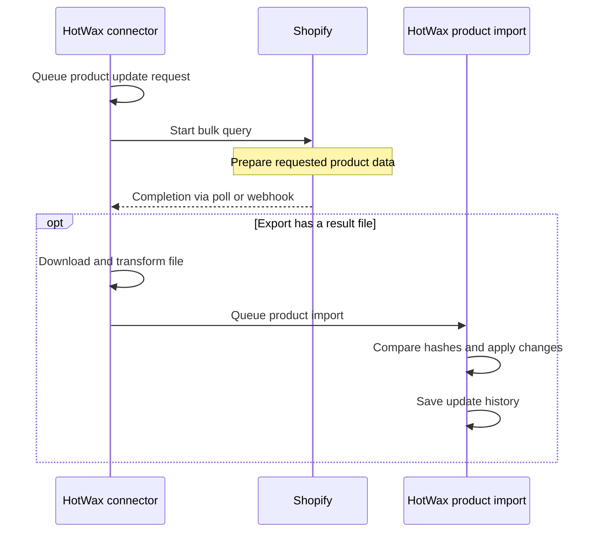
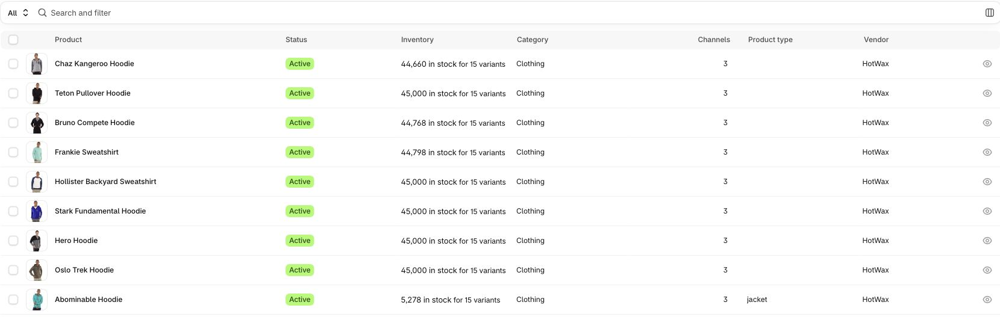
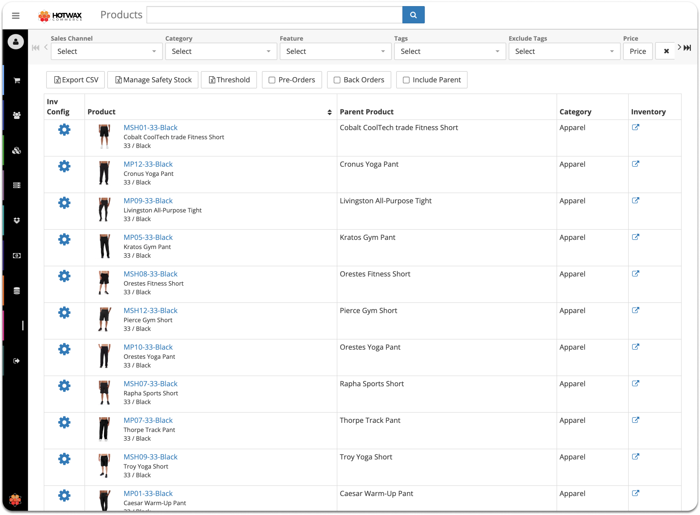
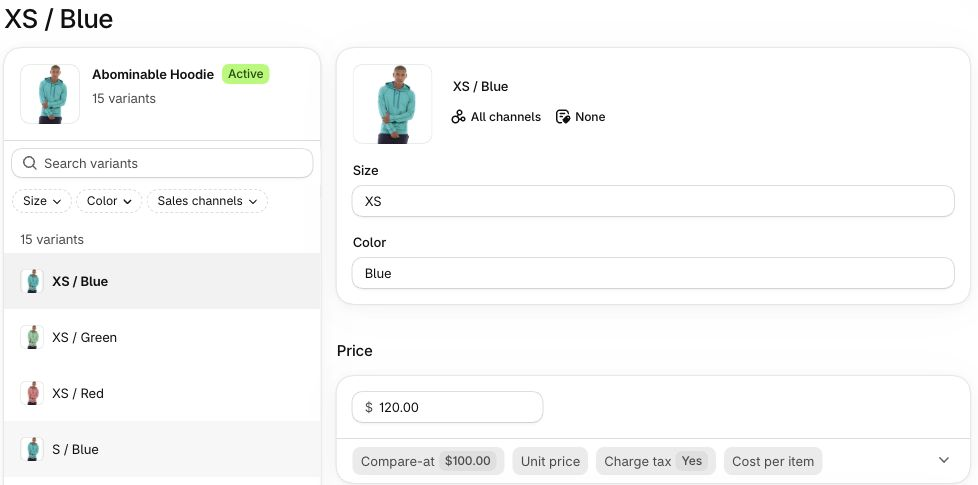
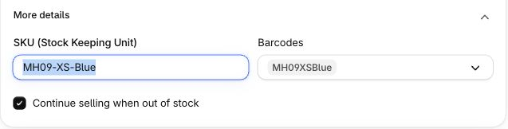
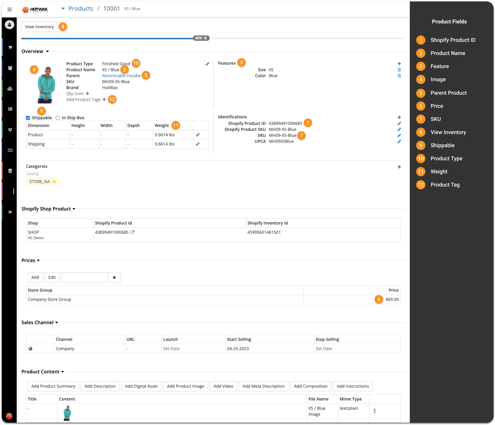

# Product download

HotWax Commerce treats Shopify as the primary source of truth for all product information. To keep large product catalogs synchronized without hitting API limits, HotWax uses the Shopify GraphQL Admin API and bulk operations.

The synchronization process runs in seven stages:

1. **Queue the request:** The scheduled `Sync Shopify Product Updates` job plans the sync. It identifies exactly what data is needed from Shopify based on the last successful sync time and adds a small time buffer to make sure no updates are missed.

2. **Send to Shopify:** HotWax sends the bulk query to Shopify's GraphQL Admin API and records the bulk operation that Shopify creates in response.

3. **Confirm completion:** Shopify processes the bulk query in the background. HotWax confirms when the operation finishes in two ways: it polls Shopify on a schedule, and it listens for a real-time `Bulk Operations Finish` webhook from Shopify. Once completion is confirmed, HotWax downloads the result file, a JSONL file containing the products and variants returned by the query. If Shopify completes the operation without a result file, there is no product file to import.

4. **Prepare data:** HotWax reads the downloaded file, transforms it into a nested JSON format, and queues it for the database sync.

5. **Identify changes:** Instead of overwriting the database, HotWax identifies exactly what has changed using a baseline comparison strategy. It groups related product data (such as core details, tags, features, identifiers, and variant associations) and computes a unique SHA-256 hash for each group. If a new hash matches the one stored in the `ProductUpdateHistory` table, that group has not changed and is skipped.

6. **Update the database:** Only the identified changes (deltas) are applied. This selective update handles core product details, features, tags, pricing, and identifiers like SKU and UPC. It also detects the correct product type (such as `FINISHED_GOOD` vs. `DIGITAL_GOOD`) based on Shopify flags.

7. **Save history:** Finally, HotWax updates the `ProductUpdateHistory` record with the new hashes and a snapshot of the current data. On subsequent runs, matching hashes let HotWax skip unchanged data groups rather than reapply those updates.

```mermaid
sequenceDiagram
    participant Connector as HotWax connector
    participant Shopify
    participant Import as HotWax product import
    Connector->>Connector: Queue product update request
    Connector->>Shopify: Start bulk query
    Note over Shopify: Prepare requested product data
    Shopify-->>Connector: Completion via poll or webhook
    opt Export has a result file
        Connector->>Connector: Download and transform file
        Connector->>Import: Queue product import
        Import->>Import: Compare hashes and apply changes
        Import->>Import: Save update history
    end
```

Shopify export completion does not prove that the HotWax import succeeded. Use the [Product sync console](product-sync-console.md) to review the export and import stages separately, including any failed import records.

Developer details: services, system messages, and statuses

The flow runs on a single system message of type `BulkQueryShopifyProductUpdates`, which moves through the following services and statuses:

| Stage | Service | System message status |
| :--- | :--- | :--- |
| Queue the request | `sync#ShopifyProductUpdates` (job `sync_ShopifyProductUpdates`) | `SmsgProduced` |
| Send to Shopify | `send#ShopifyBulkQueryMessage` (saves the bulk operation ID to `remoteMessageId`) | `SmsgSent` |
| Confirm completion | `poll_ShopifyBulkOperationResult` job, or the `Bulk Operations Finish` webhook; the result downloads to `${receiveMovePath}/${systemMessageId}.jsonl` | `SmsgReceived` |
| Prepare data | `consume#ShopifyProductDataFile` uploads to the master data management (MDM) queue `SYNC_SHOPIFY_PRODUCT` | `SmsgConsumed` |
| Identify changes, update, and save history | `sync#ShopifyProduct` computes the SHA-256 hashes, writes the deltas, and updates `ProductUpdateHistory` | — |

For a completed export with no result URL, HotWax marks the system message consumed without creating a product import file. The import stage above applies when Shopify returns a result file.

---

### Product data mapping

#### Parent product

A virtual product, also known as a parent product, does not have a set size or color. All fields in the product JSON are imported, but only relevant fields are processed to improve system performance. Here is how parent product fields are mapped between Shopify and HotWax:

| No. | Shopify fields | HotWax fields |
| :--- | :--- | :--- |
| 1 | ID | Shopify Product ID |
| 2 | Title | Product Name |
| 3 | Body HTML | Product Content |
| 4 | Vendor | Brand |
| 5 | Product_type | Categories |
| 6 | Tags | Tags |
| 7 | Variant | Variant |
| 8 | Media | Overview |

<figure><figcaption>
Demo catalog in Shopify. Each row represents a parent product with its variants; quantities are examples captured from the demo store.
</figcaption></figure>

<figure><figcaption>
Products downloaded in HotWax
</figcaption></figure>

#### Variant product

The parent product comes in various sizes and colors, resulting in multiple variants. Here is how product variant fields are mapped:

| No. | Shopify fields | HotWax fields |
| :--- | :--- | :--- |
| 1 | Product Variant ID | Shopify Product ID |
| 2 | Title | Product Name |
| 3 | Options | Feature |
| 4 | Image | Image |
| 5 | Parent Product | Parent Product |
| 6 | Price | Price |
| 7 | SKU | SKU |
| 8 | Quantity | View inventory |
| 9 | Shipping | Shippable |
| 10 | Product Type | Product Type |
| 11 | Weight | Weight |
| 12 | Metafields | Product Tag |

<figure><figcaption>
The XS / Blue variant belongs to the Abominable Hoodie parent product. Its size and color distinguish it from the other variants.
</figcaption></figure>

<figure><figcaption>
SKU and barcode for the same demo variant. Use the configured primary identifier when matching the variant to a HotWax product.
</figcaption></figure>

<figure><figcaption>
Variant product in HotWax with details
</figcaption></figure>

Shopify has multiple product identifiers, such as Shopify Product ID, Product SKU, Product Name, and UPC. Before importing products, set up the primary product identifier that maps to the product ID in HotWax. The primary product identifier can be configured in HotWax when setting up a new product store.

#### Manage sales orders for products not in HotWax

When orders are placed on Shopify, they transfer to HotWax. However, sometimes an order might include a newly launched product in Shopify that has not yet synced with HotWax. This can cause the order download to fail if the product import job has not yet run. To prevent this, HotWax creates a temporary placeholder product for the new item. Once the product import job runs, the system adds the necessary information, such as the product name, brand, price, and weight, to the placeholder product. This makes sure that the order download succeeds.
