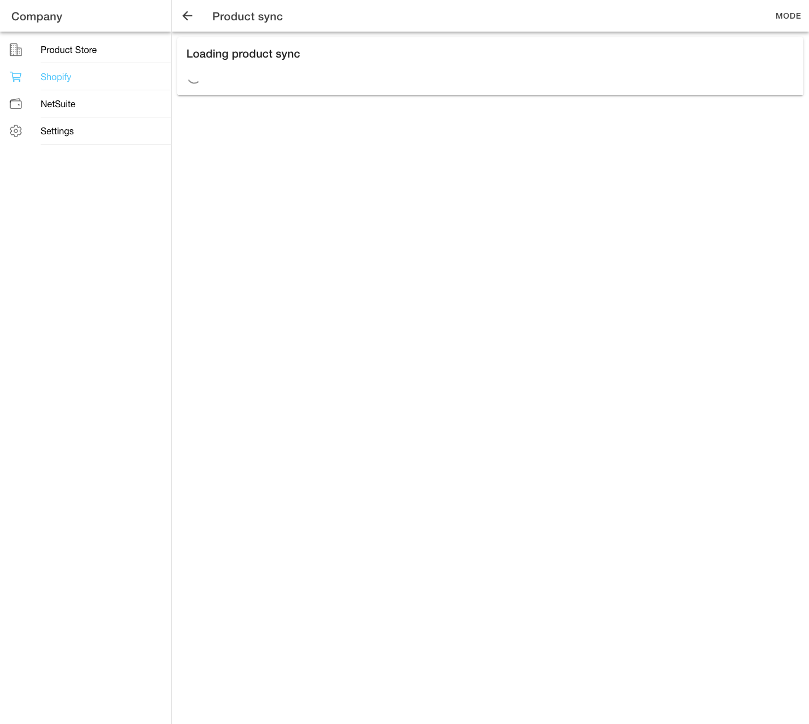
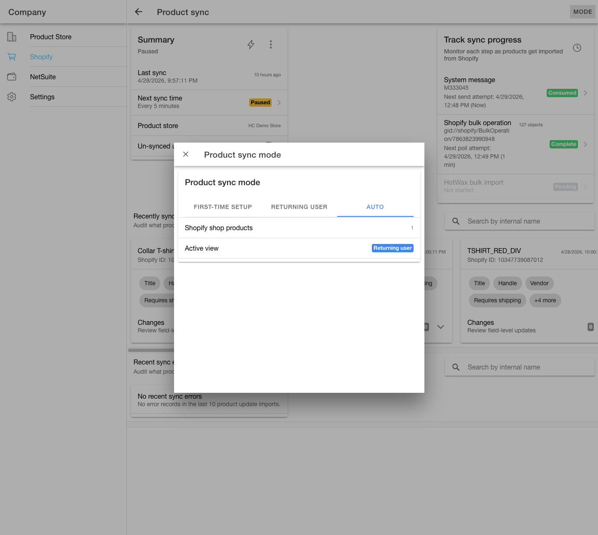
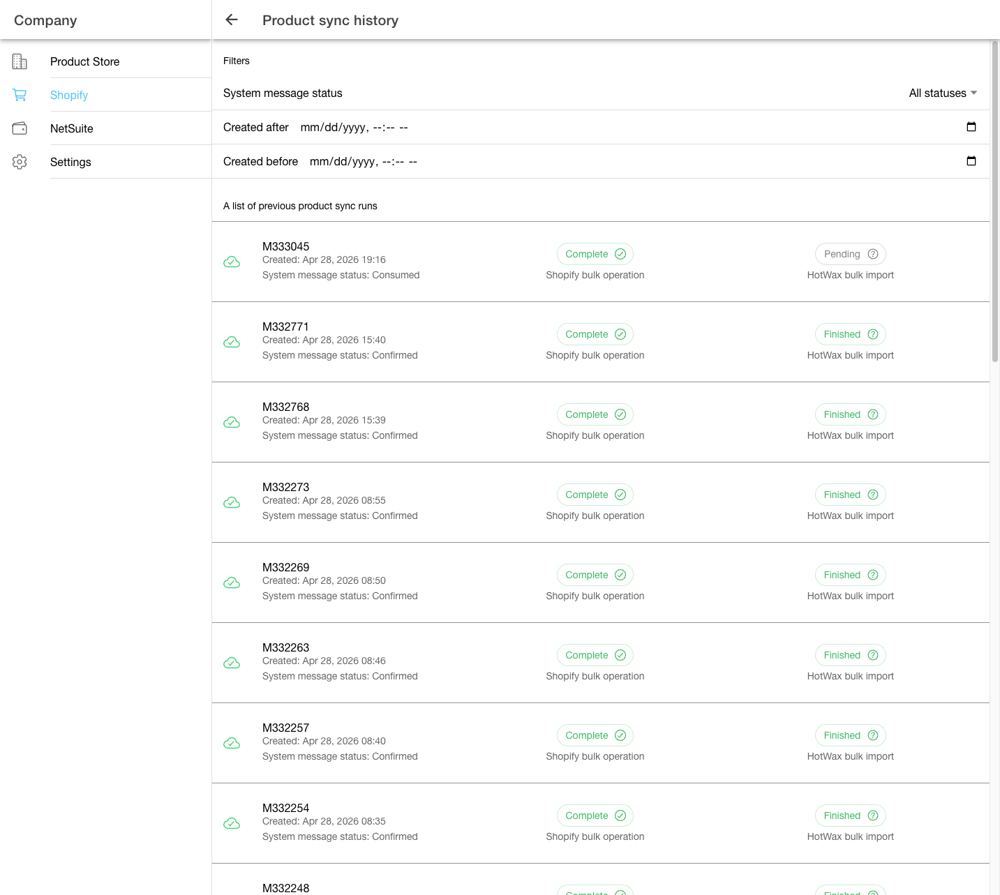

# Product sync console

Use the product sync console after Shopify onboarding to monitor current product sync progress, review recently synchronized changes, investigate errors, and audit previous runs.

For initial setup and the first product import, follow [Set up HotWax Commerce with Shopify](../../../system-admin/administration/company/product-store-onboarding.md). For exact post-launch controls and recovery actions, use [Manage Shopify Product Sync](../../../system-admin/administration/company/manage-shopify-product-sync.md).

Open the console from a Shopify shop record in the Company app:

1. Go to `Shopify`.
2. Open the Shopify shop you want to review.
3. Open `Product sync`.

The page uses the selected Shopify shop to decide which operational state to show.

- If the shop has products linked to HotWax Commerce, the page opens in the returning-user view.
- If the shop has no linked HotWax Commerce products, the page opens the setup view, which means onboarding is incomplete or the expected product links are missing.


Most users can leave the page in automatic mode. Automatic mode chooses the view by checking whether the shop has products linked to HotWax Commerce.


## If the setup view appears

Do not improvise a first import from this operational reference. Return to the [canonical Shopify onboarding guide](../../../system-admin/administration/company/product-store-onboarding.md) and complete its product preparation, identity, import, and terminal-result checks.

## Returning-user view

Returning users see a product sync dashboard with the latest known sync state.

<figure><figcaption>
Product sync dashboard for a returning Shopify shop
</figcaption></figure>

### Summary

The Summary card shows:

- Last sync time.
- Next sync time.
- Whether someone paused the scheduled product sync job.
- The linked HotWax product store.
- The count of Shopify products that have changed since the last confirmed product update sync.

Click `Un-synced updates` to review the updated Shopify products that HotWax hasn't imported yet. The modal shows product title, handle, vendor, product type, Shopify update time, variant count, status, and inventory.

If HotWax Commerce can't identify the selected shop's sync history or can't read Shopify product counts, the Summary card shows an error instead of a count. Use the error message to decide whether to retry or contact support.

### Mode selector

Use `Mode` when support asks you to compare automatic view selection with the first-time setup or returning-user view.

<figure><figcaption>
Mode selector showing automatic detection, product count, and active view
</figcaption></figure>

### Track sync progress

The Track sync progress card shows the current product update path:

| Step | What it means |
| --- | --- |
| Product sync request | Shows whether HotWax has created, queued, or completed the request to process Shopify product updates. |
| Shopify product export | Shows whether Shopify has prepared the product update file, how many objects Shopify returned, and the technical operation ID for support. |
| HotWax product import | Shows whether HotWax has started importing the Shopify file, plus processed and failed record counts. |

Click a step to open its details. A step stays unavailable until HotWax Commerce has a real record ID for that part of the sync.

Click the clock icon in the Track sync progress card header to open the Product sync history page for the same Shopify shop.

### How HotWax chooses the progress run

The progress card helps users answer this business question: "Which product sync run needs attention right now?"

For the selected Shopify shop, HotWax reviews the product update sync requests it has already recorded for that shop. It then chooses the run that's most useful for an operator to monitor:

| Priority | Where the Shopify bulk operation is | What this means for the user |
| --- | --- | --- |
| HotWax is importing the Shopify product file. | Shopify has already accepted the bulk request, prepared the product data file, and returned it to HotWax. HotWax is now applying that file to products, variants, tags, features, metafields, and Shopify shop links. | This is the most important active run because it can still change catalog data in HotWax. If it stalls here, Shopify finished its part, but HotWax hasn't finished making the products usable for orders, inventory, and fulfillment. |
| HotWax has received Shopify's bulk operation response and is preparing the import. | Shopify has responded to the bulk job. HotWax has enough information to continue toward file processing, but the HotWax import record may not exist yet. | This confirms the request reached both systems. Wait for HotWax to create or continue the import instead of starting another run. |
| Shopify has the bulk operation request. | HotWax has sent the product sync request to Shopify. Shopify is now responsible for preparing the product export file. | This tells the user the work is outside HotWax for the moment. If the run stays here, the likely issue is Shopify bulk operation progress, not product matching or HotWax import logic. |
| HotWax has queued the request, but Shopify doesn't have it yet. | The product sync request exists in HotWax, but HotWax hasn't sent the bulk operation to Shopify. | This exposes an early queue or scheduler delay. The user knows Shopify hasn't started preparing product data yet. |
| No active bulk operation or import needs attention. | The latest product sync run already moved through Shopify export and HotWax import. | The card becomes a reference for the most recent completed sync, so users can confirm what happened last without mistaking it for active work. |

This order matters because the card surfaces the oldest unresolved work before it shows the newest finished work. That helps users identify whether the run is waiting on Shopify to prepare the file or waiting on HotWax to apply the file.

It also keeps attention on the run that can still affect product availability, product details, and downstream inventory or order workflows.

After HotWax selects the run, it loads the related Shopify export record and HotWax import record. Those records supply the Shopify object count, import ID, total record count, failed record count, and status badges shown in the progress card.

### Recently synced product updates

The Recently synced product updates section shows the product changes HotWax detected from Shopify's product export file. Each card shows the product or variant, the Shopify reference, the update time, and the field-level changes HotWax can apply or audit.

HotWax currently supports these product update fields:

| Shopify change | HotWax impact |
| --- | --- |
| Parent product title | Updates the parent product name. |
| Parent product vendor | Updates the product brand. |
| Parent product handle | Updates the parent product's internal name with the Shopify handle. |
| Parent product image link | Updates the parent product image. |
| Parent product gift card, shipping, and component flags | Updates the product type when the product store permits that type to change. |
| Shopify product options and option values | Updates selectable product features, including option position and value. |
| Shopify product tags | Updates product tag keywords. |
| Shopify product metafields | Updates product attributes. A configured `parent_product` metafield updates the parent product identification used by HotWax. |
| Variant title | Updates the variant product name. |
| Variant image link | Updates the variant product image. |
| Variant price | Updates the variant list and purchase price for the product store currency. |
| Variant gift card, shipping, and component flags | Updates the variant product type when the product store permits that type to change. |
| Variant stock keeping unit, barcode, and Shopify variant ID | Updates product identifiers and the Shopify product link. |
| Variant selected options | Updates variant features such as size, color, or any Shopify option values used by the shop. |
| Variant inventory item ID and weight | Updates the Shopify inventory item link, shipping weight, product weight, and weight unit. |
| Variant parent product and sequence | Updates the parent-child product association and variant order. |
| Shopify product type | Updates the product type keyword used for the variant's parent product. |

Use the search field to filter by internal name or Shopify reference.

When no updates exist, the section shows `No recently synced product updates`.

### Recent sync errors

The Recent sync errors section shows failed product update imports. Each item includes the product reference and error content.

If errors exist, each error card helps the user decide whether to retry the failed work or download the raw Shopify file for review.

Click `Retry` to rerun the failed product update import for that record. Click `Download raw file` to download the Shopify file or error content used by the failed import.

When no errors exist, the section shows `No recent sync errors`.

## Product sync history

Open history from the returning-user view by clicking the clock icon in the Track sync progress card header. The app opens the history page for the same Shopify shop.

<figure><figcaption>
Product sync history with filters and previous sync runs
</figcaption></figure>

The history page helps users answer these questions:

- Did a previous product sync run finish?
- Which run changed product data most recently?
- Did Shopify return product data for the run?
- Did HotWax import every record or report failures?

Use filters to narrow the list:

- Run status.
- Created after.
- Created before.

Each run expands into the Shopify export and HotWax import details that support or operations teams may need during review.

| History field | What it means |
| --- | --- |
| Run status | Whether the product sync request is still waiting, in progress, finished, or failed. |
| Shopify product export | The Shopify background task used to read product updates. |
| Object count | The number of Shopify objects returned by the export. |
| HotWax product import ID | The HotWax import log that processed the Shopify file. |
| Total record count | Number of records processed by the HotWax import. |
| Failed record count | Number of records that failed in the HotWax import. |

Click the query chip to review the Shopify query used for the run. Click the download chip to download the raw Shopify file when HotWax has a downloadable import file.

If the history page can't load, use `Retry` to request the shop's sync history again. If the page still doesn't load, contact support because HotWax Commerce can't confirm the previous Shopify export or HotWax import status for that shop.

### How history filtering and sorting work

The history page starts with the selected Shopify shop. HotWax finds the sync history that belongs to that shop and requests product update runs with the newest run first.

When users select a run status, HotWax asks for only runs in that status. The page still uses the shop as the boundary, so one Shopify shop's history doesn't mix with another shop's history.

The date filters work after each page of results loads. The page compares each run's created time with the `Created after` and `Created before` fields, then keeps only matching rows.

The page shows the newest runs first, even when older history records come back from HotWax Commerce in a different order.

The page loads 25 history rows at a time. It removes duplicate runs before appending rows. Then it loads Shopify export and HotWax import details in small groups, so users can start reviewing the list before every detail record finishes loading.
