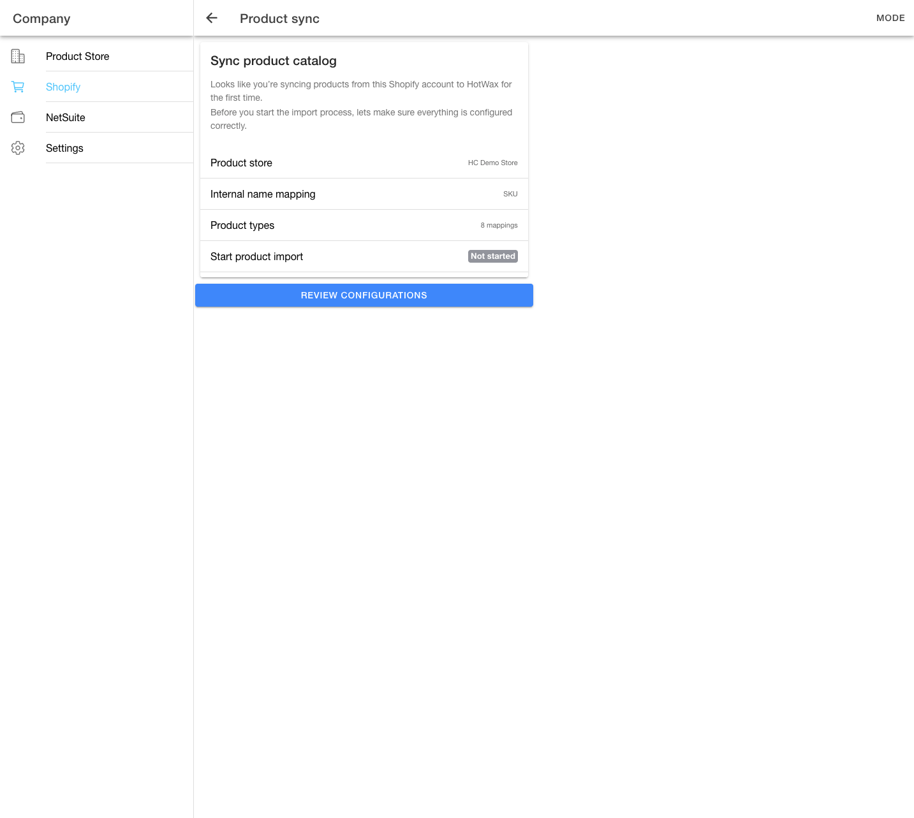
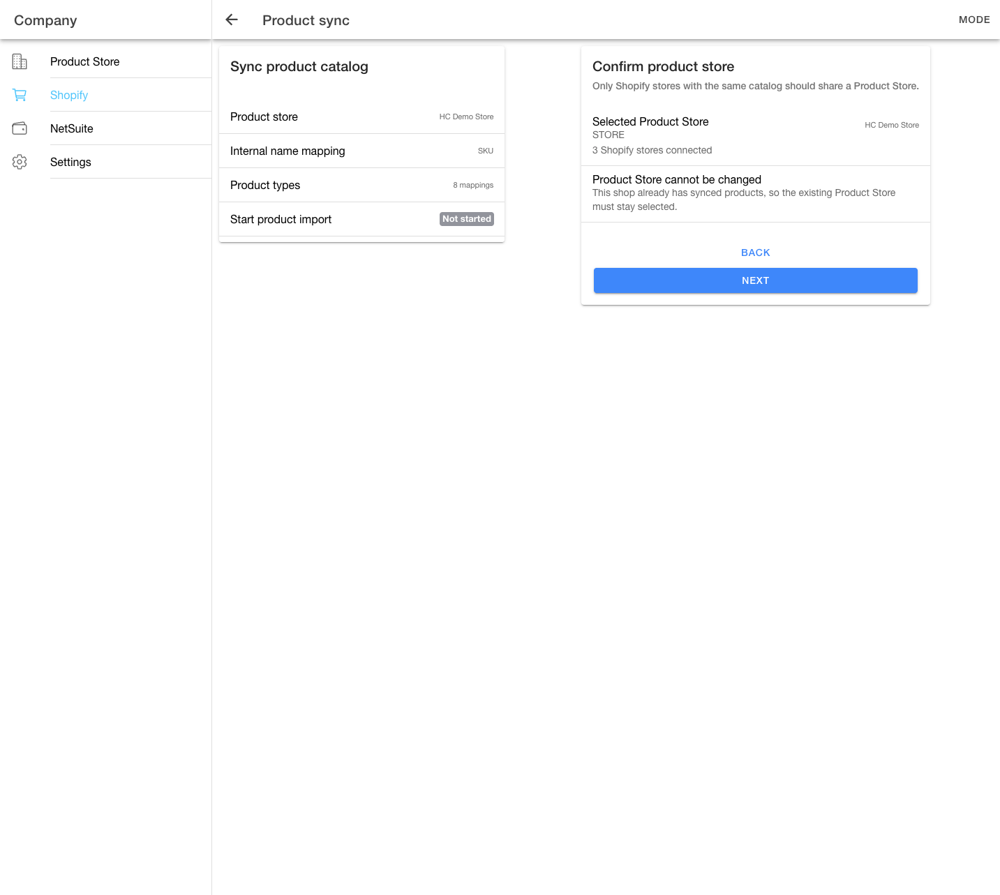

# First-time product sync setup

Use first-time product sync setup when a Shopify shop is sending products to HotWax Commerce for the first time.

This setup matters because product sync creates the product data that HotWax Commerce uses for order download, inventory, routing, fulfillment, and reporting. These choices decide which HotWax product store receives the Shopify catalog. They also decide how Shopify products match HotWax products.


If a Shopify shop already has product update history, HotWax Commerce treats the shop as a returning user. It opens the product sync dashboard instead of the setup wizard.


## Start setup

Open the product sync console from the Shopify shop and click `Review configurations`.

<figure><figcaption>
First-time product sync setup starts with a configuration review
</figcaption></figure>

The first screen summarizes the setup decisions:

* Product store.
* Internal name mapping.
* Product types.
* Start product import.

Use this screen as a final pause before changing catalog data. If the product store or identifier is wrong, products may import into the wrong catalog or fail to match existing products.

## Confirm product store

The product store decides which HotWax catalog receives products from Shopify.

<figure><figcaption>
Product store confirmation for a shop that already has synced products
</figcaption></figure>

Choose the product store that represents the catalog sold by the Shopify shop.

### Business impact

The product store connects product data to the rest of HotWax Commerce. Orders, inventory rules, facility routing, and reporting all depend on products using the right product store.

If multiple Shopify shops share one product catalog, use the same product store for those shops. If shops sell different catalogs, use different product stores.

### Locked product store

When HotWax Commerce finds that the shop already has synced products, it locks the product store. The selected value remains visible, but users can't change it from the wizard. This prevents existing Shopify product links from moving to another catalog by mistake.

### Unlocked product store

When HotWax Commerce hasn't locked the product store, users must confirm that related Shopify stores use the same catalog before continuing. This protects multi-store setups where two Shopify shops may share the same products.

## Confirm internal name mapping

The internal name mapping decides which Shopify identifier HotWax Commerce uses to match Shopify products with HotWax products.

Common choices are:

* Stock keeping unit.
* Barcode.
* Shopify internal ID.

### Business impact

This choice affects product matching. If users select the wrong identifier, HotWax Commerce may create duplicate products or fail to connect Shopify products to existing HotWax records.

For most retailers, stock keeping unit is the recommended identifier because it's usually shared across commerce, warehouse, and enterprise systems. Barcode can work when barcode is the shared merchandising identifier. Use Shopify internal ID only when the retailer wants HotWax Commerce to match directly to Shopify's product IDs.

### Locked identifier

When the product store already has linked Shopify products, HotWax Commerce locks the identifier. Changing it after product linking can break product matching for future updates.

## Review product types

Product type mappings translate Shopify product types into HotWax Commerce product categories or handling rules.

### Business impact

Product type mappings affect how HotWax Commerce handles special products. For example, gift cards, donations, loyalty cards, and digital products may need different fulfillment or reporting behavior from physical products.

This step is informational. It helps users notice missing mappings before import, but it doesn't block setup when no mappings exist.

## Review product import

The review step compares the current catalog state before import.

The page shows:

* Shopify product count.
* Shopify variant count.
* HotWax product count.
* HotWax variant count.
* Linked Shopify store count.

### Business impact

These counts help users catch obvious setup mistakes before importing products. For example, avoid connecting a Shopify shop with thousands of products to an empty or unrelated HotWax product store unless the merchant expects a full new catalog import.

If HotWax Commerce can't load real counts, the import remains blocked. Don't continue from guessed counts.

## Check for mistakes

Click `Am I making a mistake?` to run the preflight check.

The preflight check compares a small set of Shopify products with HotWax Commerce products using the selected identifier. If the match rate is low, the wizard asks the user to confirm before continuing.

### Business impact

The preflight check protects users from catalog mismatch. A low match rate may mean users selected the wrong product store or identifier.

Review warnings before import because importing with the wrong mapping can create cleanup work across product records, orders, and inventory.

## Start product import

Click `Run product import` only after reviewing the setup. The confirmation modal requires users to select a checkbox before starting import.

### Business impact

Starting import tells HotWax Commerce to request product data from Shopify and process it into HotWax product records. After import starts, monitor progress until the import either finishes or shows an error.

The wizard moves to progress after HotWax Commerce starts a real sync job. If HotWax Commerce can't start the job, the wizard stays blocked and shows an error.

## Track import progress

The progress screen shows where the import is in the product sync path:

| Stage | What it means |
| --- | --- |
| Product import request | HotWax Commerce created the request to import Shopify products and is waiting for the next step to pick it up. |
| Shopify product export | Shopify accepted the request and is preparing the product data file. Large catalogs can stay in this stage while Shopify gathers product and variant data. |
| HotWax product import | HotWax Commerce is processing the Shopify file into product records. This is the stage that changes product data inside HotWax. |

The Reconcile button becomes available after progress is complete.

## Reconcile product sync

Use reconcile after the import completes. Reconciliation confirms whether the product sync finished and helps users review the final import state.

A completed state means HotWax Commerce confirmed completion. If HotWax Commerce can't confirm progress, use the error message to decide whether to retry or contact support.

## First-time setup checklist

1. Confirm the Shopify shop is the correct shop.
2. Confirm the selected product store represents the catalog sold by that shop.
3. Confirm any related Shopify shops share the same catalog before using the same product store.
4. Confirm the identifier matches how the retailer manages products across systems.
5. Review product type mappings for special product handling.
6. Review Shopify and HotWax product counts before import.
7. Run the preflight check and review warnings.
8. Start import only after the user selects the confirmation checkbox.
9. Monitor progress through product import request, Shopify product export, and HotWax product import.
10. Reconcile only after the import completes.
