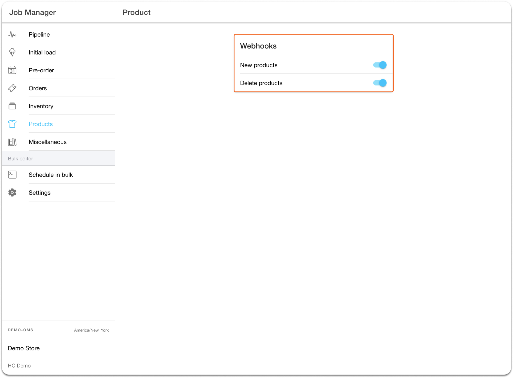

# Create and delete products with Shopify webhooks

Shopify offers webhooks for real-time communication between apps. HotWax uses Shopify's product creation and deletion webhooks to create or delete products.

However, these webhooks have two limitations:

* They only track the creation or deletion of parent products, not product variants.
* Shopify states that webhook delivery is not always guaranteed, and recommends running reconciliation jobs to fetch data periodically.

<figure><figcaption>
Product webhooks for Shopify
</figcaption></figure>

