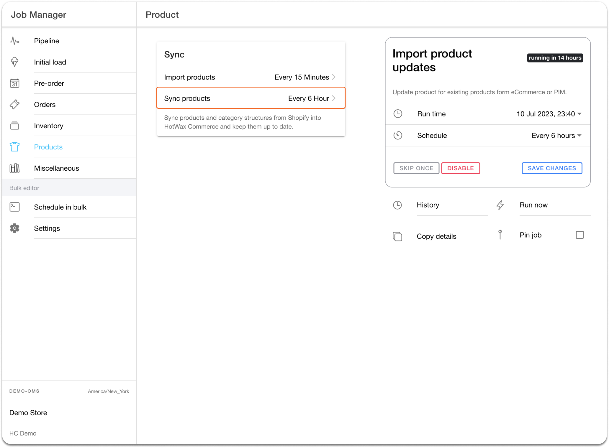

# Updating Product Details

### Updating Product Details from Shopify to HotWax Commerce

Merchants use Shopify to update their product information, such as the name, image, tags, and weight. HotWax Commerce regularly downloads these updates through the 'Sync Products' job, which can be set up in the Job Manager App. If a merchant needs to make changes to a product's details in Shopify, they can achieve this in the following two ways:

* **Deleting the existing product and creating a new one with updated details.**

In the event that merchants opt to remove their current products and generate new ones with revised information, HotWax Commerce will proceed to erase the old items and introduce fresh products through an "Import Products" task.

* **Editing products’ fields in Shopify.**

To keep their product details up-to-date, merchants can easily schedule the "Sync Products" job from the Product page in the Job Manager App. This job checks the "updated\_at" field of the product in Shopify and compares it to the job's last run time. If the time in the "updated\_at" field is later than the job's last run time, it will download all the product details from Shopify, compare them with the data in HotWax Commerce, and update any changed fields. By default, the "Sync Products" job runs every 6 hours, but merchants can adjust this frequency as needed from the Job Manager app.

<figure><figcaption>
<em>Fig.5: Sync product updates from Shopify</em>
</figcaption></figure>
