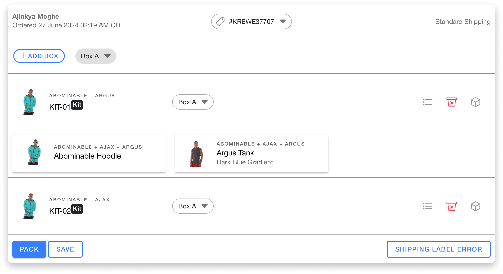

# Fulfillment App Upgrade

## Introduction

HotWax Commerce's [fulfillment application](https://fulfillment.hotwax.io/) has received a significant upgrade, boasting a revamped user interface and exciting new features. These features empower retailers and store associates to streamline order management, particularly when dealing with complex kit products and order rejections.

## Kit Products Visibility

The revamped user interface streamlines the handling of orders containing kit products. By offering clear visual cues and intuitive controls, the new UI empowers users to efficiently identify, manage, and process kit components within the order.

### Identifying Kit Products:

* Kit items now display a **Kit Label** next to their identifiers in the order view, helping store associates quickly recognize kit components.
* Clicking the **Options Icon** next to a kit label reveals a list of **all its included items**. This is especially helpful when processing orders with multiple kits, allowing associates to easily identify which components belong to each.

### Managing Kit Products:

* **Accurate Stock Levels:** Stock availability for an entire kit is now based on the lowest individual component's inventory. This ensures store associates have a clear picture of whether they can fulfill the entire kit or not.
* **Simplified Rejection:** Use the Bin icon to reject the entire kit. Any chosen rejection reason will automatically apply to all items within the kit, streamlining the process and ensuring consistency.

<figure><figcaption></figcaption></figure>

## Simplified Order Rejection:

Previously, rejecting orders containing multiple items was a time-consuming process. Retailers often prefer to fulfill entire orders and avoid partial shipments. This meant manually selecting rejection reasons for each item, which could be tedious.

In the previous version of the `Fulfillment` app, users had to click on `Report an Issue` before being presented with rejection reasons. **Now, the order rejection button has been relocated to a more accessible position. Store associates can easily reject an order and select the specific reason by clicking the `red bin` icon directly on the order card.**

The updated `Fulfillment` app offers a company-level setting for automatic complete order rejection. When activated, if a single item in an order is out of stock, the entire order will be rejected, allowing for potentially more cost-effective shipping options. If partial fulfillment is preferred, retailers can enable partial allocation so that only the out-of-stock items are rejected, while the remaining in-stock items are fulfilled.

### Enable Partial Rejections Toggle:

* **Settings Page:** Navigate to the `Settings` page and locate the `Partial Rejections Toggle`. Enable or disable partial rejections based on your preferences. **Note:** This setting will affect rejections throughout the company.
* **Save Changes:** Click the `Save` button to apply the changes and ensure the new settings are active.

### Reject Orders

* **Partial Rejections:** Store associates can reject individual items by clicking the `Bin` icon and selecting the appropriate rejection reason. The reason will apply only to the selected item and other items can be packed.
* **Complete Rejections:** If partial rejections are disabled, store associates can still reject individual items using the `Bin` icon, but all other order items will also be marked as `Reject Entire Orders`. The items with `Reject Entire Orders` won't have any impact on their inventory.

For more details, refer to our detailed [user manual](../../../store-operations/fulfillment/rejection.md)










