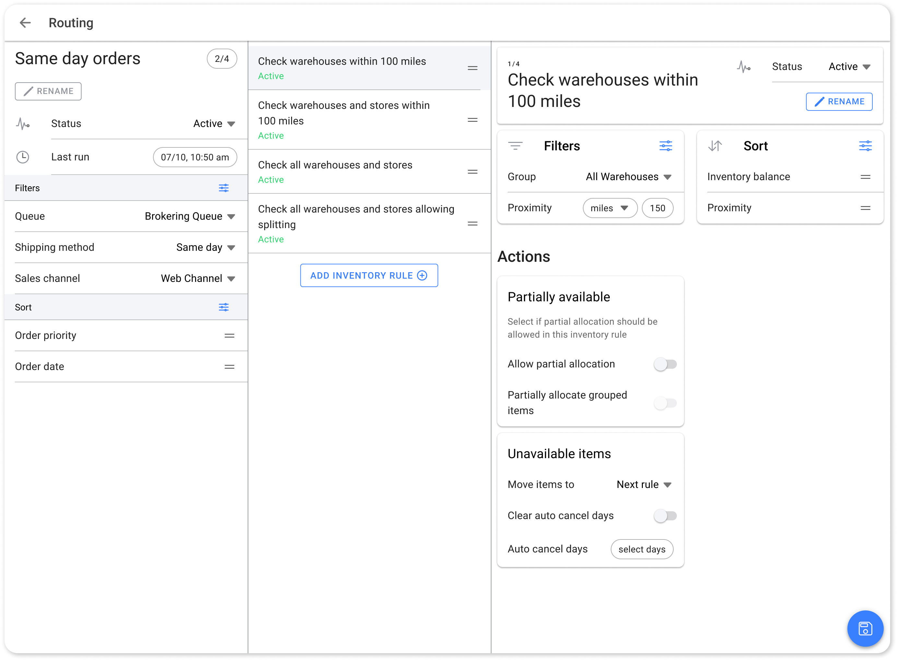

# Routings

A routing in the brokering system defines the criteria for fetching orders and specifies the inventory rules to apply. Understanding how to create, manage, and optimize routings is crucial for configuring your order processing to meet specific fulfillment requirements.

<figure><figcaption>
Routings in Order Routing App
</figcaption></figure>

### Adding a New Routing

* Click the **Add** button next to the "Order batches" label to create a new routing.
* Provide a name for the routing and click **Save** to add it to the routing list of a run.

<figure><figcaption>
New Routings
</figcaption></figure>

### Sequencing Routings

Adjust the sequence of order routings:

* Click and drag the chip on the top right of the routing card.
* The sequence number on the card will automatically update based on the card's position.

### Configuring a Routing

#### 1. Order

* Customize the criteria for orders using the options icon in the "Filters" section.
* Sort order batches by adding sorting criteria and rearranging them.

#### 2. Inventory

* Manage filters applied to determine where orders in this routing should be attempted for allocation.
* Sort inventory options to prioritize available inventory effectively.

#### 3. Allocation Actions

* Specify actions related to order allocation.

### Archiving a Routing Rule

When a routing is no longer needed in a brokering run:

* Click on the **Archive** button at the bottom right of the routing card.
* This action moves the routing to the archive, removing it from the brokering run flow.

Archived routings can be reactivated if needed and are accessible from the archive drawer at the bottom of the list.

Next, let's delve into the detailed configuration options for order filters, inventory filters, and allocation actions that are involved during routing.

***

### Finding Orders

Order lookup is broken down into multiple facets. Each facet is designed to find orders based on metrics that are relevant to retailers. Once order results are obtained, their sequence (sort order) is configurable to ensure that even within a batch of orders, they are not bound to a simple first-in-first-out sequence.

Learn how you can have granular control over which orders are sent to which locations, depending on specific criteria such as order priority, sales channels, and shipping method:

#### Managing Order Filters

* Click on the options icon in the "Filters" section to add or remove filters.
* Ensure orders are routed based on specific criteria that align with your fulfillment strategy.

#### Available Order Filters

**Origin Facility Groups**

This parameter allows retailers to filter Send Sale orders based on the facility group from which they originated. For example, if a retailer wants all Send Sale orders from specific facilities to be routed to a warehouse only, they can apply this filter. It is especially useful for ensuring that orders from certain facility groups are handled consistently based on their origin.

This parameter allows retailers to filter orders based on the facility group from which they originated. For example, many times when walk-in customers cannot find their preferred items in store, store associates place the order on their behalf. These are known as Send Sale orders. In this scenario, the origin facility becomes the specific physical location. If a retailer wants all Send Sale orders from specific facilities to be routed differently, then they can apply this filter to create a batch of orders and proceed to create their routing.

**Order Priority**

Not all orders carry the same urgency. Retailers can pick orders with higher priorities (such as VIP or time-sensitive orders) before others. By filtering orders based on priority, they can ensure that the most critical ones are routed and processed before any less urgent orders.

**Promise Date**

Pre-orders or backorders can be filtered based on their promise date. Retailers may choose to broker orders that have passed their promise date first, ensuring timely fulfillment of overdue orders.

**Queue**

The parking location to fetch orders from.

HotWax Commerce has virtual queues to park orders that are not brokered to a facility. Retailers can filter by queue type (e.g., brokering queue, rejected parking, or unfillable parking) to determine which orders should be brokered to available inventory.

**Sales Channel**

Where the order was captured.

Different sales channels (eCommerce or marketplaces) may require different routing strategies. Orders can be filtered by channel to ensure the right group of orders is picked for routing based on channel-specific fulfillment rules, reducing the risk of penalties or delays in fulfilling orders from marketplaces like Amazon.

**Shipping Method**

SLA promised to the customer.

When customers choose specific shipping methods, like expedited or same-day delivery, these orders must be prioritized differently. Retailers can use this filter to fetch a batch of orders based on the chosen shipping method, ensuring that orders requiring fast shipping are processed first.

#### Managing Sorting Options

* Click on the options icon on the "Sort" card to add or remove sorting options.
* Adjust the priority of sort options by clicking and dragging them to the desired sequence.

#### Available Order Sorting

**Order Date**

Orders can be sorted on a first-in, first-out (FIFO) basis to ensure that older orders are fulfilled first.

**Order Priority**

Orders can be sorted by customer priority levels, such as loyalty plus, loyalty, or regular customers, allowing retailers to prioritize orders for high-value customers.

**Ship By**

**Ship After**

**Shipping Method**

Retailers can sort orders by shipping method, ensuring that orders with expedited shipping are allocated inventory before those with standard shipping.
