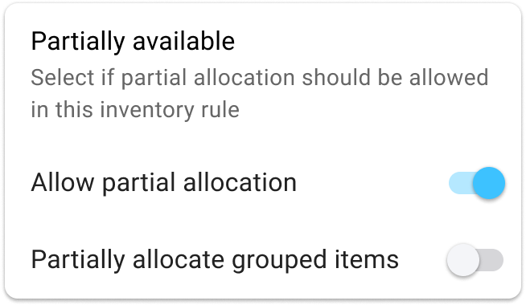

# Rules

## 1. Finding Orders

HotWax Commerce allows retailers to apply multiple order fetching "rules" to ensure that the right orders are picked for routing.

Order lookup is broken down into multiple facets. Each facet is designed to find orders based on metrics that are relevant to retailers. Once order results are obtained, their sequence (sort order) is configurable to ensure that even within a batch of orders, they are not bound to a simple first-in-first-out sequence.

Learn how you can have granular control over which orders are sent to which locations, depending on specific criteria such as order priority, sales channels, and shipping method:

### Managing Order Filters

* Click on the options icon in the "Filters" section to add or remove filters.
* Ensure orders are routed based on specific criteria that align with your fulfillment strategy.

### Available Order Filters

<figure><figcaption>
Order Filters
</figcaption></figure>

1. **Origin Facility Groups**: This parameter allows retailers to filter orders based on the facility group from which they originated. For example, many times when walk-in customers cannot find their preferred items in store, store associates place the order on their behalf. These are known as Send Sale orders. In this scenario, the origin facility becomes the specific physical location. If a retailer wants all Send Sale orders from specific facilities to be routed differently, then they can apply this filter to create a batch of orders and proceed to create their routing.
2. **Order Priority**: Not all orders carry the same urgency. Retailers can pick orders with higher priorities (such as VIP or time-sensitive orders) before others. By filtering orders based on priority, they can ensure that the most critical ones are routed and processed before any less urgent orders.
3. **Promise Date**: Pre-orders or backorders can be filtered based on their promise date. Retailers may choose to broker orders that have passed their promise date first, ensuring timely fulfillment of overdue orders.
4. **Queue**: The parking location to fetch orders from. HotWax Commerce has virtual queues to park orders that are not brokered to a facility. Retailers can filter by queue type (e.g., brokering queue, rejected parking, or unfillable parking) to determine which orders should be brokered to available inventory.
5. **Sales Channel**: Where the order was captured. Different sales channels (eCommerce or marketplaces) may require different routing strategies. Orders can be filtered by channel to ensure the right group of orders is picked for routing based on channel-specific fulfillment rules, reducing the risk of penalties or delays in fulfilling orders from marketplaces like Amazon.
6. **Shipping Method**: SLA promised to the customer. When customers choose specific shipping methods, like expedited or same-day delivery, these orders must be prioritized differently. Retailers can use this filter to fetch a batch of orders based on the chosen shipping method, ensuring that orders requiring fast shipping are processed first.

### Managing Sorting Options

* Click on the options icon on the "Sort" card to add or remove sorting options.
* Adjust the priority of sort options by clicking and dragging them to the desired sequence.

### Available Order Sorting

<figure><figcaption>
Order Sorting Options
</figcaption></figure>

1. **Order Date**: Orders can be sorted on a first-in, first-out (FIFO) basis to ensure that older orders are fulfilled first.
2. **Order Priority**: Orders can be sorted by customer priority levels, such as loyalty plus, loyalty, or regular customers, allowing retailers to prioritize orders for high-value customers.
3. **Ship By**
4. **Ship After**
5. **Shipping Method**: Retailers can sort orders by shipping method, ensuring that orders with expedited shipping are allocated inventory before those with standard shipping.

### Configuring Order Filter and Sorting Rules for Our Example Routing

In this example, we have created a routing to broker all orders that require two-day delivery, as they are assigned a two-day shipping method.


Finding Orders and Managing Sorting


Next, let's hop onto inventory rules. Before we proceed to apply inventory rules, let's first clarify their purpose. 

## 2. Finding Inventory

HotWax Commerce allows retailers to apply multiple recursive inventory allocation "rules" for different batches of orders.

Retailers must specify the available facilities for brokering an order batch. To achieve this, they need to establish order brokering facility groups. For example, for standard orders, retailers may opt to broker solely within warehouses, while expedited orders can be brokered across all facilities based on proximity.

To ensure this, retailers should create two distinct order brokering facility groups: one comprising warehouse locations exclusively, and the other incorporating both warehouses and stores. These facility groups can be established within the Facilities App. Refer to our [user manual](https://docs.hotwax.co/documents/v/system-admins/administration/facilities/manage-groups) for detailed instructions on creating brokering facility groups.


HotWax Commerce routes orders based on the proximity of the customer to the facilities. To determine this proximity, HotWax Commerce compares the customer's shipping address with the facility locations. To ensure accurate location matching, it is essential that the facility's zip code, along with its latitude and longitude, is added.


Once a batch of orders is identified, inventory lookup conditions (using different filters) are applied to find the correct inventory. To optimize inventory lookup performance, facilities are first filtered out to ensure that inventory lookup is only performed on facilities that qualify for fulfillment.

Once valid inventory facilities have been identified, those facilities can be sorted and sequenced as well to optimize fulfillment location selection.

### Managing Inventory Rules

* Add a new inventory rule by clicking on the "Add Inventory Rule" button.
* Click on the options icon on the "Filters" card to manage filters for inventory rules.
* Rearrange the sequence of inventory rules by clicking and dragging items using the reorder icon on each rule.

### Available Inventory Filters

<figure><figcaption>
Inventory Filters
</figcaption></figure>

1. **Turn Off the Facility Order Limit Check**: Retailers have the option to bypass the maximum order limit for a facility. This filter allows flexibility in managing facility capacity during peak times or high demand periods. For example, if a retailer chooses to turn off this limit, orders can continue to be brokered to that facility even after its order limit has been reached.
2. **Brokering Safety Stock**: Different from online ATP safety stock, brokering safety stock defines the minimum stock required for an order to be brokered to a facility. For example, if a retailer sets a brokering safety stock level of 10 units, only facilities with at least 10 units of the item in stock will be eligible to fulfill the order. This prevents over-allocation and ensures that safety stock levels are maintained for unforeseen demand.
3. **Facility Group**: Custom grouping of locations. Grouping certain facilities allows retailers to simplify their decision-making. For example, slow-moving or lower-demand facilities can be grouped together and designated for non-urgent orders, while high-demand facilities are reserved for time-sensitive fulfillment.
4. **Proximity**: Distance between fulfillment facility and destination based on either carrier provided zone mapping or destination address zip code and latitude and longitude of the fulfillment facility. For example, a retailer can set a 200-mile proximity filter for next-day delivery orders, ensuring that only inventory within 200 miles of the delivery location is used to fulfill those orders. This helps in meeting delivery SLAs and reducing shipping times.
5. **Split Order Item Group**: Retailers can control whether they want to split items that belong to a specific order item group. For example, certain items, like gift sets or kits, may need to be shipped together to maintain the integrity of the order. Retailers can decide whether to allow splitting of such groups or to prioritize keeping them intact, even if other items in the order are split across multiple facilities.

<figure><figcaption>
Allocate Inventory From All Facilities
</figcaption></figure>

### Managing Sorting Options

* Click on the options icon on the "Sort" card to add or remove sorting options.
* Adjust the priority of sort options by clicking and dragging them to the desired sequence.

### Available Inventory Sorting

<figure><figcaption>
Inventory Sorting Options
</figcaption></figure>

1. **Proximity**: Retailers can sort inventory allocation based on the distance between the customer's shipping address and the facility. This sorting method prioritizes inventory located closer to the customer, helping reduce shipping times and costs, especially for expedited orders or those requiring same-day or next-day delivery.
2. **Facility Order Limit**: In order to ensure that the workload at facilities is balanced, facilities can also be sorted on how much fulfillment capacity they have left.
3. **Inventory Balance**: Inventory can be sorted based on stock levels, ensuring that orders are routed to the facility with the highest available inventory of the ordered item. This method helps to deplete stock from high-inventory locations first, ensuring better stock rotation and preventing stock outs at key locations.
4. **Custom Sequence**: Allows full manual override to the sequence at which facilities are attempted. Retailers can set a custom sequence of facilities, defining a specific order in which locations should be considered for order routing. For example, if a retailer wants to prioritize fulfillment from underperforming stores with lower foot traffic, they can create a custom sequence that favors those stores, helping to balance inventory across all locations. Custom sequences can also be useful for managing seasonal inventory or routing orders to specific regions.

### Configuring Inventory Filter and Sorting Rules for Our Example Routing

Here, we have configured three inventory rules to allocate inventory for orders that require two-day shipping.


Finding Inventory and Managing Sorting





Adding New Inventory Rule





Adding New Inventory Rule




## 3. Allocation Actions

<mark style="color:orange;">**Committing Orders to Inventory**</mark>

After all possible inventory has been found, retailers can choose what conditions must be met for the order to be allocated to inventory. The conditions of allocation depend on the availability of inventory at a particular facility for all the items being attempted, which will either be fully available at one location or partially available.

### Availability States

* Fully Available Without Splitting
  * Partially Available
* Meets Shipment Threshold Value

**What is Shipment Threshold Value?**

Setting order splitting thresholds based on shipment value directly addresses the problem of maintaining the profitability of shipments while balancing fulfillment speed and customer experience. Retailers can set a minimum shipment value that they want to maintain during allocation which also ensures profitability of the order. When ordered items are allocated, the brokering engine will not only ensure that the allocated items meet the threshold but also that the unallocated items also meet the threshold. Checking outstanding and unallocated items of an order is equally important because if their value doesn’t meet the shipment value threshold, those items will never be automatically allocated. By checking both allocated and unallocated item totals, the brokering engine ensures that inventory is selected in a way that ensures fulfillment margins for the entire order.

Based on each of these conditions, an action can be tied to the allocation. Retailers can choose which action to perform based on the outcome.

### Available Actions

<figure><figcaption>
Allocate Partial
</figcaption></figure>

1. **Allocate Partial**: Allow an order to be split and allocated partially if some items are available at a location.

<figure><figcaption>
Available Actions
</figcaption></figure>

2. **Move to the Next Rule**: Automatically move unallocated items to the next rule in the sequence.
3. **Move to Queue**: Transfer unallocated items to a selected queue for further processing. When an order cannot be allocated but should not undergo further allocation attempts by other rules in the flow, it can be moved to a specific queue. This allows for holding orders until the appropriate action can be taken. For example, unfillable orders can be transferred to the "Unfillable Parking", where they can later be rerouted through a different routing strategy.
4. **Add Auto Cancel Date**: Specify the number of days to automatically cancel orders that could not be allocated. Based on the inventory availability, retailers may want to add an auto cancel date on the order, to ensure that they do not remain in the fulfillment pipeline for too long.


Final Inventory Rule


Understanding and appropriately configuring these actions will let you fine-tune brokering rules, improving order routing efficiency and meeting specific fulfillment requirements.


By leveraging the full range of order fetching, inventory filtering, and sorting parameters provided by HotWax Commerce’s Order Routing App, retailers can create highly customized and efficient order routing strategies that optimize inventory usage, reduce shipping times and costs, and align their fulfillment process with their unique business needs.

