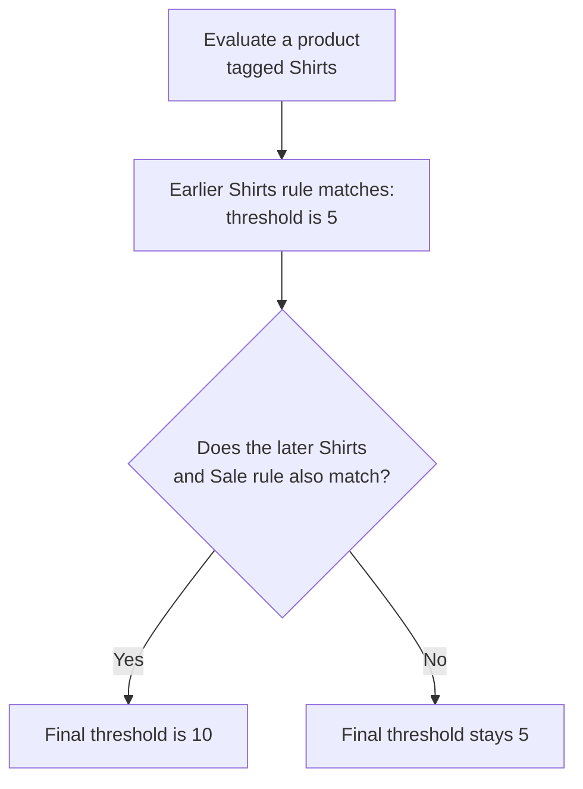

# Understand sourcing concepts

Use the `Sourcing` section of the **Order Routing Rules** app to manage the rules that contribute to available-to-promise (ATP) inventory.

## Use product filters

Apply a rule to a group of products with tags or product features.

* Use `Products by tags` for values synced from the product catalog, such as `Clearance` or `New arrival`.
* Use `Products by feature` for attributes such as color, size, or category.
* Add values under `Included` to bring matching products into the rule.
* Add values under `Excluded` to remove matching products from the rule.
* Select `AND` when a product must match every selected value.
* Select `OR` when a product can match any selected value.

Leave both product filter sections empty when the rule should apply to all products in its facility or channel scope.

The filter picker displays the number of products that match each value and a live total for your current selection.

## Use facility groups

A facility group collects facilities that share a business purpose. Sourcing rules use facility groups so you can apply one rule to many locations.

For example, create separate groups for retail stores, warehouses, or a region. On facility-based rule forms, use `Included` and `Excluded` to define the final scope. Before saving, select the button that shows the number of impacted facilities and confirm the resulting scope.

You can create a facility group or use an existing group from a rule form when no suitable group is available.

## Use pickup groups

A pickup group identifies the facilities that can fulfill store pickup orders for a product store.

Open `Sourcing` > `Store pickup`, then select the `Facility` tab to manage pickup groups. Each facility card contains a toggle for every linked pickup group. Turning on a toggle adds the facility to that pickup group. Turning it off removes the facility.

## Use inventory channels

An inventory channel combines:

* A channel facility group that identifies the facilities contributing inventory
* A configuration facility used by channel-level product rules

Open `Sourcing` > `Channels` to manage both parts. The page title is `Inventory channels`.

Use a separate inventory channel when sales channels require different inventory sources. For example, a Canadian sales channel can use stores and warehouses while a United States sales channel uses warehouses only.

Shopify inventory event sync is configured in the Company App. Map the channel to an aggregate Shopify location, review its publisher and reset jobs, then verify event and batch delivery. Physical-location events use their own mapped facilities and publisher in the same monitor. See [Monitor Shopify inventory sync](../../../system-admin/administration/company/manage-shopify-inventory-sync.md).

## Understand rule priority

More than one rule can match the same product and facility. The last matching rule in the sequence sets the final value for that combination.

Place broad base rules before specific exceptions. For example:

1. Set a threshold of five units for products tagged `Shirts`.
2. Set a threshold of 10 units for products tagged `Shirts` and `Sale`.

The second rule overrides the first rule for sale shirts.

This example assumes both rules are active and target the same inventory channel. A later rule overrides the earlier value only when its product and channel conditions also match.

Use the sequence button at the bottom of a sourcing rule page to reorder rules. Drag the rules into position, then select the save button.

Continue with [Create inventory channels](create-channels.md) or [Schedule sourcing rules](schedule-atp-rules.md).
