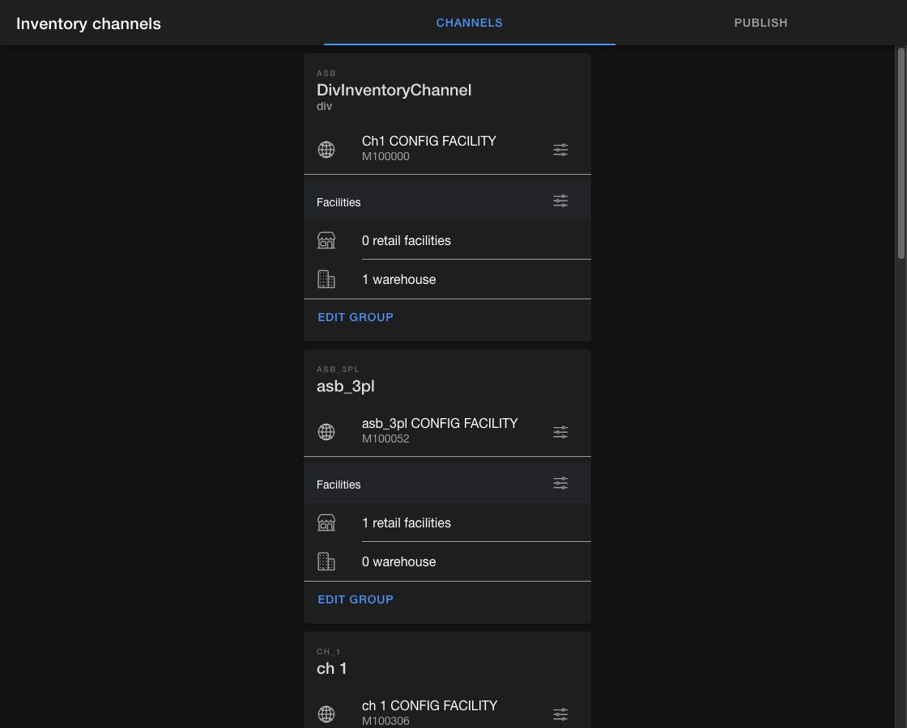

# Manage inventory channels

An inventory channel groups the facilities that contribute sellable inventory to a sales channel. Each channel can also have a configuration facility for channel-level product rules.

## Create an inventory channel

1. Open the **Order Routing App**, then go to `Inventory channels`.
2. Stay on the `Channels` tab and select the add button.
3. In `Create channel group`, enter a `Name`, `ID`, and optional `Description`.
4. Under `Group level configurations`, select `Create new` to create a configuration facility or select an existing configuration facility.
5. Save the channel.

The `ID` can contain no more than 20 characters. Use a durable ID because integrations and rules can reference it.

<figure><figcaption>
Each channel card shows its configuration facility and linked retail and warehouse facilities.
</figcaption></figure>

## Link a configuration facility

A configuration facility stores network-level product settings for the channel.

1. Find the inventory channel on the `Channels` tab.
2. Select `Add` when no configuration facility is linked. If one is already linked, select the options button beside it.
3. Choose the configuration facility in `Link threshold`.
4. Save the selection.

## Link facilities

1. Select the options button in the `Facilities` section of the channel card.
2. In `Link facilities`, select the stores and warehouses whose inventory should contribute to the channel.
3. Save the selection.

The card updates the retail facility and warehouse counts after the facilities are linked.

## Publish inventory to a sales channel

The `Publish` tab lists publish jobs for connected Shopify shops.

1. Open the `Publish` tab.
2. Set the `Run time` and `Frequency` for the shop.
3. Select the `Inventory channel` whose inventory should be published.
4. Select `Save changes`.

Use the job's overflow menu to view `History`, `Copy details`, `Run now`, or `Disable` the job. Running a job now creates an immediate copy and does not replace its recurring schedule.
