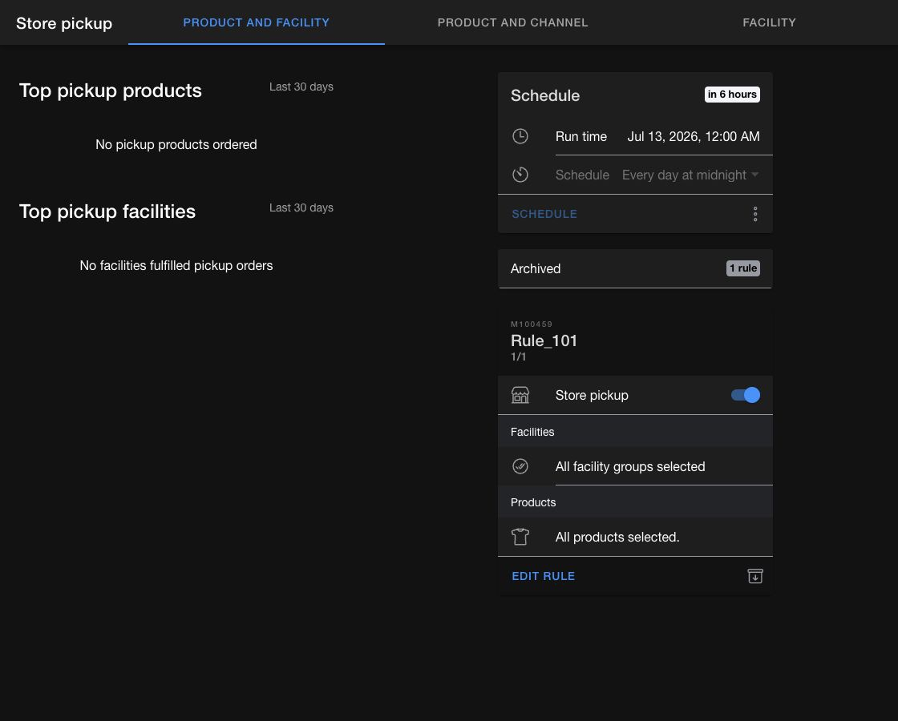

# Configure store pickup rules

Store pickup rules control whether selected products can be picked up from selected facilities or sales channels.

The `Store pickup` page has three tabs:

* `Product and facility` applies a rule to facility groups.
* `Product and channel` applies a rule to inventory channels.
* `Facility` manages the facilities that belong to pickup groups.

<figure><figcaption>
Review pickup rules, their schedule, and recent pickup activity from one page.
</figcaption></figure>

## Create a product and facility rule

1. Open the **Order Routing App**, then go to `Store pickup`.
2. Select the `Product and facility` tab and select the add button.
3. Enter a unique `Name`.
4. Turn `Store pickup` on to allow pickup or off to suppress pickup.
5. Turn on `Select all facility groups` or add at least one group to `Included`.
6. Optional: Add groups to `Excluded`.
7. Optional: Narrow the rule with included or excluded product tags and features.
8. Review the impacted facilities in `Preview`, then save the rule.

## Create a product and channel rule

1. Select the `Product and channel` tab and select the add button.
2. Enter a unique `Name` and set the `Store pickup` toggle.
3. Turn on `Select all channels` or select at least one inventory channel.
4. Optional: Narrow the rule with product tags and features.
5. Review `Preview`, then save the rule.

## Manage pickup facilities

Open the `Facility` tab to review the facilities that can fulfill pickup orders. If no pickup group is linked, select `Create pickup group` or `Use an existing group`. Use search and sort to find facilities in a linked group.

## Update and run rules

Rule cards show the pickup setting, facility groups or channels, and product selection. Use the toggle on a card for a quick availability change, or select `Edit rule` to change the full configuration. You can also archive or reorder rules.

Use the `Schedule` card to run pickup rules. Open its overflow menu to view `History`, select `Run now`, or `Disable` the schedule.
