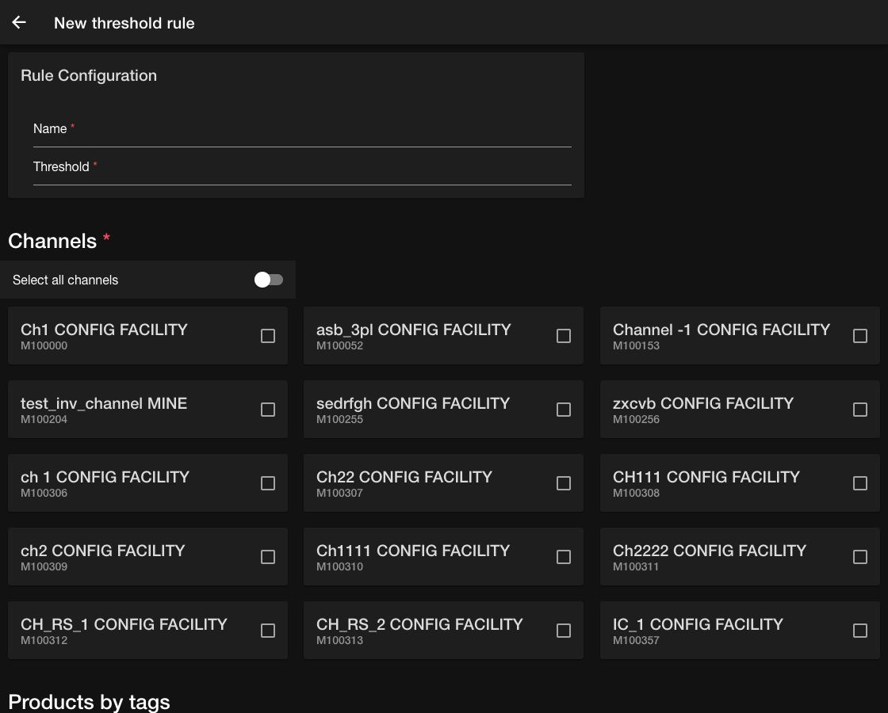

# Configure threshold rules

A threshold holds back a network-level quantity from a selected inventory channel. Use thresholds to protect a buffer before inventory is published to an online sales channel.

For example, if a channel has 220 units available after facility-level controls and a threshold of 10, the channel can publish up to 210 units.

## Create a threshold rule

1. Open the **Order Routing App**, then go to `Threshold`.
2. Select the add button.
3. In `New threshold rule`, enter a unique `Name` and a nonnegative `Threshold` value.
4. Under `Channels`, turn on `Select all channels` or select one or more configuration facilities.
5. Optional: Under `Products by tags`, add included or excluded product tags and choose the matching operator.
6. Optional: Under `Products by feature`, add included or excluded product features and choose the matching operator.
7. Select the save button.

At least one channel is required. Leave the product filters empty when the threshold should apply to every product in the selected channels.

<figure><figcaption>
Set the threshold, select channels, and optionally narrow the rule by product tags or features.
</figcaption></figure>

## Review and update threshold rules

Each rule card shows its threshold value, channels, and product selection. From the `Threshold` page you can:

* Select `Edit rule` to change the full configuration.
* Select the threshold value to update only the quantity.
* Use the archive button to move a rule out of the active sequence.
* Open `Archived` to review archived rules.
* Use the reorder action to change rule priority, then save the sequence.

## Run threshold rules

Use the `Schedule` card to activate the recurring rule computation. Open its overflow menu to view `History`, select `Run now`, or `Disable` the schedule. See [Schedule sourcing rules](schedule-atp-rules.md) for details.
